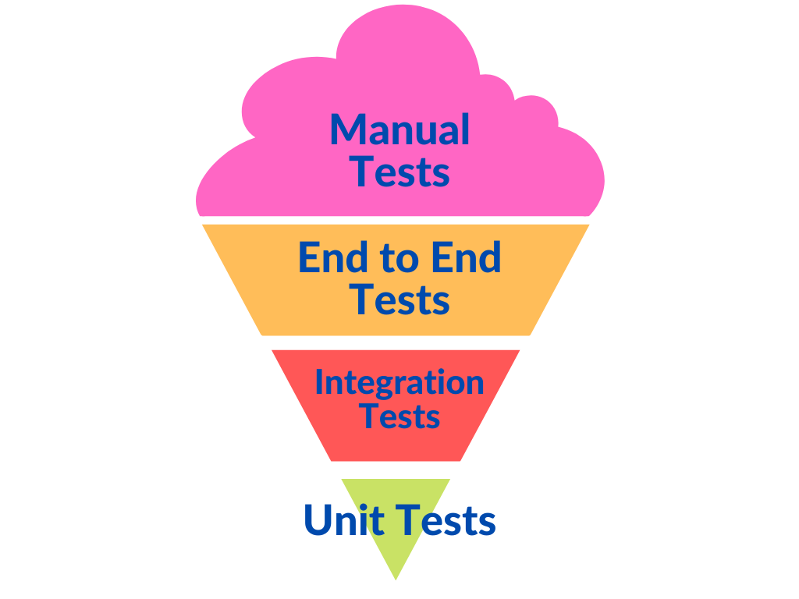
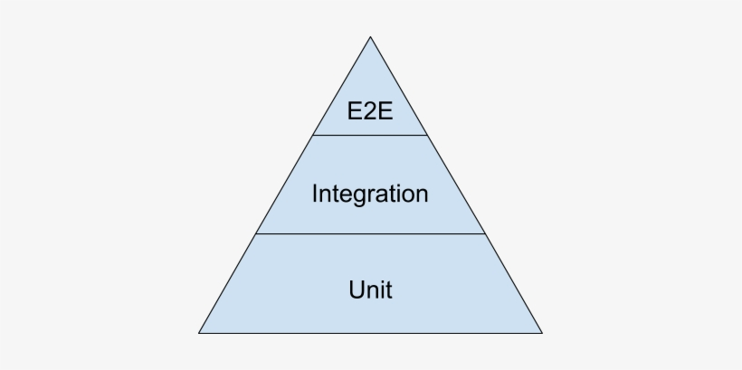
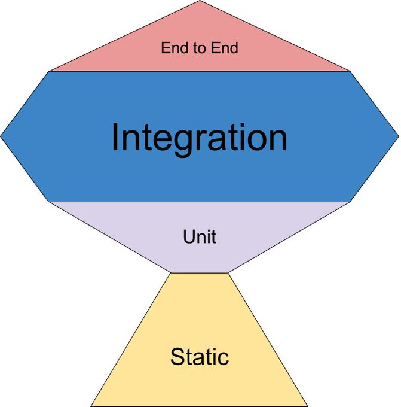
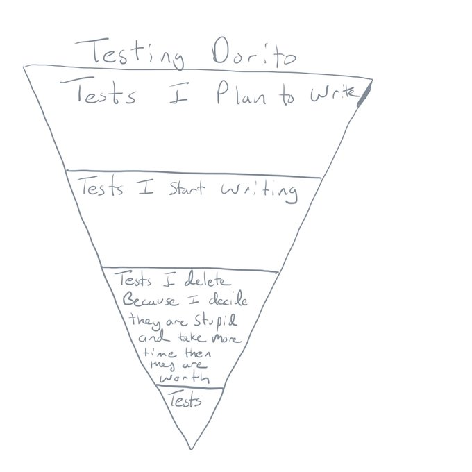

### 프런트엔드 테스트 범위

> 웹 애플리케이션은 여러 모듈을 조합해 만든다.
>
> 라이브러리가 제공하는 함수, UI 관련 함수, 웹 API 클라이언트, API 서버, 데이터베이스 서버, ..

#### 정적 분석

- 타입스크립트나 ESLInt가 제공하는 기능 활용
  - 타입스크립트 → 타입 추론으로 런타임 작동을 예측 가능
  - ESLint → 코드 가이드라인 제공

#### 단위 테스트

- 한 가지 모듈에 한정하여 해당 모듈이 제공하는 기능을 검증하는 테스트
- 독립된 환경에서 검증
- 어떤 상황에서 예외를 발생시켜야 할지 판단할 때 도움 → _'이런 상황은 일어날 수 없을까? 일어날 수 있다면 어떻게 처리해야 하는가'_

#### 통합 테스트

- 여러 모듈을 연동한 기능을 테스트 → 주로 인터랙션
- ①을 실행하면 ④도 실행된다
  - ① 셀렉트 박스를 조작한다
  - ② URL 검색 쿼리가 변경된다.
  - ③ 검색 쿼리가 변경되어 데이터 취득 API가 호출된다.
  - ④ 목록 화면 내용을 갱신한다.
- 테스트의 복잡도, 효율성을 고려하여 테스트 필요

#### E2E 테스트

- UI 테스트뿐만 아니라 외부 스토리지와 같이 연동 중인 하위 시스템을 포함하는 테스트
- 입력 내용에 따라 저장된 값이 갱신 → UI는 물론 연동된 외부 기능이 정상적으로 작동하는지 검증 가능
- 가장 광범위한 통합 테스트로 실제 서비스 환경과 가장 유사한 테스트

### 프런트엔드 테스트 목적

#### 기능 테스트(인터랙션 테스트)

- 개발된 기능에 문제가 없는지 검증하는 테스트 → 대부분 인터랙션 테스트
- 웹 프런트엔드의 주요 개발 대상은 사용자가 조작할 UI 컴포넌트
  - 사용자 조작 시 상태 변경
  - 사용자가 원하는 정보 제공을 위해 화면 갱신
- 크로미엄(Chromiun)같은 실제 브라우저를 헤드리스 모드로 실행하여 UI 테스트 자동화 실시
- 실제 브라우저가 없어도 가상 브라우저 환경에서 가능한 인터랙션 테스트
  - 버튼을 클릭하면 콜백 함수가 호출된다.
  - 문자를 입력하면 전송 버튼이 활성화된다.
  - 로그아웃 버튼을 클릭하면 로그인 화면으로 이동한다.
- 실제 브라우저가 필요한 인터랙션 테스트
  - 맨 아래까지 스크롤을 내리면 추가 데이터를 가져온다.
  - 세션 스토리지에 저장된 값을 불러온다.

#### 비기능 테스트(접근성 테스트)

- 접근성 테스트
  - 비기능 테스트의 한 종류
  - 신체적, 정신적 특성에 따른 차이 없이 동등하게 제품을 사용할 수 있는지 검증하는 테스트
- 접근성 테스트 실제 사례
  - 키보드로 체크 박스를 체크할 수 있다.
  - 오류 응답을 받았을 때 오류 문구를 렌더링한다.
  - 렌더링된 화면에 접근성 위반 사례가 있는지 검사한다.

#### 시각적 회귀 테스트

- 특정 시점을 기준으로 전후 차이를 비교하여 문제가 있는지 검증하는 테스트
- 웹 프론트엔드는 시각적으로 보여지기 때문에 시각적 회귀 테스트가 중요
- 초기에 렌더링된 상태만 캡처하여 비교하는 것에 그치지 않고 사용자 조작으로 변경된 화면까지 캡처하여 비교

### 테스트 전략 모델

#### 아이스크림 콘 모델

- 안티패턴으로 자주 언급되는 테스트 전략 모델
- 상층부 테스트 비중이 높아 높은 운용 비용 및 외부 모듈 의존성으로 불안정한 테스트 비율이 상대적으로 많음
- 모든 테스트가 통과되는 데 걸리는 시간 → 개발 흐름에 영향
- 그렇다고 실행 시간을 줄이기 위해 실행 빈도를 낮춘다? → 테스트 자동화의 신뢰성이 낮아짐

#### 테스트 피라미드 모델

- 하층부 테스트의 비중이 높을수록 더욱 안정적이고 가성비 높은 테스트 가능하다는 것이 핵심
- 상층부 테스트 → 실행 시간이 길어서 신속성이 떨어짐
- 하층부 테스트 → 실행 시간이 짧아 신속성이 높고, 자주 실행할 수 있어서 안정성 또한 높음

#### 테스트 트로피 모델

> "Write tests. Not too many. Mostly integration."
>
> — Guillermo Rauch (@rauchg) [December 10, 2016](https://x.com/rauchg/status/807626710350839808?ref_src=twsrc%5Etfw)

- 통합 테스트 비중이 가장 높은 모델
  - 주로 여러 컴포넌트의 조합으로 구현된 기능
  - 사용자 조작(인터랙션)에서 시작
- 테스팅 라이브러리와 Jest를 사용하면 헤드리스 브라우저 없이도 사용자 조작을 재현해 테스트 할 수 있어 실행 속도가 빠르면서도 실제 제품과 유사한 테스트 가능

> - [해당 모델을 제안한 Kent C. dodds의 발표 영상](https://youtu.be/Fha2bVoC8SE?si=ehB3wmH_gpvqjaZO)
> - 도리토 모델에서 공감X1000 😂
>
> 

### 테스트 전략 계획

- 테스트가 없어 리팩터링이 불안한 경우 → 목 서버를 활용한 통합 테스트
- 반응형으로 제작된 프로젝트 → 스토리북, reg-suit을 활용한 시각적 회귀 테스트
- 데이터베이스를 포함한 E2E 테스트가 필요한 경우 → 테스트용 스테이징 환경이나 컨테이너 사용
  - 스테이징 환경: 실제로 배포할 환경에 가까운 형태로 만든 테스트용 환경
