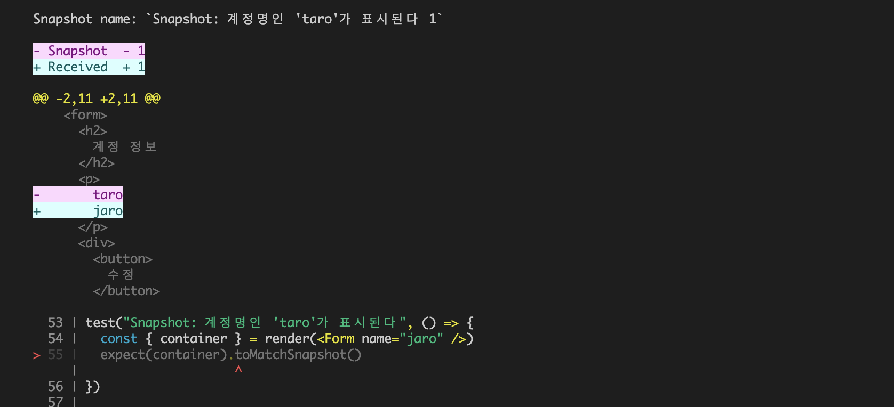

## UI 컴포넌트 테스트 기초 지식

### MPA와 SPA의 차이점

- 멀티 페이지 애플리케이션(MPA): 여러 HTML 페이지와 HTTP 요청으로 만들어진 웹 애플리케이션
  - ‘페이지 요청 단위’에 기반하여 사용자와 대화하는 방식으로 개발
- 싱글 페이지 애플리케이션(SPA): 한 개의 HTML 개발하는 웹 애플리케이션
  - 웹 서버가 응답으로 보낸 최초의 HTML 페이지를 사용자 입력에 따라 부분적으로 HTML 변경

### UI 컴포넌트 테스트

- 버튼과 같은 작은 단위의 UI 컴포넌트를 하나씩 조합하여 화면 단위의 UI를 완성
- 만약 고려해야 할 사항을 빠뜨려서 중간 크기의 UI 컴포넌트에 문제가 생긴다면?
- 테스트를 고려해야 할 UI 컴포넌트 기능
  - 데이터를 렌더링하는 기능
  - 사용자의 입력을 전달하는 기능
  - 웹 API와 연동하는 기능
  - 데이터를 동적으로 변경하는 기능
- _의도한 대로 작동하고 있는가?_ + _문제가 생긴 부분이 없는가?_

### 웹 접근성 테스트

- 웹 접근성: 신체적, 정신적 특성에 따른 차이 없이 정보에 접근할 수 있는 정도를 측정하는 기준
- 화면에 보이는 문제가 아니기 때문에 의식적으로 신경 써야만 알 수 있음

> [!NOTE]
>
> #### 🎯 웹 표준을 잘 지킨다 ≠ 웹 접근성을 완벽히 보장한다
>
> - **웹 표준(Web Standards):** 어떤 운영체제나 어느 브라우저에서든 상관없이 웹사이트가 항상 동일하게 보여지도록 표준을 맞추는 것
> - **웹 접근성(Web Accessibility, a11y)**: 장애인, 고령자 등을 포함한 모든 인터넷 사용자가 **웹**사이트에 쉽게 접근할 수 있도록 구현하는 것
>
> _웹 표준이 웹 접근성을 높이는 데 도움이 되는 것은 사실이지만, 완벽히 보장해 주는 것은 아님!_
>
> #### 🎯 ARIA(Accessible Rich Internet Applications)
>
> - W3C의 하위 집합인 WAI에서 발표한 웹 접근성 명세서 → 그래서 WAI-ARIA
> - 실제 프로그래밍 언어가 아니라 HTML 요소에 정보를 추가하여 접근성 향상
>   - 역할(Role): UI에 포함된 특정 컴포넌트의 역할을 정의
>   - 속성(Property): 해당 컴포넌트의 특징이나 상황을 정의하며 속성명으로 `aria-` 접두사를 사용
>   - 상태(State): 해당 컴포넌트의 상태 정보를 정의
> - ARIA의 5가지 규칙
>   - 최대한 HTML5의 시맨틱 태그가 지원하는 ARIA 사용하기
>   - 불필요한 ARIA 추가하지 않기
>   - 키보드 탐색 지원하기 → `tabindex="0"`
>   - 포커스를 받을 수 있는 요소를 숨기지 않기 → `aria-hidden="true"` / `role="presentation"`
>   - 대화형 요소에 접근 가능한 이름 사용하기
>
> #### 참고 링크…
>
> - [웹 접근성 준수를 통한 모두에게 배달되는 일상의 행복](https://techblog.woowahan.com/15541/)
> - [ARIA 및 HTML - web.dev](https://web.dev/learn/accessibility/aria-html?hl=ko)
> - [Using ARIA - W3C docs](https://www.w3.org/TR/using-aria/#rule1)
> - [Document conformance requirements for use of ARIA attributes in HTML - W3C docs](https://www.w3.org/TR/html-aria/#dfn-no-corresponding-role)

- 마우스를 쓰는 사용자와 보조 기기를 쓰는 **사용자가 동일하게 요소들을 인식할 수 있는 쿼리로 테스트를 작성해야 하기 때문에** UI 컴포넌트 테스트는 웹 접근성 향상 측면에서 좋은 선택지
  - 접근성 친화적인 쿼리 사용 → `getByRole`, `getByLabelText`, `getByText` 등

## 라이브러리 설치

### UI 컴포넌트 테스트 환경 구축

- UI 컴포넌트 테스트에 필요한 라이브러리
  - `jest-environment-jsdom`
  - `@testing-library/react`
  - `@testing-library/jest-dom`
  - `@testing-library/user-event`
- 기본적인 테스트 환경은 `jest.config.js`의 `testEnvironment`에 지정

```jsx
module.exports = {
  testEnvironment: 'jest-environment-jsdom',
}
```

```jsx
/**
 * @jest-environment jest-environment-jsdom
 */
```

### 테스팅 라이브러리

- 테스팅 라이브러리의 기본 원칙 → _테스트는 소프트웨어의 사용법과 유사해야 한다_
- 테스팅 라이브러리의 역할
  - UI 컴포넌트 렌더링
  - 렌더링된 요소에서 임의의 자식 요소 취득
  - 렌더링된 요소에 인터랙션 유발
- 공통적으로 `@testing-library/dom`을 코어로 사용
- `@testing-library/jest-dom`의 커스텀 매처라는 제스트의 확장 기능을 통해 UI 컴포넌트 테스트를 위한 여러 매처 사용 가능
- 이벤트 발생을 위해서는 `fireEvent` API 보다는 실제 사용자의 입력에 가깝게 시뮬레이션이 가능한 `@testing-library/user-event`를 추가로 사용하는 것을 권장

## 처음 시작하는 UI 컴포넌트 테스트

### 테스트할 UI 컴포넌트

```tsx
type Props = {
  name: string
  onSubmit?: (event: React.FormEvent<HTMLFormElement>) => void
}

export const Form = ({ name, onSubmit }: Props) => {
  return (
    <form
      onSubmit={event => {
        event.preventDefault()
        onSubmit?.(event)
      }}
    >
      <h2>계정 정보</h2>
      <p>{name}</p>
      <div>
        <button>수정</button>
      </div>
    </form>
  )
}
```

- props로 보낸 `name`이 화면에 잘 렌더링 되는지?
- ‘수정’ 버튼이 화면에 잘 렌더링 되는지?
- ‘계정 정보’ 텍스트가 화면에 잘 렌더링 되는지?
- ‘수정’ 버튼을 클릭 시 `onSubmit` 이벤트가 잘 호출되는지?

### UI 컴포넌트 테스트

- UI 컴포넌트 렌더링 → `render` 함수
- 단언문 작성 → `@testing-library/jest-dom`으로 확장한 커스텀 매처 사용
  - `toBeInTheDocument` → 해당 요소가 DOM에 존재하는지 검증
  - `toHaveTextContent` → 해당 요소에 원하는 문자가 포함되어 있는지 검증
  - `toMatchSnapshot` →
- `screen.getByText` → 문자열로 특정 DOM 요소 찾기
- `screen.getByRole` → HTML 속성인 `role`로 특정 DOM 요소 찾기
- `screen.debug` → 테스트 코드 작성 중 UI 요소 디버깅용
- `logRoles` → 렌더링 결과로부터 역할과 접근 가능한 이름 확인

- 이벤트 핸들러: 어떤 입력이 발생했을 때 호출되는 함수 → _버튼을 클릭하면 ~한다_
- 이벤트 호출은 함수 단위 테스트와 동일하게 **목 함수**로 검증 → `mockFn`
- 이벤트 핸들러로 목 함수를 전달하고 이를 fireEvent로 검증

```tsx
const user = userEvent.setup()

test('이름을 표시한다', () => {
  render(<Form name="taro" />)
  screen.debug(screen.getByText('taro')) // <p>taro</p>
  expect(screen.getByText('taro')).toBeInTheDocument()
})

test('버튼을 표시한다', () => {
  render(<Form name="taro" />)
  screen.debug(screen.getByRole('button')) // <button>수정</button>
  expect(screen.getByRole('button')).toBeInTheDocument()
})

test('heading을 표시한다', () => {
  render(<Form name="taro" />)
  screen.debug(screen.getByRole('heading')) // <h2>계정 정보</h2>
  expect(screen.getByRole('heading')).toHaveTextContent('계정 정보')
})

test('버튼을 클릭하면 이벤트 핸들러가 실행된다', async () => {
  const mockFn = jest.fn()
  render(<Form name="taro" onSubmit={mockFn} />)

  const button = screen.getByRole('button')
  await user.click(button)

  expect(mockFn).toHaveBeenCalled()
})
```

## 아이템 목록 UI 컴포넌트 테스트

- Props로 취득한 목록을 표시하는 테스트
- 한 번에 여러 DOM 요소를 취득하는 방법
- ‘존재하지 않음’을 확인하는 매처로 요소가 화면에 존재하는지 확인하는 방법

### 테스트할 UI 컴포넌트 - `ArticleList`

```tsx
type Props = {
  items: ItemProps[]
}

export const ArticleList = ({ items }: Props) => {
  return (
    <div>
      <h2>기사 목록</h2>
      {items.length ? (
        <ul>
          {items.map(item => (
            <ArticleListItem {...item} key={item.id} />
          ))}
        </ul>
      ) : (
        <p>게재된 기사가 없습니다</p>
      )}
    </div>
  )
}
```

- 표시할 기사가 있으면 기사 목록을 화면에 표시하는지?
- 표시할 기사가 없으면 기사 목록 대신 `게재된 기사가 없습니다` 텍스트를 화면에 표시하는지?

### 목록에 표시된 내용 테스트

- `getAllByRole` → 지정한 역할과 일치하는 모든 요소를 배열로 취득
- `toHaveLength` → 배열 길이를 검증
- `within` 함수로 테스트 범위 좁히기

```tsx
import { render, screen, within } from '@testing-library/react'
import { ArticleList } from './ArticleList'
import { items } from './fixture'

test('items의 수만큼 목록을 표시한다', () => {
  render(<ArticleList items={items} />)

  const list = screen.getByRole('list')

  expect(list).toBeInTheDocument() // (1) ul이 잘 렌더링 됐는지 먼저 검증
  expect(within(list).getAllByRole('listitem')).toHaveLength(3) // (2) within으로 범위를 한정한 후 목록에 표시된 아이템 개수 검증
})
```

### 목록에 표시할 내용이 없는 경우 테스트

- `queryByRole` → 해당 요소가 없는 경우를 검증하는 테스트를 처리할 때 주로 사용
  - `not.toBeInTheDocument` 매처로 화면에 없는 경우를 검증 가능
  - 취득할 요소가 없으면 `null`을 반환하므로 `toBeNull` 매처로도 검증 가능

```tsx
test('목록에 표시할 데이터가 없으면 "게재된 기사가 없습니다"를 표시한다', () => {
  render(<ArticleList items={[]} />)
  const list = screen.queryByRole('list')

  expect(list).not.toBeInTheDocument() // (1) ul이 화면에 없는지 먼저 검증
  expect(screen.getByText('게재된 기사가 없습니다')).toBeInTheDocument() // (2) '게재된 기사가 없습니다'가 표시되는지 검증
})
```

> [!NOTE]
>
> #### 🎯 [쿼리 유형 더 알아보기](https://testing-library.com/docs/queries/about/#types-of-queries)
>
> | 쿼리 유형       | 0 Matches   | 1 Match              | >1 Matches | 자동 재시도 (async/await) |
> | --------------- | ----------- | -------------------- | ---------- | ------------------------- |
> | **단일 요소**   |             |                      |            |                           |
> | `getBy...`      | 에러 발생   | 요소 반환            | 에러 발생  | X                         |
> | `queryBy...`    | `null` 반환 | 요소 반환            | 에러 발생  | X                         |
> | `findBy...`     | 에러 발생   | 요소 반환            | 에러 발생  | O                         |
> | **복수 요소**   |             |                      |            |                           |
> | `getAllBy...`   | 에러 발생   | 배열 반환 (1개 요소) | 배열 반환  | X                         |
> | `queryAllBy...` | `[]` 반환   | 배열 반환 (1개 요소) | 배열 반환  | X                         |
> | `findAllBy...`  | 에러 발생   | 배열 반환 (1개 요소) | 배열 반환  | O                         |
>
> #### 🤔 어떤 상황에서 어떤 쿼리를 사용하는 게 좋을까?
>
> | 사용 상황                                     | 쿼리 유형       | 이유                                    |
> | --------------------------------------------- | --------------- | --------------------------------------- |
> | 요소가 **무조건 존재**해야 함                 | `getBy...`      | 요소가 없으면 에러 발생, 즉 테스트 실패 |
> | 요소가 **없을 수도 있음**                     | `queryBy...`    | 요소가 없으면 `null` 반환 (에러 발생 X) |
> | 요소가 **비동기적으로 나타남**                | `findBy...`     | `await` 필요, 요소가 없으면 에러 발생   |
> | 요소가 **여러 개일 수도 있음**                | `getAllBy...`   | 항상 배열 반환, 요소가 없으면 에러 발생 |
> | 요소가 **여러 개일 수도 있고 없을 수도 있음** | `queryAllBy...` | 항상 배열 반환, 요소가 없으면 `[]`      |
> | 요소가 **비동기적으로 여러 개 나타남**        | `findAllBy...`  | `await` 필요, 요소가 없으면 에러 발생   |

### 테스트할 UI 컴포넌트 - `ArticleListItem`

```tsx
export type ItemProps = {
  id: string
  title: string
  body: string
}

export const ArticleListItem = ({ id, title, body }: ItemProps) => {
  return (
    <li>
      <h3>{title}</h3>
      <p>{body}</p>
      <a href={`/articles/${id}`}>더 알아보기</a>
    </li>
  )
}
```

- ‘더 알아보기’ 링크에 연결된 url이 `id`로 만들어졌는지?

### 링크가 `id`를 기반으로 잘 만들어졌는지 테스트

- `toHaveAttribute` → 요소의 속성 검증

```tsx
test('링크에 id로 만든 URL을 표시한다', () => {
  render(<ArticleListItem {...item} />)
  const link = screen.getByRole('link', { name: '더 알아보기' })
  expect(link).toHaveAttribute('href', '/articles/howto-testing-with-typescript')
})
```

> [!NOTE]
>
> #### 🎯 [쿼리의 우선순위](https://testing-library.com/docs/queries/about/#priority)
>
> - 모두가 접근 가능한 쿼리
>   - 시각/마우스 사용자와 스크린 리더 같은 보조 기기를 사용하는 사용자가 동일한 사용자 경험을 할 수 있도록 함
>   - 신체적, 정신적 특성에 따른 차이 없이 접근할 수 있는 쿼리
>
> | `getByRole`            | 요소의 `role`을 기반으로 검색                |
> | ---------------------- | -------------------------------------------- |
> | `getByLabelText`       | `<label>`과 연결된 input 요소를 찾을 때 사용 |
> | `getByPlaceholderText` | `placeholder` 속성을 기반으로 요소 검색      |
> | `getByText`            | 요소에 포함된 텍스트 콘텐츠를 기반으로 검색  |
> | `getByDisplayValue`    | input 요소의 현재 값을 기준으로 검색         |
>
> - 시맨틱 쿼리
>   - 웹 표준에 기반한 속성을 사용하는 쿼리
>
> | `getByAltText` | `alt` 속성을 가진 요소를 찾을 때 사용 |
> | -------------- | ------------------------------------- |
> | `getByTitle`   | `title` 속성을 기반으로 요소 검색     |
>
> - 테스트 ID - 테스트용으로 할당된 식별자 - 문자 콘텐츠를 활용한 쿼리를 사용할 수 없거나 의도적으로 의미 부여를 피하고 싶을 때만 사용 권장
>
> | `getByTestId` | `data-testId` 속성을 기반으로 요소 검색 |
> | ------------- | --------------------------------------- |

## 인터랙티브 UI 컴포넌트 테스트

### 이용 약관 동의 체크박스 테스트

```tsx
type Props = {
  onChange?: React.ChangeEventHandler<HTMLInputElement>
}

export const Agreement = ({ onChange }: Props) => {
  return (
    <fieldset>
      <legend>이용 약관 동의</legend>
      <label>
        <input type="checkbox" onChange={onChange} />
        서비스&nbsp;<a href="/terms">이용 약관</a>을 확인했으며 이에 동의합니다
      </label>
    </fieldset>
  )
}
```

- `getByRole(’group’, { name: ‘이용 약관 동의’ })` → [접근 가능한 이름](https://developer.mozilla.org/ko/docs/Glossary/Accessible_name) 인용하기
- `toBeChecked` → 체크 박스의 체크 여부 검증

```tsx
test('fieldset의 접근 가능한 이름을 legend에서 인용합니다', () => {
  render(<Agreement />)
  const fieldset = screen.getByRole('group', { name: '이용 약관 동의' })
  expect(fieldset).toBeInTheDocument()
})

test('체크 박스가 체크되어 있지 않습니다', () => {
  render(<Agreement />)
  const checkbox = screen.getByRole('checkbox')
  expect(checkbox).not.toBeChecked()
})
```

> [!NOTE]
>
> #### 🎯 접근 가능한 이름(Accessible name)
>
> - 접근 가능한 이름은 **접근 가능한 이름 계산**을 기반으로 결정됨
> - 접근 가능한 이름 계산은 단계별로 진행
>   - _각 단계를 순서대로 확인 후, 해당 값이 있을 경우 즉시 적용_
>   - (1) `aria-labelledby` 속성 확인
>   - (2) `aria-label` 속성 확인
>   - (3) HTML 요소에 따른 속성 값 사용 (`value`, `alt`, `legend`, `label` 등)
>   - (4) 요소 내부 텍스트 콘텐츠 사용
>   - (5) 기타 속성 값 사용 (fallback - `title`, `placeholder` 등)
> - [Accessible name - mdn docs](https://developer.mozilla.org/ko/docs/Glossary/Accessible_name)
> - [Accessible name calculation - W3C docs](https://www.w3.org/WAI/ARIA/apg/practices/names-and-descriptions/#name_calculation)

### 계정 정보 입력 컴포넌트 테스트

```tsx
export const InputAccount = () => {
  return (
    <fieldset>
      <legend>계정정보 입력</legend>
      <div>
        <label>
          메일주소
          <input type="text" placeholder="example@test.com" />
        </label>
      </div>
      <div>
        <label>
          비밀번호
          <input type="password" placeholder="8자 이상" />
        </label>
      </div>
    </fieldset>
  )
}
```

- `user.type` → `@testing-library/user-event`로 입력 재현
- `role`을 찾을 수 없는 요소의 경우
  - `getByPlaceholderText` 사용하기
  - `aria-labelledby` 지정하기 → 접근 가능한 계산 최상단 우선순위

```tsx
// 테스트 파일 작성 초기에 설정
const user = userEvent.setup()

test('메일주소 입력란', async () => {
  render(<InputAccount />)

  const textbox = screen.getByRole('textbox', { name: '메일주소' })
  const value = 'taro.tanaka@example.com'
  await user.type(textbox, value) // user-event로 입력 재현 및 검증할 값 입력

  expect(screen.getByDisplayValue(value)).toBeInTheDocument()
})

test('비밀번호 입력란', async () => {
  render(<InputAccount />)

  expect(() => screen.getByPlaceholderText('8자 이상')).not.toThrow()
  expect(() => screen.getByRole('textbox', { name: '비밀번호' })).toThrow()
})

test('비밀번호 입력란', async () => {
  render(<InputAccount />)

  const password = screen.getByPlaceholderText('8자 이상')
  const value = 'abcd1234'
  await user.type(password, value)

  expect(screen.getByDisplayValue(value)).toBeInTheDocument()
})
```

### 신규 회원가입 폼 테스트

```tsx
export const Form = () => {
  const [checked, setChecked] = useState(false)
  const headingId = useId()
  return (
    <form aria-labelledby={headingId}>
      <h2 id={headingId}>신규 계정 등록</h2>
      <InputAccount />
      <Agreement
        onChange={event => {
          setChecked(event.currentTarget.checked)
        }}
      />
      <div>
        <button disabled={!checked}>회원가입</button>
      </div>
    </form>
  )
}
```

- 회원가입 버튼 활성화 여부 테스트
  - `userEvent.setup`으로 만든 `user`로 클릭 재현
  - `toBeDisabled` → `disabled` 속성 활성화 여부

```tsx
test('회원가입 버튼은 비활성화 상태다', () => {
  render(<Form />)
  expect(screen.getByRole('button', { name: '회원가입' })).toBeDisabled()
})

test('이용 약관에 동의하는 체크 박스를 클릭하면 회원가입 버튼은 활성화된다', async () => {
  render(<Form />)
  await user.click(screen.getByRole('checkbox'))
  expect(screen.getByRole('button', { name: '회원가입' })).toBeEnabled()
})
```

- form의 `role`로 요소 취득하기 → 리액트의 `useId` 훅 사용

```tsx
test('form의 접근 가능한 이름은 heading에서 인용합니다', () => {
  render(<Form />)
  expect(screen.getByRole('form', { name: '신규 계정 등록' })).toBeInTheDocument()
})
```

## 유틸리티 함수를 활용한 테스트

```
이전 배송지 - 없음 - 연락처 및 배송지 입력
  ㄴ 있음 - 연락처 입력 및 이전 배송지 선택
    ㄴ 연락처 및 새로운 배송지 입력
```

- 테스트해야 할 화면 분기마다 연락처 및 배송지 입력이 반복됨 → 유틸리티 함수로 만들기

### 폼 입력을 함수화하기(인터랙션 함수)

```tsx
// 연락처 입력 인터랙션 함수
async function inputContactNumber(
  inputValues = {
    name: '배언수',
    phoneNumber: '000-0000-0000',
  },
) {
  await user.type(screen.getByRole('textbox', { name: '전화번호' }), inputValues.phoneNumber)
  await user.type(screen.getByRole('textbox', { name: '이름' }), inputValues.name)
  return inputValues
}

// 배송지 입력 인터랙션 함수
async function inputDeliveryAddress(
  inputValues = {
    postalCode: '16397',
    prefectures: '경기도',
    municipalities: '수원시 권선구',
    streetNumber: '매곡로 67',
  },
) {
  await user.type(screen.getByRole('textbox', { name: '우편번호' }), inputValues.postalCode)
  await user.type(screen.getByRole('textbox', { name: '시/도' }), inputValues.prefectures)
  await user.type(screen.getByRole('textbox', { name: '시/군/구' }), inputValues.municipalities)
  await user.type(screen.getByRole('textbox', { name: '도로명' }), inputValues.streetNumber)
  return inputValues
}

// 버튼 클릭 인터랙션 함수
async function clickSubmit() {
  await user.click(screen.getByRole('button', { name: '주문내용 확인' }))
}
```

- Form 이벤트를 검증하기 위한 목 함수 → 스파이와 이벤트 핸들러를 조합해 작성

```tsx
function mockHandleSubmit() {
  const mockFn = jest.fn()
  const onSubmit = (event: React.FormEvent<HTMLFormElement>) => {
    event.preventDefault()
    const formData = new FormData(event.currentTarget)
    const data: { [k: string]: unknown } = {}
    formData.forEach((value, key) => (data[key] = value))
    mockFn(data)
  }
  return [mockFn, onSubmit] as const
}
```

### 이전 배송지가 없는 경우의 테스트

```tsx
describe('이전 배송지가 없는 경우', () => {
  test('배송지 입력란이 존재한다', () => {
    render(<Form />)
    expect(screen.getByRole('group', { name: '연락처' })).toBeInTheDocument()
    expect(screen.getByRole('group', { name: '배송지' })).toBeInTheDocument()
  })

  test('폼을 제출하면 입력 내용을 전달받는다', async () => {
    const [mockFn, onSubmit] = mockHandleSubmit()
    render(<Form onSubmit={onSubmit} />) // 목 함수 전달
    const contactNumber = await inputContactNumber() // 인터랙션 함수로 연락처 입력 재현
    const deliveryAddress = await inputDeliveryAddress() // 인터랙션 함수로 배송지 입력 재현
    await clickSubmit() // 유틸 함수로 폼 제출 재현
    expect(mockFn).toHaveBeenCalledWith(
      expect.objectContaining({ ...contactNumber, ...deliveryAddress }), // 부분적으로 대상 검증
    )
  })

  test('Snapshot', () => {
    const { container } = render(<Form />)
    expect(container).toMatchSnapshot()
  })
})
```

### 이전 배송지가 있는 경우의 테스트

```tsx
describe('이전 배송지가 있는 경우', () => {
  test('질문에 대답할 때까지 배송지를 선택할 수 없다', () => {
    render(<Form deliveryAddresses={deliveryAddresses} />) // fixture 전달
    expect(
      screen.getByRole('group', { name: '새로운 배송지를 등록하시겠습니까?' }),
    ).toBeInTheDocument()
    expect(screen.getByRole('group', { name: '이전 배송지' })).toBeDisabled()
  })

  test("'아니오'를 선택하고 제출하면 입력 내용을 전달받는다", async () => {
    const [mockFn, onSubmit] = mockHandleSubmit()
    render(<Form deliveryAddresses={deliveryAddresses} onSubmit={onSubmit} />) // 목 함수 전달
    await user.click(screen.getByLabelText('아니오'))
    expect(screen.getByRole('group', { name: '이전 배송지' })).toBeInTheDocument()
    const inputValues = await inputContactNumber() // 인터랙션 함수로 연락처 입력 재현
    await clickSubmit()
    expect(mockFn).toHaveBeenCalledWith(expect.objectContaining(inputValues))
  })

  test("'네'를 선택하고 제출하면 입력 내용을 전달받는다", async () => {
    const [mockFn, onSubmit] = mockHandleSubmit()
    render(<Form deliveryAddresses={deliveryAddresses} onSubmit={onSubmit} />)
    await user.click(screen.getByLabelText('네'))
    expect(screen.getByRole('group', { name: '새로운 배송지' })).toBeInTheDocument()
    const contactNumber = await inputContactNumber()
    const deliveryAddress = await inputDeliveryAddress() // 인터랙션 함수로 (새로운) 배송지 입력 재현
    await clickSubmit()
    expect(mockFn).toHaveBeenCalledWith(
      expect.objectContaining({ ...contactNumber, ...deliveryAddress }),
    )
  })

  test('Snapshot', () => {
    const { container } = render(<Form deliveryAddresses={deliveryAddresses} />)
    expect(container).toMatchSnapshot()
  })
})
```

## 비동기 처리가 포함된 UI 컴포넌트 테스트

```tsx
export const RegisterAddress = () => {
  const [postResult, setPostResult] = useState('')
  return (
    <div>
      <Form
        onSubmit={handleSubmit(values => {
          try {
            checkPhoneNumber(values.phoneNumber)
            postMyAddress(values)
              .then(() => {
                setPostResult('등록됐습니다')
              })
              .catch(() => {
                setPostResult('등록에 실패했습니다')
              })
          } catch (err) {
            if (err instanceof ValidationError) {
              setPostResult('올바르지 않은 값이 포함되어 있습니다')
              return
            }
            setPostResult('알 수 없는 에러가 발생했습니다')
          }
        })}
      />
      {postResult && <p>{postResult}</p>}
    </div>
  )
}
```

- `handleSubmit` → form에 전송된 값을 `values`라는 객체로 변환
- `checkPhoneNumber` → 전송된 값에 유효성 검사
- `postMyAddress` → 웹 API 클라이언트 호출

### 웹 API 클라이언트의 목 함수

- `postMyAddress` 목 함수 만들기

```tsx
// postMyAddress 목 함수
export function mockPostMyAddress(status = 200) {
  if (status > 299) {
    return jest.spyOn(Fetchers, 'postMyAddress').mockRejectedValueOnce(httpError) // 실패 결과 반환
  }
  return jest.spyOn(Fetchers, 'postMyAddress').mockResolvedValueOnce(postMyAddressMock) // 성공 결과 반환
}
```

### 입력된 값을 전송하는 인터랙션 함수

```tsx
// 올바른 입력값 인터랙션 함수
async function fillValuesAndSubmit() {
  const contactNumber = await inputContactNumber()
  const deliveryAddress = await inputDeliveryAddress()
  const submitValues = { ...contactNumber, ...deliveryAddress }
  await clickSubmit()
  return submitValues
}

// 올바르지 않은 입력값 인터랙션 함수
async function fillInvalidValuesAndSubmit() {
  const contactNumber = await inputContactNumber({
    name: '배언수',
    phoneNumber: 'abc-defg-hijkl',
  })
  const deliveryAddress = await inputDeliveryAddress()
  const submitValues = { ...contactNumber, ...deliveryAddress }
  await clickSubmit()
  return submitValues
}
```

### 응답 성공 테스트

```tsx
test("성공하면 '등록됐습니다'가 표시된다", async () => {
  const mockFn = mockPostMyAddress() // 기본값 200
  render(<RegisterAddress />)
  const submitValues = await fillValuesAndSubmit()
  expect(mockFn).toHaveBeenCalledWith(expect.objectContaining(submitValues))
  expect(screen.getByText('등록됐습니다')).toBeInTheDocument()
})
```

### 응답 실패 테스트

```tsx
test("실패하면 '등록에 실패했습니다'가 표시된다", async () => {
  const mockFn = mockPostMyAddress(500)
  render(<RegisterAddress />)
  const submitValues = await fillValuesAndSubmit()
  expect(mockFn).toHaveBeenCalledWith(expect.objectContaining(submitValues))
  expect(screen.getByText('등록에 실패했습니다')).toBeInTheDocument()
})
```

### 유효성 검사 오류 테스트

- `fillInvalidValuesAndSubmit` 인터랙션 함수로 유효성 검사에 실패하는 입력값 전달

```tsx
test("유효성 검사 에러가 발생하면 '올바르지 않은 값이 포함되어 있습니다'가 표시된다", async () => {
  render(<RegisterAddress />)
  await fillInvalidValuesAndSubmit()
  expect(screen.getByText('올바르지 않은 값이 포함되어 있습니다')).toBeInTheDocument()
})
```

### 알 수 없는 오류 테스트

- `mockFn` 없이 테스트 → 웹 API 요청 처리 불가 → `알 수 없는 에러` 발생

```tsx
test("원인이 명확하지 않은 에러가 발생하면 '알 수 없는 에러가 발생했습니다'가 표시된다", async () => {
  render(<RegisterAddress />)
  await fillValuesAndSubmit()
  expect(screen.getByText('알 수 없는 에러가 발생했습니다')).toBeInTheDocument()
})
```

## UI 컴포넌트 스냅숏 테스트

### 스냅숏 기록하기

- UI 컴포넌트의 스냅숏 테스트를 실행하면 HTML 문자열로 해당 시점의 렌더링 결과를 외부 파일에 저장
- `toMatchSnapshot`을 사용하는 단언문으로 스냅숏 테스트 실행

```tsx
test("Snapshot: 계정명인 'taro'가 표시된다", () => {
  const { container } = render(<Form name="taro" />)
  expect(container).toMatchSnapshot()
})
```

- 테스트 파일과 같은 경로에 `__snapshots__` 폴더가 생성되고 `.snap` 형식으로 스냅샷 파일이 저장됨

### 회귀 테스트 발생시키기

- 스냅숏 테스트는 이미 커밋된 `.snap` 파일과 현시점의 스냅숏 파일을 비교하여 차이점이 발견되면 테스트가 실패하게 만드는 형태



### 스냅숏 갱신하기

- 실패한 테스트를 성공시키려면 커밋된 스냅숏을 갱신해야 함 → `--updateSnapshop` / `-u`

```bash
npx jest --updateSnapshop
```

> 스냅숏 테스트를 기록한 후에도 기능을 추가하거나 수정하면 UI 컴포넌트의 HTML 출력 결과는 수시로 바뀐다. 발견한 변경 사항이 의도한 것이라면 갱신을 허가한다는 의미에서 새로 출력된 스냅숏을 커밋하자.

## 암묵적 `role`과 접근 가능한 이름

- `getByRole`은 HTML 요소의 `role`을 참조
- `role`은 WAI-ARIA 사양에 포함된 내용 중 하나
  - WAI-ARIA → 마크업만으로는 부족한 정보를 보강하거나 의도한 대로 의미를 전달하기 위한 목적

### 암묵적 역할

- 태그가 기본적으로 가지고 있는 `role`
- 테스팅 라이브러리는 내부적으로 `aria-query` 라이브러리로 암묵적 역할을 취득
  - `jsdom`은 접근성에 관여하지 않음

> [!NOTE]
>
> #### 🎯 `role` 참고 링크...
>
> - [W3C에서 제공하는 HTML 태그별 역할 - W3C docs](https://www.w3.org/TR/html-aria/#dfn-no-corresponding-role)
> - [WAI-ARIA Roles - mdn docs](https://developer.mozilla.org/en-US/docs/Web/Accessibility/ARIA/Roles)

### 일대일로 매칭되지 않는 `role`과 HTML 요소

```tsx
<input type="checkbox" /> // checkbox
<input type="radio" /> // radio
<input type="button" /> // button
<input type="text" /> // textbox
<input type="number" /> // spinbutton
<input type="password" /> // 없음
<input type="search" /> // searchbox
<input type="range" /> // slider
```

### aria 속성값을 활용해 추출하기

```tsx
getByRole('heading', { level: 1 })
/*
(1) <h1>제목</h1>
(2) <div role="heading" aria-level="1">제목</div>
*/
```

### 접근 가능한 이름을 활용해 추출하기

- 접근 가능한 이름: 스크린 리더가 인식한느 노드 명칭
  - 버튼에 ‘전송’이라는 문자가 있으면 → 스크린 리더에서는 `‘전송’ 버튼` 으로 읽힘

```tsx
getByRole('button', { name: '전송' })
/*
 (1) <button>전송</button>
 (2) <button></button>
*/
```

### 역할과 접근 가능한 이름 확인하기

- `logRoles` → 렌더링 결과로부터 role과 접근 가능한 이름 확인 가능
