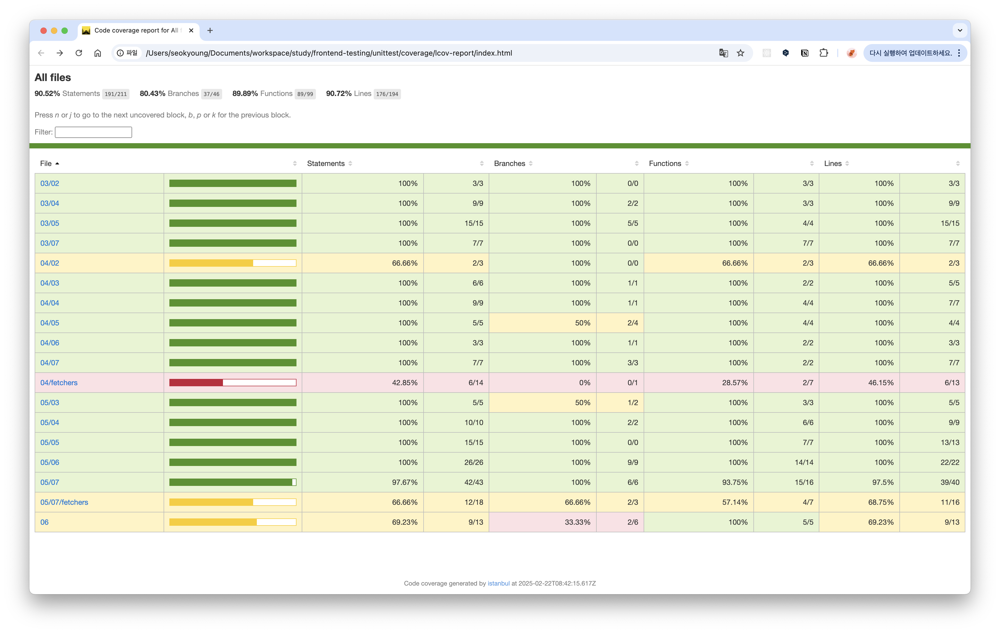

## 커버리지 리포트

### 커버리지 리포트 출력하기

```bash
npx jest --coverage
```


### 커버리지 리포트 구성

- `Stmts`: 구현 파일에 있는 모든 구문이 적어도 한 번은 실행됐는지
- `Branch`: 구현 파일에 있는 모든 조건 분기가 적어도 한 번은 실행됐는지 (`if`문, `case`문, 삼항연산자)
- `Funcs`: 구현 파일에 있는 모든 함수가 적어도 한 번은 호출됐는지
- `Lines`: 구현 파일에 포함된 모든 라인이 적어도 한 번은 통과됐는지

## 커버리지 리포트 읽기

- `jest.config.ts` 설정을 추가하여 HTML로 커버리지 리포트 생성하기

```bash
export default {
	collectCoverage: true,
	coverageDirectory: 'coverage'
}
```

- 테스트 실행 후, 커버리지 리포트 HTML 열기

```bash
open coverage/lcov-report/index.html
```



> 색깔로 테스트 커버리지 정도를 셀의 색깔로 알 수 있음
>
> - 🟢 → 테스트가 충분하다
> - 🟡, 🔴 → 테스트가 불충분하다

### 함수의 테스트 커버리지

```bash
export function greetByTime() {
  const hour = new Date().getHours();
  if (hour < 12) {
    return "좋은 아침입니다";
  } else if (hour < 18) {
    return "식사는 하셨나요";
  }
  return "좋은 밤 되세요";
}
```

- `xtest`: 테스트 실행 건너뛰기

```tsx
xtest("점심에는 '식사는 하셨나요'를 반환한다", () => {
  jest.setSystemTime(new Date(2023, 4, 23, 14, 0, 0))
  expect(greetByTime()).toBe('식사는 하셨나요')
})
```

- 커버리지를 더 높이고 싶다면 함수 커버리지와 분기 커버리지에 중점을 두자
- 커버리지 리포트는 구현 코드의 내부 구조를 파악하여 논리적으로 문서를 작성하는 화이트박스 테스트에 필수

### UI 컴포넌트의 테스트 커버리지

- 커버리지는 객관적인 측정이 가능한 정량 지표
- 하지만 커버리지 수치가 높다고 반드시 품질이 높은 것은 아님
  - 커버리지 충족이 버그가 없다는 것을 보장해주지 않음

## 커스텀 리포트

### `jest-html-reporters`

- 테스트 실행 결과를 그래프 형태로 보여주는 라이브러리
- 시간이 많이 걸리는 테스트를 찾거나 정렬 기능이 있어 편리함

#### 설치 및 설정

```bash
npm i jest-html-reporter
```

- `jest.config.ts` 설정

```ts
reporters: [
  'default',
  [
    'jest-html-reporters',
    {
      publicPath: '__reports__',
      filename: 'jest.html',
    },
  ],
]
```
