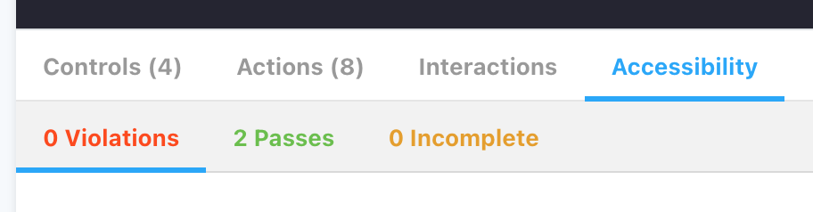
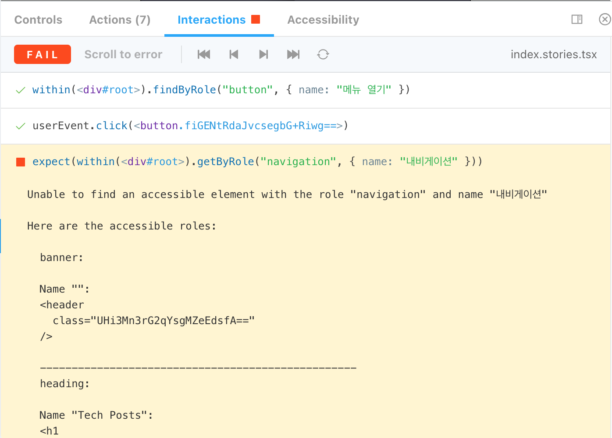
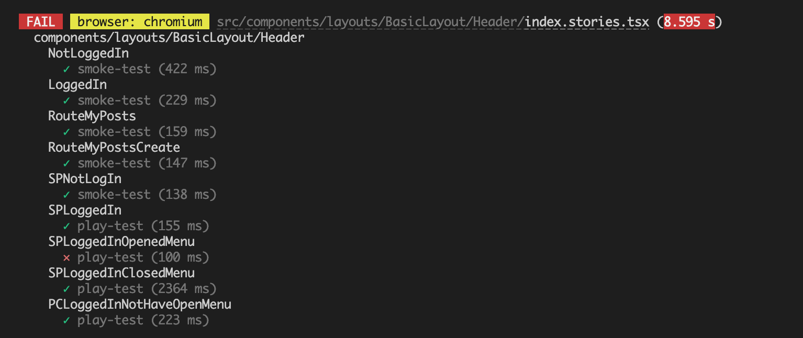

## 스토리북

### 스토리북 설치

```bash
npx storybook init
```

### 스토리 등록

- 최신 포맷인 [CSF3.0](https://storybook.js.org/blog/component-story-format-3-0/)에 따라 작성

> [!NOTE]
>
> #### **Component Story Format (CSF) 3.0**
>
> - **스토리북에서 컴포넌트의 스토리를 작성하는 권장 방식**
> - ES6 모듈 기반 → export를 사용하여 컴포넌트 스토리를 정의
> - 포터블(Portable) → Storybook 외의 환경에서도 활용 가능
> - 자동 문서화 → Storybook Docs에서 자동으로 문서화 지원
>
> #### 스토리 작성 방식
>
> - `storiesOf` → `CSF` → `CSF 3.0`
>
> ```tsx
> storiesOf('atoms/Button', module)
>   .add('text', () => <Button>Hello</Button>)
>   .add('emoji', () => <Button>😀😎👍💯</Button>)
> ```
>
> ```tsx
> export default { title: 'atoms/Button' }
>
> export const text = () => <Button>Hello</Button>
> export const emoji = () => <Button>😀😎👍💯</Button>
> ```
>
> ```tsx
> // CSF 3.0
> export default { component: Button }
> export const Primary = { args: { primary: true } }
> ```
>
> #### 3.0 주요 변경점
>
> - 스토리 작성법: 함수 표현식 → 객체 표현식
> - 어떻게 렌더링할지 선언하지 않고 args로 전개 방식을 전달 알아서 처리해줌 → 대신 명시적으로 선언하고 싶으면 `render` 사용

### 3단계 깊은 병합

- Global 단계: 모든 스토리에 적용할 설정(`.storybook/preview.js`)
- Component 단계: 스토리 파일에 적용할 설정 (`export default`)
- Story 단계: 개별 스토리에 적용할 설정(`export const`)

## 스토리북 필수 애드온

> 공식 문서: [Essential addons](https://storybook.js.org/docs/essentials)

### Controls

- `@storybook/addon-controls`
- `props` 변경에 따른 UI 컴포넌트 확인 가능
  - 긴 문자열을 입력했을 때 레이아웃 처리가 되었는지?
  - 의도한대로 줄넘김이 되는지?

### Actions

- 이벤트 핸들러의 네이밍 컨벤션에 맞추어 전역에서 로그 출력 가능

```tsx
// .storybook/preview.js
export const parameters = {
  // on으로 시작하는 모든 이벤트 핸들러 로그 출력
  actions: { argTypesRegex: '^on[A-Z].*' },
}
```

### Viewport

- 반응형으로 구현한 UI 컴포넌트를 화면 크기별로 스토리 등록 가능

```tsx
const const SPStory = {
  parameters: {
    viewport: {
      viewports: INITIAL_VIEWPORTS,
      defaultViewport: 'iphone6',
    },
  },
}
```

> [!NOTE]
>
> #### `@storybook/addon-essentials`
>
> - Actions: `@storybook/addon-actions`
> - Backgrounds: `@storybook/addon-backgrounds`
> - Controls: `@storybook/addon-controls`
> - Docs: `@storybook/addon-docs`
> - Highlight: `@storybook/addon-highlight`
> - Measure: `@storybook/addon-measure`
> - Outline: `@storybook/addon-outline`
> - Toolbars: `@storybook/addon-toolbars`
> - Viewport: `@storybook/addon-viewport`

## Context API에 의존하는 스토리 등록

> 스토리북의 데커레이터로 초기 값을 주입하는 `Provider` 만들기

### 데커레이터

- 스토리의 렌더링 함수에 적용할 래퍼 역할
  - 추가적인 마크업, 스타일링, 로직, 컨텍스트 추가 가능
- 3단계의 상속이 가능: Story → Component → Global

### Provider를 소유한 데커레이터

> 스토리북 전용 `Provider`를 데커레이터로 만드는 것이 좋다.

```tsx
// src/components/layouts/BasicLayout/index.tsx
export const BasicLayoutProviders = ({ children }: { children: ReactNode }) => {
  return (
    <LoginUserInfoProvider>
      <ToastProvider>
        <AlertDialogProvider>{children}</AlertDialogProvider>
      </ToastProvider>
    </LoginUserInfoProvider>
  )
}
```

```tsx
// src/tests/storybook.tsx
export const BasicLayoutDecorator = (Story: PartialStoryFn<ReactFramework, Args>) =>
  BasicLayout(<Story />)
```

### 데커레이터 고차함수

> 고차함수(HOF)를 사용하여 데커레이터 만드는 반복을 줄이고 쉽게 만들 수 있음

```tsx
function createDecorator(defaultState?: Partial<ToastState>) {
  return function Decorator() {
    return <ToastProvider defaultState={{ ...defaultState, isShown: true }}>{null}</ToastProvider>
  }
}

export const Succeed: Story = {
  decorators: [createDecorator({ message: '성공했습니다', style: 'succeed' })],
}

export const Failed: Story = {
  decorators: [createDecorator({ message: '실패했습니다', style: 'failed' })],
}
```

## 웹 API에 의존하는 스토리 등록

> 웹 API를 대체하는 msw를 활용해서 스토리를 등록한다.

- msw 전용 애드온 `msw-storybook-addon` 설치

```bash
npm install msw msw-storybook-addon --save-dev
```

- 초기 설정

```tsx
// .storybook/preview.js
import { initialize, mswDecorators } from 'msw-storybook-addon'

export const decorators = [mswDecorators]

initialize()
```

> [!NOTE]
>
> - `msw` v2 에 맞춰, `msw-storybook-addon`도 업데이트가 된 상태
> - `mswDecorator` → `mswLoader`로 변경
>
> ```tsx
> // .storybook/preview.js
> import { initialize, mswLoader } from 'msw-storybook-addon'
>
> const preview = {
>   loaders: [mswLoader],
> }
>
> initialize()
>
> export default preview
> ```

### 요청 핸들러 설정

- 3단계의 상속이 가능: Story → Component → Global
- 같은 컴포넌트에서 웹 API 응답에 따라 다른 내용을 표시할 때도 유연하게 대응 가능

```tsx
export const NotLoggedIn: Story = {
  parameters: {
    msw: {
      handlers: [
        rest.get('/api/my/profile', async (_, res, ctx) => {
          return res(ctx.status(401))
        }),
      ],
    },
  },
}
```

### 고차함수로 요청 핸들러 리팩터링하기

> 고차함수를 사용하여 재사용 가능한 요청 핸들러를 만들 수 있다.

```tsx
export function handleGetMyProfile(args?: { mock?: jest.Mock<any, any>; status?: number }) {
  return rest.get(path(), async (_, res, ctx) => {
    args?.mock?.()
    if (args?.status) {
      return res(ctx.status(args.status))
    }
    return res(ctx.status(200), ctx.json(getMyProfileData))
  })
}
```

```tsx
export const NotLoggedIn: Story = {
  parameters: {
    msw: { handlers: [handleGetMyProfile({ status: 401 })] },
  },
}
```

## Play function을 활용한 인터랙션 테스트

> 폼과 같은 인터랙션이 필요한 UI 컴포넌트에 `play` 함수를 사용하여 인터랙션 할당 상태를 스토리에 등록할 수 있다.

- 관련 애드온 설치 (jest/testing-library)

```bash
npm install @storybook/testing-library @storybook/jest @storybook/addon-interactions --save-dev
```

```jsx
// .storybook/main.js
module.exports = {
  addons: ['@storybook/addon-interactions'],
  features: {
    interactionDebugger: true,
  },
}
```

- 스토리에 `play` 함수 설정

```tsx
export const SavePublish: Story = {
  play: async ({ canvasElement }) => {
    const canvas = within(canvasElement)
    await user.type(canvas.getByRole('textbox', { name: '제목' }), '나의 기사') // 인터랙션 할당 - 입력 재현
    await user.click(canvas.getByRole('switch', { name: '공개 여부' })) // 인터랙션 할당 - 클릭 재현
    await expect(canvas.getByRole('button', { name: '공개하기' })).toBeInTheDocument() // 단언문 작성
  },
}
```

## 접근성 테스트

- 관련 애드온 설치 (jest/testing-library)

```bash
npm install @storybook/addon-a11y --save-dev
```

```jsx
// .storybook/main.js
module.exports = {
  addons: ['@storybook/addon-a11y'],
}
```

### 접근성 관련 주의 사항 점검하기



- 🔴 Violations: 접근성 위반
- 🟢 Passes: 접근성 준수
- 🟡 Incomplete: 접근성 수정 필요

### 일부 규칙 위반 무효화하기

```jsx
 parameters: {
    a11y: {
      config: { rules: [{ id: "label", enabled: false }] },
    },
 },
```

> [!NOTE]
>
> ### axe-core
>
> - rule 참고 문서: [Rule Descriptions](https://github.com/dequelabs/axe-core/blob/develop/doc/rule-descriptions.md)
> - **Rule ID**: 접근성 검사 규칙의 이름 → _책에서 말하는 참고하라는 셀_
> - **Impact**: 규칙 위반 시 심각도 (Critical → Serious → Moderate)

### 접근성 검증 생략하기

> 일부 규칙 위반 무효화와 달리 접근성 자체를 검증 대상에서 제외시키므로 신중하게 사용해야 한다.

```jsx
 parameters: {
    a11y: {
      disabled: true,
    },
 },
```

## 스토리북 테스트 러너




## 스토리를 통합테스트에서 재사용하기

```jsx
import { composeStories } from '@storybook/testing-react'
import { render, screen } from '@testing-library/react'
import * as stories from './index.stories'

// jest에서 사용하는 테스트에 스토리 파일을 불러오기
const { Default, CustomButtonLabel, ExcludeCancel } = composeStories(stories)

test('Default', () => {
  render(<Default />) // 스토리 렌더링
  expect(screen.getByRole('alertdialog')).toBeInTheDocument()
})
```

### 테스트 러너와의 차이점

- jest에서 스토리를 사용할 때의 장점
  - 목 모듈 혹은 스파이 함수가 필요한 테스트를 작성할 수 있음
  - 헤드리스 브라우저를 사용하지 않아 실행 속도가 빠름
- 테스트 러너의 장점
  - 테스트 파일을 따로 만들지 않아 상대적으로 적은 작업량
  - 브라우저를 사용해 실제 환경과 유사성이 높음
