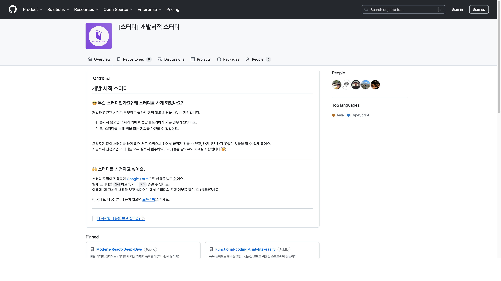
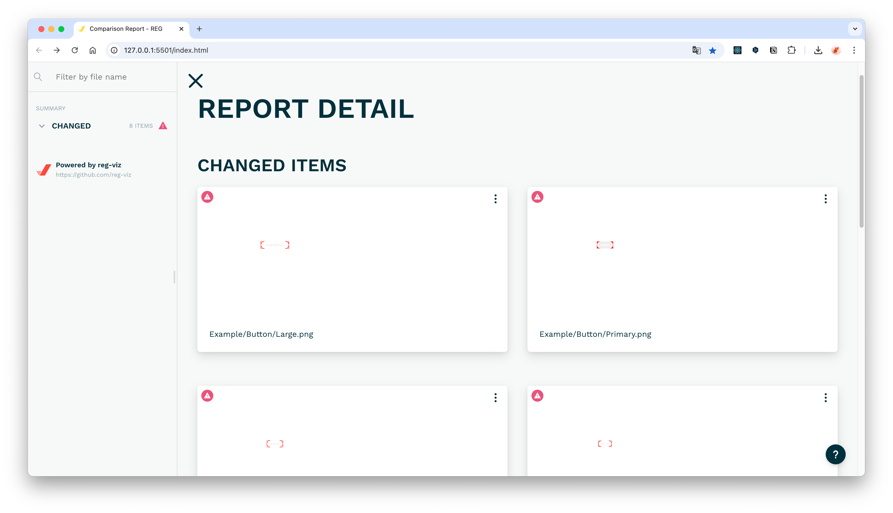
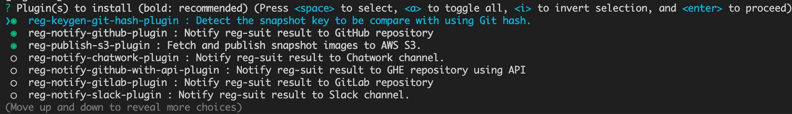
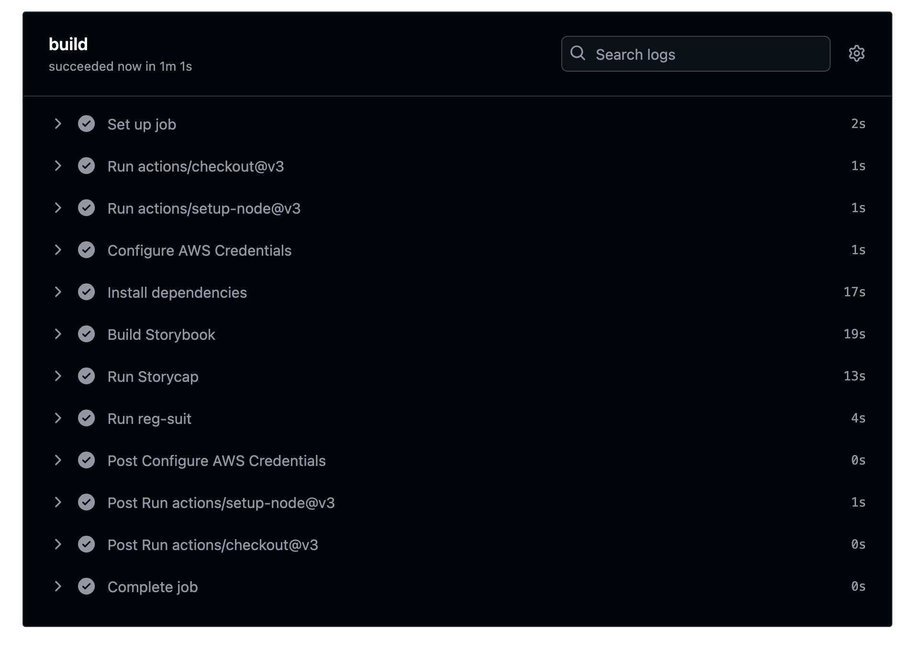
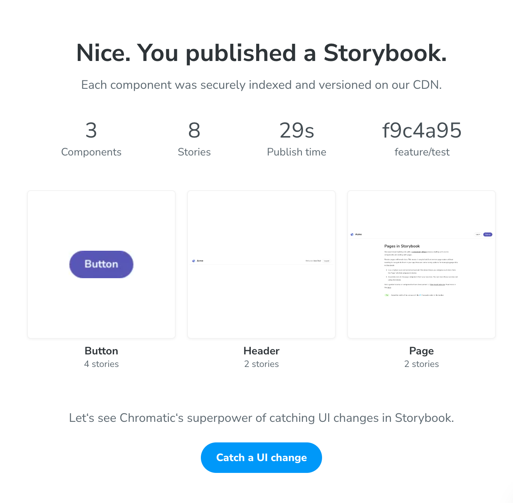
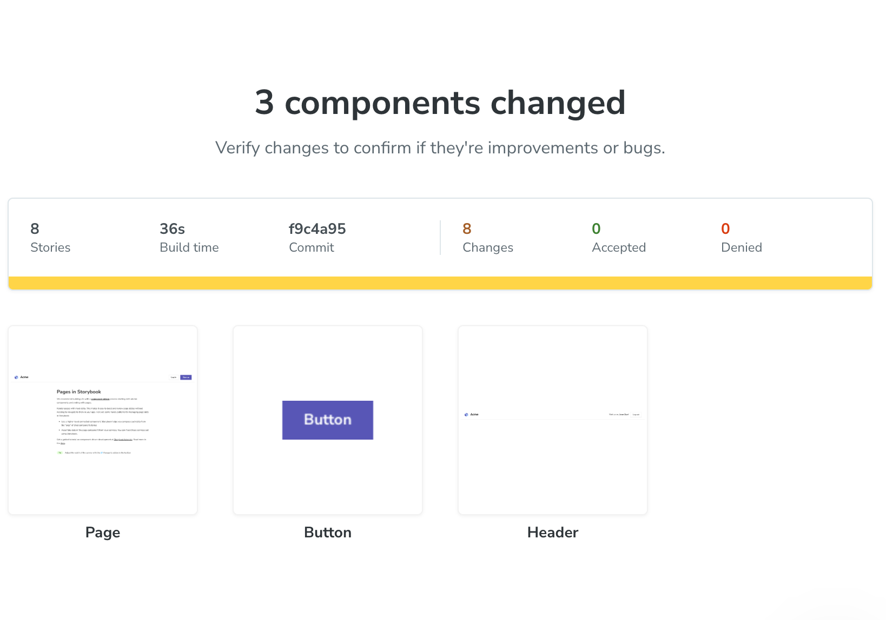
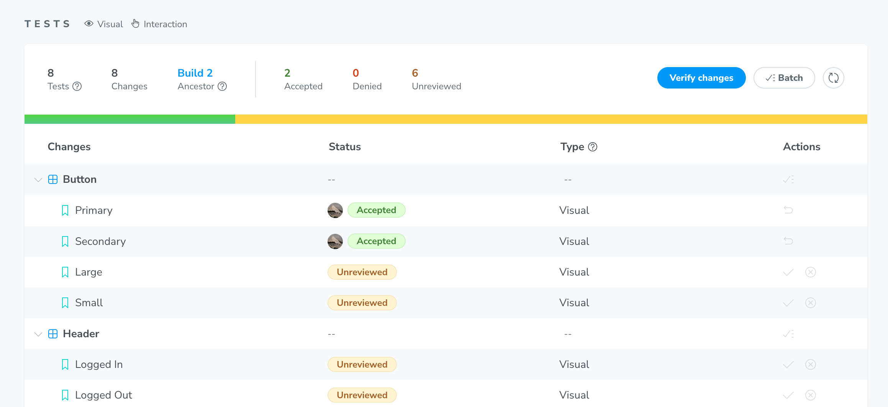

## 시각적 회귀 테스트의 필요성

### 스타일 변경 검증의 어려움

- CSS는 여러 프로퍼티가 중첩되어 최종 스타일이 결정됨
- 명시도, 적용 순서, 전역 스타일 등의 영향을 받으므로 코드만으로 예측이 어려움
- 가장 이상적인 방법은 브라우저별로 모든 페이지를 육안으로 확인하는 것 → 현실적으로 어려움
- 컴포넌트 기반 개발이 스타일 변경에 미치는 영향
  - 👍 장점: 로직 뿐만 아니라 CSS 코드의 중복을 최소화하여 한 곳에서 관리할 수 있음
  - 👎 단점: 하나의 컴포넌트를 여러 화면에서 사용하기 때문에 컴포넌트를 수정 시 영향 범위가 큼

### 스냅숏 테스트로 시각적 회귀 테스트를 대체할 수 있을까?

- 스냅숏 테스트도 시각적 회귀 테스트의 방법 중 하나
- 스냅숏 테스트의 한계
  - 전역 스타일이 미치는 영향을 알기 어려움
  - HTML 출력 결과를 비교하기 때문에 CSS Modules로 정의한 내용을 파악할 수 없음

### 시각적 회귀 테스트의 선택지

> ✨ 가장 신뢰도 높은 방법은 **실제 브라우저에 렌더링된 화면을 비교하는 테스트**하는 것

- 테스트할 화면을 브라우저에 렌더링하고 **특정 시점에 캡처한 이미지들을 픽셀 단위로 비교**
- 시각적 회귀 테스트는 헤드리스 브라우저를 실행한 상태에서 실시
- E2E 테스트 프레임워크에는 헤드리스 브라우저가 포함되어 있음
- 따라서 대부분 E2E 테스트 프레임워크는 공식적으로 시각적 회귀 테스트 지원
  - 프레임워크는 헤드리스 브라우저에 화면을 요청하고 화면이 이동하면 화면을 캡처
  - 이와 같은 방식으로 모든 페이지를 캡처하면 스타일 변경 전후의 차이점 발견 가능
- 스타일 변경 전후의 이미지를 비교하면 어떤 화면이 변경됐는지 확인할 수 있으나 세세하게 알 수는 없음
  - 시각적 회귀 테스트를 UI 컴포넌트 단위로 실시 → 스토리북 활용

> [!NOTE]
>
> #### 🎯 헤드리스 브라우저(Headless Browser)
>
> - GUI 없이 명령어 기반으로 동작하는 웹브라우저
> - 일반적인 브라우저처럼 HTML을 렌더링하고, JavaScript를 실행하며, 네트워크 요청을 처리
> - UI 렌더링이 없어서 일반 브라우저보다 대체로 빠른 편
> - 자동화에 최적화되어 테스트, 웹 스크래핑 등에 사용 (Playwright, Cypress, Puppeteer 등)
>
> #### 🎯 헤드리스 브라우저로 웹사이트 캡처하기
>
> ```bash
> $ alias chrome="/Applications/Google\ Chrome.app/Contents/MacOS/Google\ Chrome"  # Chrome 위치
> $ chrome --headless --screenshot --window-size=1920,1080 https://github.com/Book-Study-For-Developer
> ```
>
> 
>
> - Chrome 59부터 제공된 초기 헤드리스 모드 - [헤드리스 Chrome 시작하기](https://developer.chrome.com/blog/headless-chrome?hl=ko)
> - Chrome 112부터 제공된 헤드리스 모드 - [Chrome 헤드리스 모드](https://developer.chrome.com/docs/chromium/headless?hl=ko)
> - https://blog.outsider.ne.kr/1291

## `reg-cli`로 이미지 비교하기

> ✨ `reg-suit`의 핵심 기능<br/>
> ✨ 기존 이미지와 비교할 이미지를 담은 디렉터리를 비교해서 그 차이점을 리포트로 출력

```bash
$ mkdir vrt && vrt
$ mkdir {actual,expected,diff}
```

- 기존 이미지와 비교할 이미지를 담은 디렉터리를 비교해서 그 차이점을 리포트로 출력
- 각 디렉터리에 이미지가 있는지 확인하고, 이미지 간 차이점을 검출
  - `actual`: 기존 이미지
  - `expected`: 비교할 이미지
  - `diff`: 비교 결과를 검출한 이미지
- 직접 확인해보자 → [reg-viz.github.io/reg-cli/](https://reg-viz.github.io/reg-cli/)

## Storycap 도입

> ✨ 스토리북을 활용한 시각적 회귀 테스트

```bash
$ npm install storycap --save-dev
```

### Storycap 설정

- Storybook 설정 파일에 Storycap 설정 추가

```jsx
// preview.js
import { withScreenshot } from 'storycap'

export const decorators = [withScreenshot]
```

```jsx
// main.js
module.exports = {
  addons: ['storycap'],
}
```

### Storycap 실행

```json
// package.json
{
  "scripts": {
    "storybook:build": "storybook build",
    "storycap": "storycap --serverCmd \"npx http-server storybook-static -a localhost -p 6006\" http://localhost:6006"
  }
}
```


- Storybook 빌드 → Storycap 실행 → 모든 스토리 캡처
  - 이때 만들어지는 정적 사이트는 `storybook-static` 하위에 생김
  - 캡처가 완료된 이미지는 `__screenshots__` 디렉터리에 저장됨



## reg-suit + AWS S3 + Github Actions

> ✨ 깃허브 연동을 통한 시각적 회귀 테스트 자동화


- `Fetch Expected`: topic 브랜치에서 비교 기준이 될 Expected 이미지를 가져오기
- `Push Actual`: topic 브랜치에서 현재 상태의 Actual 이미지를 저장소에 푸시
- `Compare`: Expected 이미지와 Actual 이미지를 비교해서 시각적 차이 검출



- `reg-keygen-git-hash-plugin`: git 커밋 해시를 기준으로 고유한 이미지 파일 이름 생성
- `reg-publish-s3-plugin`: Amazon S3에 시각적 회귀 테스트 결과 업로드
- `reg-notify-github-plugin`: GitHub PR에 시각적 회귀 테스트 결과 알림



> #### 🎯 Github Actions
>
> - `name`: 워크플로우의 이름
> - `on`: 워크플로우를 트리거하는 이벤트
> - `env`: 워크플로우에서 참조하는 환경 변수
> - `jobs`: 워크플로우에서 실행할 작업들
> - `runs-on`: 작업이 실행될 가상 환경의 운영체제
> - `steps`: 각 작업에서 실행할 모든 스텝
> - `uses`: `steps`에서 액션을 사용할 때 선언
>   - `actions/checkout`: CI 환경에서 저장소 접근
>   - `actions/setup-node`: CI 환경에 특정 버전의 Node.js 설치
> - `run`: CI 환경에서 실행할 커맨드

## 시각적 회귀 테스트를 활용한 적극적 리팩터링

- 반응형 디자인에 활용하기
- 릴리스 직전에 실제로 필요한 CSS 코드만 남기는 리팩터링으로 활용 가능
- 스토리 커밋 습관화로 스토리 단위로 시각적 회귀 테스트 실시 가능

## Chromatic로 시각적 테스트

> Chromatic is a **visual testing & review tool** that scans every possible UI state across browsers to catch visual and functional bugs before they reach users. Assign reviewers and resolve discussions to streamline team sign-off.<br/>
> ✨ 시각적 테스트 및 리뷰 자동화

### 프로젝트에 Chromatic 연동하기

> 후기: 크로마틱이 알아서 다 해줌..🥹

- https://www.chromatic.com/

> [!NOTE]
>
> 😰 크로마틱이 `build-storybook` 스크립트를 읽어서 프로젝트를 자동으로 연동해주기 때문에 이전 Storycap을 사용하면서 변경했던 `storybook:build` 스크립트를 다시 되돌려야한다..
>
> ```jsx
> "build-storybook": "storybook build", // Storybook 빌드 스크립트명을 꼭 build-storybook으로 지정
> ```
>
> 😇 이것만 주의하면 나머지는 크로마틱이 알아서 다 해준다... .

|                      변경 전                      |                      변경 후                      |
| :-----------------------------------------------: | :-----------------------------------------------: |
|  |  |

> ✨ 리뷰 기능도 있다!



> [!NOTE]
>
> #### 🎯 reg-suit vs Chromatic ?
>
> 둘 다 이번 책을 읽으면서 처음 써봤다. 그래서 단편적인 비교일 수 있지만... 나라면 크로마틱을 쓸 것 같다.
> <br/>(압도적으로 편했다. 이전에 이미 워크플로우를 설정해준 탓도 있지만..)
>
> 스토리북과의 연동도 좋았고, 특히 PR에서 변경된 UI 내용 뿐만 아니라 해당 변경 사항이 적용된 배포된 스토리북도 볼 수 있어 여러 사람과 협업 면에서 좋아 보였다.
>
> 
>
> - [Automate Chromatic with GitHub Actions](https://www.chromatic.com/docs/github-actions/)
