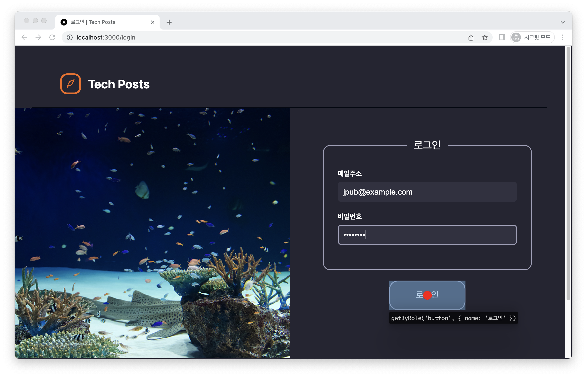
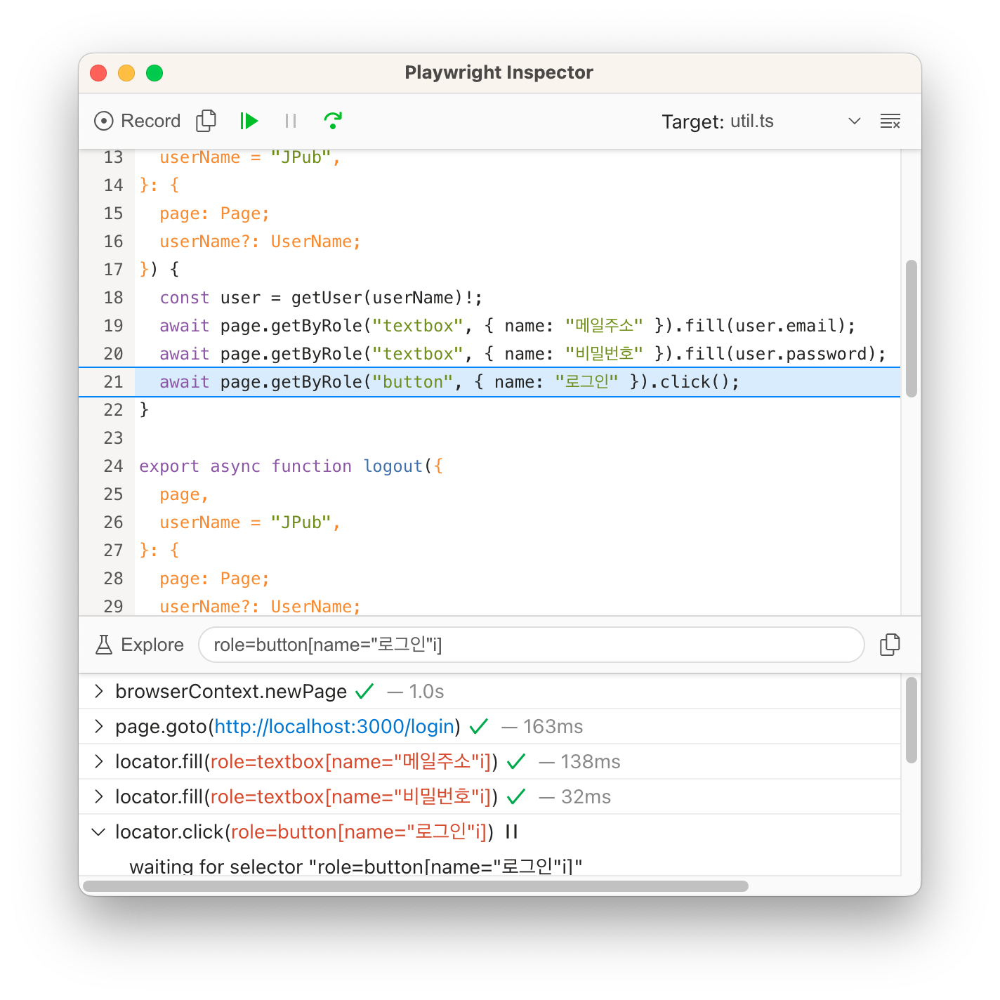
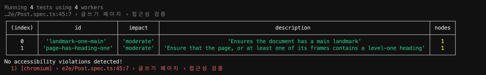

## E2E 테스트란

> 프론트엔드에서 E2E 테스트는 브라우저를 사용할 수 있기 때문에 실제 애플리케이션에 가까운 테스트가 가능하다.
> 주로 브라우저 고유의 API를 사용하는 상황이나 화면을 이동하며 테스트해야 할 때 사용한다.

### 브라우저 고유 기능과 연동한 UI 테스트

> 브라우저를 사용하지 않으면 검증하기 어려운 UI 테스트

- 화면 간의 이동
- 화면 크기를 측정해서 실행되는 로직
- CSS의 미디어 쿼리를 사용한 반응형 처리
- 스크롤 위치에 따른 이벤트 발생
- 쿠키나 로컬 저장소 등에 데이터 저장

### 데이터베이스 및 서브 시스템과 연동한 E2E 테스트

- 데이터베이스 서버와 연동하여 데이터를 불러오거나 저장
- 외부 저장소 서비스와 연동하여 이미지 등을 업로드
- 레디스와 연동하여 세션을 관리

> - 👍 장점: 표현 계층, 응용 계층, 영속 계층을 연동하여 검증하므로 실제 상황과 유사성이 높은 테스트 가능
> - 👎 단점: 많은 시스템과 연동하기 때문에 실행 시간이 길고, 불안정할 수 있음

## Playwright

> 공식 문서: https://playwright.dev/ <br/>
> 마이크로소프트가 공개한 E2E 테스트 프레임워크

- 다양한 기능 지원: 크로스 브라우징 지원, 디버깅 테스트, 리포터, 트레이스 뷰어, 테스트 코드 생성기
- 수동으로 브라우저를 조작하면서 애플리케이션 기능을 검증하는 것을 코드로 대체해 테스트를 자동화

### 로케이터(Locator)

- 공식 문서 - Locators: https://playwright.dev/docs/locators
- 현재 페이지에서 특정 요소를 가져오는 방법
- 1.27.0 버전부터 접근성 기반 로케이터가 추가됨 (권장)

```jsx
await page.getByLabel('User Name').fill('John')
await page.getByRole('button', { name: 'Sign in' }).click()
await page.getByPlaceholder('name@example.com').fill('playwright@microsoft.com')
```

- 대기 시간이 필요한지에 따라 쿼리 타입 구분해서 사용해야 하는 테스팅 라이브러리와 달리 비동기로 인터랙션이 완료될 때까지 기다린 후 다음 인터랙션을 실행하는 방식으로 동작

### 단언문(Assertion)

- 공식 문서 - Assertions: https://playwright.dev/docs/test-assertions
- 명시적으로 `expect`를 import해서 작성
- 사용법은 jest와 유사하고, 검증하고자 하는 요소에 알맞은 매처와 조합하여 단언문 작성

```jsx
import { expect } from '@playwright/test'
test('페이지를 사용한 단언문 작성법', async ({ page }) => {
  await expect(page).toHaveURL(/.*intro/)
  await expect(page).toHaveTitle(/Playwright/)
})
```

## 개발 환경에서 E2E 테스트 실행하기

- 개발 환경에서 E2E 테스트를 실시하려면 빌드된 Next.js 애플리케이션을 실행해야 함 (+도커 컨테이너를 실행한 상태여야 함)

```bash
$ npm run build && npm run start
```

- E2E 테스트를 실행하기 전에 데이터 베이스의 테스트 데이터 초기화 필수

```bash
$ npm run prisma:reset
```

- E2E 테스트 실행 (헤드리스 모드)

```bash
$ npx playwright test
```

- 테스트 결과 리포트 생성

```bash
$ npx playwright show-report
```

- 디버깅

```bash
$ npx playwright test Login.spec.ts --debug
```

|                    e2e 테스트 화면창                    |                       디버깅 검사용 창                        |
| :-----------------------------------------------------: | :-----------------------------------------------------------: |
|  |  |

- ⏯(재생): 자동화된 UI 테스트 실행
- ⤵️(스텝오버): 한 줄씩 테스트 코드 실행

## 프리즈마를 활용한 테스트

> ✨ UI 조작으로 데이터베이스를 갱신할 수 있는지?

- 데이터베이스와 연동된 E2E 테스트는 테스트를 실행할 때마다 데이터베이스를 초기화하고 테스트용 데이터 추가 필요
- **시드 스크립트**은 항상 같은 내용을 가진 데이터 베이스를 재구축할 수 있기 때문에 테스트 및 개발 환경 초기 설정에 필수

### 프리즈마 스키마

- 프리즈마에서 데이터베이스 정의 시 엔티티 간 관계를 나타내는 도메인 특화 언어

```scheme
generator client {
  provider = "prisma-client-js"
}

datasource db {
  provider = "postgresql"
  url      = env("DATABASE_URL")
}

model User {
  id             Int    @id @default(autoincrement())
  createdAt      DateTime @default(now())
  updatedAt      DateTime @updatedAt
  name           String
  bio            String
  githubAccount  String
  twitterAccount String
  imageUrl       String
  email          String @unique
  password       String
  posts          Post[]
  likes          Like[]
}

model Post {
  id          Int     @id @default(autoincrement())
  createdAt   DateTime @default(now())
  updatedAt   DateTime @updatedAt
  title       String
  description String?
  body        String?
  imageUrl    String?
  published   Boolean @default(false)
  author      User    @relation(fields: [authorId], references: [id])
  authorId    Int
  likes       Like[]
}

model Like {
  id        Int  @id @default(autoincrement())
  createdAt DateTime @default(now())
  user      User @relation(fields: [userId], references: [id])
  userId    Int
  post      Post @relation(fields: [postId], references: [id])
  postId    Int
  authorId  Int
}
```

### 프리즈마 클라이언트

> ✨ `prisma.schema` 파일에 정의된 내용에 기반한 클라이언트
> → `User` 테이블에는 `prisma.user`로, `Post` 테이블에는 `prisma.post`로 접근

- _타입스크립트와 호환성이 좋다_ → 타입 추론 제공

```tsx
import { PrismaClient } from '@prisma/client'
export const prisma = new PrismaClient()
```

### 시드 스크립트 등록

> ✨ 타입스크립트 파일을 트랜스파일링하지 않고 ts-node를 경유해 `prisma/seed/index.ts` 실행
> → `npm run prisma:reset` 실행 시 초기 데이터 주입이 가능해짐!

```json
  "prisma": {
    "seed": "ts-node --compiler-options {\"module\":\"CommonJS\"} prisma/seed/index.ts"
  }
```


### 시드 스크립트 실행

```tsx
import { PrismaClient } from '@prisma/client'
import { likes } from './like'
import { posts } from './post'
import { users } from './user'

export const prisma = new PrismaClient()

const main = async () => {
  console.log(`Start seeding ...`)
  await prisma.$transaction([...users(), ...posts(), ...likes()])
  console.log(`Seeding finished.`)
}

main()
  .catch(e => {
    console.error(e)
    process.exit(1)
  })
  .finally(async () => {
    await prisma.$disconnect()
  })
```

### 접근성 검증

- 공식 문서 - Accessibility testing: https://playwright.dev/docs/accessibility-testing
- `axe-playwright` → `axe-core` 환경을 기반으로 한 Playwright 전용 라이브러리
- `injectAxe`: 페이지에 `axe-core`를 주입하여 접근성 검사
  - ❗️`page.goto()` 다음, `checkA11y` 전에 실행
- `checkA11y`: 페이지의 접근성 검사를 실행 및 결과 반환



### Page 인터랙션

- `waitForLoadState`: 페이지가 네트워크 요청을 거의 하지 않는 상태(즉, 대부분의 요청이 완료된 상태)가 될 때까지 대기
  - 일반적으로 페이지가 완전히 로드되었는지를 확인하는 데 유용
  - `waitForLoadState('networkidle')` → 네트워크 요청이 안정될 때까지 대기
- `waitForNavigation`: 페이지가 다른 URL로 이동하거나 새로고침될 때까지 대기
  - ❗️deprecated → 경쟁 상태(race condition)를 일으킬 수 있어 정확한 URL 매칭을 요구하는 `waitForURL` 사용을 권장 ([참고](https://playwright.dev/docs/api/class-page#page-wait-))

## 불안정한 테스트 대처 방법

> 불안정한 테스트는 네트워크 지연이나 메모리 부족에 의한 서버 응답 지연 등 다양한 원인으로 발생
> 테스트 실행 순서의 영향으로 의도하지 않은 상태에서 테스트를 시작하여 문제가 발생하기도…

- 실행할 때마다 데이터베이스 재설정하기
- 테스트마다 사용자를 새로 만들기
- 테스트 간 리소스가 경합하지 않도록 주의하기
  - 각 테스트에서 새로운 리소스 작성 → 테스트 간 격리
- 빌드한 애플리케이션 서버로 테스트하기
- 비동기 처리 대기하기
- `—debug`로 테스트 실패 원인 조사하기
- CI 환경과 CPU 코어 수 맞추기
- 테스트 범위 최적화
