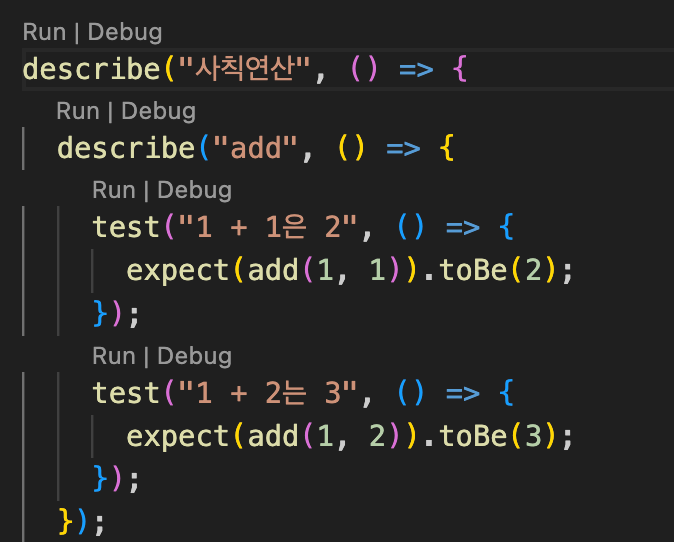
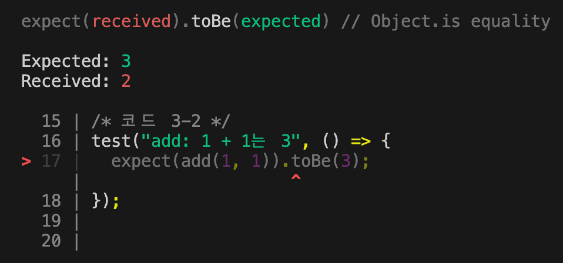
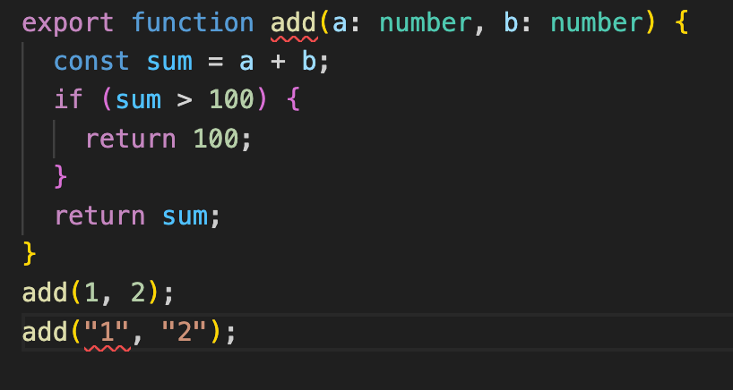

# 3. 처음 시작하는 단위 테스트

# 3.2 테스트 구성요소

## 3.2.3 테스트 구성 요소

```jsx
//index.ts
export function add(a:number, b:number) {
	return a+b;
}

add(1,2);

//index.test.ts
import { add } from './';

test("add: 1+2는 3", () => {
	expect(add(1,2)).toBe(3);
})
```

- test(테스트명, 테스트 함수)
    - jest에서 제공하는 API
    - 첫 번째 인수는 테스트명
    - 두 번째 인수는 테스트함수, 검증값이 기대값과 일치하는지 검증하는 단언문
- 단언문
    - expect(검증값).toBe(기댓값)
    - expect 함수와 이에 덧붙이는 매처로 구성되어있음

## 3.2.3 테스트 그룹 작성

```jsx
describe("add", () => {
	test("1+1은 2", () => {
		expect(add(1,1)).toBe(2);
	});
	test("1+2는 3", () => {
	 expect(add(1,2)).toBe(3);
	})
}),
```

- describe(그룹명, 그룹함수)
    - 연관성있는 테스트들을 그룹화하고 싶을 때 사용하는 함수
    - test 함수는 중첩이 불가능하지만 describe함수는 중첩이 가능
    
    ```jsx
    describe("사칙연산", () => {
      describe("add", () => {
        test("1 + 1은 2", () => {
          expect(add(1, 1)).toBe(2);
        });
        test("1 + 2는 3", () => {
          expect(add(1, 2)).toBe(3);
        });
      });
      describe("sub", () => {
        test("1 - 1은 0", () => {
          expect(sub(1, 1)).toBe(0);
        });
        test("2 - 1은 1", () => {
          expect(sub(2, 1)).toBe(1);
        });
      });
    });
    ```
    

# 3.3 테스트 실행 방법

1. 명령줄 인터페이스 실행

```jsx
//package.json

{
  "scripts": {
    "test": "jest"
   }
}

//terminal
npm test
npm test 'src/03/02/index.test.ts'
```

1. jest runner 확장프로그램 설치



- 실행 결과 확인
    - 성공한 경우
        
        ```bash
        Test Suites: 1 passed, 1 total //테스트 파일 수
        Tests:       4 passed, 4 total // 개별 테스트 수
        Snapshots:   0 total // 스냅샷 테스팅 기능 관련 결과
        Time:        0.578 s, estimated 1 s // 실제 실행시간과 예상 실행 시간
        ```
        
    - 실패한 경우
        
        

# 3.4 조건분기

테스트는 의도(사양)대로 구현됐는지 검증하는 행위다. 따라서 조건 분기가 있는 부분에는 특별히 주의해서 테스트를 작성해야한다.

- 테스트명은 함수의 의도와 기능에 부합하는 이름으로 작성하자.

```jsx
export function add(a: number, b: number) {
  const sum = a + b;
  //상한 설정
  if (sum > 100) {
    return 100;
  }
  return sum;
}

❌
test("50 + 50은 100", () => {
  expect(add(50, 50)).toBe(100);
});
test("70 + 80은 100", () => {
  expect(add(70, 80)).toBe(100);
});

✅
test("반환값은 첫 번째 매개변수와 두 번째 매개변수를 더한 값이다", () => {
  expect(add(50, 50)).toBe(100);
});
test("반환값의 상한은 '100'이다", () => {
  expect(add(70, 80)).toBe(100);
});
```

# 3.5 엣지 케이스와 예외처리

- 타입스크립트로 입력값 제약 설정
    - 다른 타입의 값이 할당되면 실행하기 전에 오류 발생
        
        
        
- 예외 발생시키기
    - 입력값이 기댓값과 다르면 예외를 발생시켜 프로그램을 중지함
    
    ```jsx
    export function add(a: number, b: number) {
      if (a < 0 || a > 100) {
        throw new Error("0〜100 사이의 값을 입력해주세요"); 
      }
      if (b < 0 || b > 100) {
        throw new Error("0〜100 사이의 값을 입력해주세요");
      }
      const sum = a + b;
      if (sum > 100) {
        return 100; 
      }
      return sum; 
    }
    
    test("인수가 '0~100'의 범위밖이면 예외가 발생한다", () => {
      expect(() => add(110, -10)).toThrow("0〜100 사이의 값을 입력해주세요");
    });
    ```
    
- 예외 발생 검증 테스트
    - 범위 밖의 값을 할당했을 때 예외가 발생하는지 검증한다.
    - expect 인수로 **값이 아닌 예외가 발생하는 함수를 할당**하고 매처로 toThrow를 사용한다.
        
        ```jsx
        test("올바른 단언문 작성법", () => {
          ❌
          expect(add(-10, 110)).toThrow();
          ✅
          expect(() => add(-10, 110)).toThrow();
        });
        ```
        
    - toThrow매처의 인수로 오류메시지를 할당하면, 오류메시지가 기댓값과 일치하는지 검증할 수 있다.
        
        ```jsx
        test("인수가 '0~100'의 범위밖이면 예외가 발생한다", () => {
          expect(() => add(110, -10)).toThrow("0〜100 사이의 값을 입력해주세요");
        });
        ```
        

- instanceof 연산자를 활용하여 세부사항 검증
    - Error 클래스를 구체적인 상황에 맞게 작성하자
        
        ```jsx
        export class HttpError extends Error {}
        export class RangeError extends Error {}
        
        //입력값이 범위에 해당하지않으면, RangeError 인스턴스를 throw하는 함수
        function checkRange(value: number) {
          if (value < 0 || value > 100) {
            throw new RangeError("0〜100 사이의 값을 입력해주세요");
          }
        }
        
        export function add(a: number, b: number) {
        //매개변수 범위체크를 한 곳에서 처리할 수 있어서 더 좋은 코드가 됐음
          checkRange(a);
          checkRange(b);
          const sum = a + b;
          if (sum > 100) {
            return 100;
          }
          return sum;
        }
        
        //toThrow 매처의 인수에 클래스를 할당하여, 발생한 예외가 특정 클래스의 인스턴스인지 검증할 수 있음.
        test("특정 클래스의 인스턴스인지 검증한다", () => {
          // ✅ 발생한 예외가 RangeError이므로 실패한다
          expect(() => add(110, -10)).toThrow(HttpError);
          // ✅ 발생한 예외가 RangeError이므로 성공한다
          expect(() => add(110, -10)).toThrow(RangeError);
          // ❌ 부적절한 테스트
          // RangeError가 Error를 상속받은 클래스라 테스트에 성공하지만, 
          // '오류를 세부적으로 구분한다'는 의도에 맞게 RangeError를 할당하는게 적절함.
          expect(() => add(110, -10)).toThrow(Error);
        })
        
        ```
        

# 3.6 용도별 매처

<aside>
💡

공식문서 참고 [https://jestjs.io/docs/using-matchers](https://jestjs.io/docs/using-matchers)

</aside>

- 진릿값 검증
    
    ```jsx
    describe("진릿값 검증", () => {
      test("참인 진릿값 검증", () => {
        expect(1).toBeTruthy();
        expect("1").toBeTruthy();
        expect(true).toBeTruthy();
        expect(0).not.toBeTruthy();
        expect("").not.toBeTruthy();
        expect(false).not.toBeTruthy();
      });
      test("거짓인 진릿값 검증", () => {
        expect(0).toBeFalsy();
        expect("").toBeFalsy();
        expect(false).toBeFalsy();
        expect(1).not.toBeFalsy();
        expect("1").not.toBeFalsy();
        expect(true).not.toBeFalsy();
      });
      test("null과 undefined 검증", () => {
        expect(null).toBeFalsy();
        expect(undefined).toBeFalsy();
        expect(null).toBeNull();
        expect(undefined).toBeUndefined();
        expect(undefined).not.toBeUndefined();
      });
    });
    ```
    
    - `toBeTruthy` true값 일치
    - `toBeFalsy` false값 일치, null이나 undefined도 일치
    - `not` 추가 시 진릿값을 반전
    - `toBeNull`  null 일치
    - `toBeUndefined` undefined 일치

- 수치 검증
    
    ```jsx
    describe("수치 검증", () => {
      const value = 2 + 2;
      test("검증값이 기댓값과 일치한다", () => {
        expect(value).toBe(4);
        expect(value).toEqual(4);
      });
      test("검증값이 기댓값보다 크다", () => {
        expect(value).toBeGreaterThan(3); // 4 > 3
        expect(value).toBeGreaterThanOrEqual(4); // 4 >= 4
      });
      test("검증값이 기댓값보다 작다", () => {
        expect(value).toBeLessThan(5); // 4 < 5
        expect(value).toBeLessThanOrEqual(4); // 4 <= 4
      });
      test("소수 계산은 정확하지 않다", () => {
        expect(0.1 + 0.2).not.toBe(0.3);
      });
      test("소수 계산 시 지정한 자릿수까지 비교한다", () => {
        expect(0.1 + 0.2).toBeCloseTo(0.3); // 두 번째 인수의 기본값은 2다.
        expect(0.1 + 0.2).toBeCloseTo(0.3, 15);
        expect(0.1 + 0.2).not.toBeCloseTo(0.3, 16);
      });
    });
    ```
    
    - 등가 비교나 대소 비교 관련 매처
    - javascript는 소숫점 계산에 오차가 있어서 소숫값을 검증할 때는  `toBeCloseTo` 매처를 사용함

<aside>
❓

소숫점 계산 오차 이슈

- 컴퓨터는 10진수를 2진수로 변환해 저장하는데, 일부 소수는 2진수로 정확히 표현할 수 없어 근사값으로 저장됨
    - 10진수의 `0.1` → 2진수로 변환하면 `0.0001100110011...` (무한 반복)
    - 10진수의 `0.2` → 2진수로 변환하면 `0.001100110011...` (무한 반복)
- 이로 인해 소수점 연산에서 작은 오차가 발생함
    
    ```jsx
    console.log(0.1 + 0.2); // 예상: 0.3, 실제: 0.30000000000000004
    console.log(0.3 === 0.1 + 0.2); // 예상: true, 실제: false
    ```
    
- `toBeCloseTo`는 엄격한 비교대신 허용 오차를 설정하여 테스트를 통과하도록 설계
</aside>

- 문자열 검증
    
    ```jsx
    describe("문자열 검증", () => {
      const str = "Hello World";
      const obj = { status: 200, message: str };
      test("검증값이 기댓값과 일치한다", () => {
        expect(str).toBe("Hello World");
        expect(str).toEqual("Hello World");
      });
      test("toContain", () => {
        expect(str).toContain("World");
        expect(str).not.toContain("Bye");
      });
      test("toMatch", () => {
        expect(str).toMatch(/World/);
        expect(str).not.toMatch(/Bye/);
      });
      test("toHaveLength", () => {
        expect(str).toHaveLength(11);
        expect(str).not.toHaveLength(12);
      });
      test("stringContaining", () => {
        expect(obj).toEqual({
          status: 200,
          message: expect.stringContaining("World"),
        });
      });
      test("stringMatching", () => {
        expect(obj).toEqual({
          status: 200,
          message: expect.stringMatching(/World/),
        });
      });
    });
    
    ```
    
    - `toContain` 문자열 일부가 일치하는지 검증
    - `toMatch` 정규표현식 검증
    - `toHaveLength` 문자열 길이 검증
    - `stringContaining`, `stringMatching` 객체에 포함된 문자열 검증

- 배열 검증
    
    ```jsx
    describe("배열 검증", () => {
      describe("원시형 값들로 구성된 배열", () => {
        const tags = ["Jest", "Storybook", "Playwright", "React", "Next.js"];
        test("toContain", () => {
          expect(tags).toContain("Jest");
          expect(tags).toHaveLength(5);
        });
      });
      describe("객체들로 구성된 배열", () => {
        const article1 = { author: "taro", title: "Testing Next.js" };
        const article2 = { author: "jiro", title: "Storybook play function" };
        const article3 = { author: "hanako", title: "Visual Regression Testing" };
        const articles = [article1, article2, article3];
        test("toContainEqual", () => {
          expect(articles).toContainEqual(article1);
        });
        test("arrayContaining", () => {
          expect(articles).toEqual(expect.arrayContaining([article1, article3]));
        });
      });
    });
    ```
    
    - `toContain` 배열 내 원시형인 특정값의 포함여부 검증
    - `toHaveLength` 배열 길이 검증
    - `toContainEqual` 배열에 특정 객체 포함 여부
    - `arrayContaining` 배열에 특정 객체들 포함 여부

- 객체 검증
    
    ```jsx
    describe("객체 검증", () => {
      const author = { name: "taroyamada", age: 38 };
      const article = {
        title: "Testing with Jest",
        author,
      };
      test("toMatchObject", () => {
        //부분적으로 일치함
        expect(author).toMatchObject({ name: "taroyamada", age: 38 });
        expect(author).toMatchObject({ name: "taroyamada" });
        //일치하지않는 프로퍼티가 있음
        expect(author).not.toMatchObject({ gender: "man" });
      });
      test("toHaveProperty", () => {
        expect(author).toHaveProperty("name");
        expect(author).toHaveProperty("age");
      });
      test("objectContaining", () => {
        expect(article).toEqual({
          title: "Testing with Jest",
          author: expect.objectContaining({ name: "taroyamada" }),
        });
        expect(article).toEqual({
          title: "Testing with Jest",
          author: expect.not.objectContaining({ gender: "man" }),
        });
      });
    });
    ```
    
    - `toMatchObject` 부분적으로 일치하는 프로퍼티가 있으면 성공, 일치하지않는 프로퍼티가 있으면 실패
    - `toHaveProperty` 특정 프로퍼티 존재 여부 체크
    - `objectContaining` 객체 내 또다른 객체를 검증할 때 사용, 부분적으로 일치하면 테스트는 성공

# 3.7 비동기 처리 테스트

- Promise를 반환하는 작성법
    - Promise를 반환한 후, `then` 이나 `catch` 에 단언문을 작성하는 방법
        
        ```jsx
        // 테스트 함수가 Promise를 반환하면, 해당 작업이 완료될 때까지 테스트 판정이 유예됨
         test("지정 시간을 기다린 뒤 경과 시간과 함께 resolve된다", () => {
            return wait(50).then((duration) => {
              expect(duration).toBe(50);
            });
          });
          
        test("지정 시간을 기다린 뒤 경과 시간과 함께 reject된다", () => {
            return timeout(50).catch((duration) => {
              expect(duration).toBe(50);
            });
          });
        ```
        
    - `resolves` , `rejects` 매처를 사용한 단언문을 return하는 방법
        
        ```jsx
        test("지정 시간을 기다린 뒤 경과 시간과 함께 resolve된다", () => {
          return expect(wait(50)).resolves.toBe(50);
        });
        
        test("지정 시간을 기다린 뒤 경과 시간과 함께 reject된다", () => {
          return expect(timeout(50)).rejects.toBe(50);
        });
        ```
        
- async/await을 활용한 작성법
    - 테스트 함수를 async로 만들고, 함수 내 Promise가 완료될때까지 기다리는 방법
        
        ```jsx
        test("지정 시간을 기다린 뒤 경과 시간과 함께 resolve된다", async () => {
          await expect(wait(50)).resolves.toBe(50);
        });
        
        test("지정 시간을 기다린 뒤 경과 시간과 함께 reject된다", async () => {
           await expect(timeout(50)).rejects.toBe(50);
        });
        ```
        
    - Promise가 완료된 것을 기다린 후에 단언문 실행하는 방법
        
        ```
         test("지정 시간을 기다린 뒤 경과 시간과 함께 resolve된다", async () => {
          expect(await wait(50)).toBe(50);
        });
        ```
        
    - try-catch 문에서 catch 블록의 오류를 단언문으로 검증하는 방법
        - [expect.assertions(number)](https://jestjs.io/docs/expect#expectassertionsnumber): 테스트 중 특정 횟수의 단언문이 호출되었는지 검증
        
        ```jsx
        test("지정 시간을 기다린 뒤 경과 시간과 함께 reject된다", async () => {
          expect.assertions(1);
          try {
            await timeout(50);
          } catch (err) {
            expect(err).toBe(50);
          }
        });
        ```
        
- 비동기 처리 테스트 시 주의사항
    - Promise를 return한다.
        
        ```jsx
        test("return하고 있지 않으므로 Promise가 완료되기 전에 테스트가 종료된다", () => {
          // ❌ Promise를 반환하지않으면, 비동기작업(wait(2000))이 끝나기전에 테스트가 종료됨.
          expect(wait(2000)).resolves.toBe(3000);
          // ✅ Promise를 반환하면, Promise의 결과를 확인한 단언문 평가.
          return expect(wait(2000)).resolves.toBe(3000);
        });
        ```
        
    - 비동기 테스트함수는 `async`로 작성한다.
    - `resolves`, `rejects` 매처가 포함된 단언문은 `await`으로 기다린다.
    - `try-catch`에서는 `expect.assertions`을 사용한다.