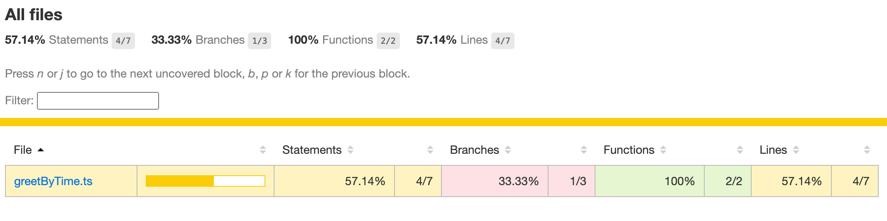
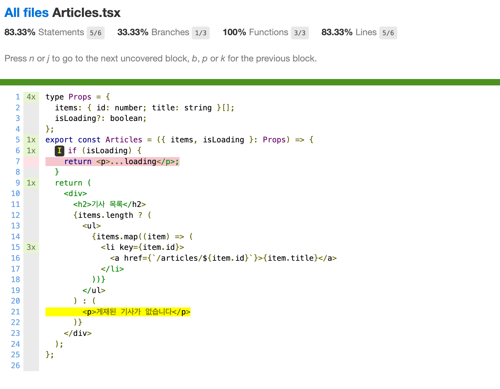

# 6. 커버리지 리포트 읽기

## 명령어 및 설정

- 명령어

```bash
npx jest --coverage
```

- coverage 설정 ([공식문서 링크](https://jestjs.io/docs/configuration#coveragedirectory-string))
    - **collectCoverage** (기본값: `false`)
        - 테스트 실행 시 커버리지 정보를 수집할지 여부를 결정하는 옵션
        - 활성화하면 테스트를 분석하고 수정하는 작업이 추가되어 테스트 속도가 저하될 가능성 존재
        - `-coverage` 플래그를 사용하면 자동으로 활성화됨
    - **collectCoverageFrom** (기본값: `undefined`)
        - 커버리지를 수집할 파일을 지정하는 glob 패턴 배열(특정 파일들을 찾기 위한 문자열 패턴)
        - 테스트 코드에서 사용되지 않은 파일도 포함 가능
        - 예: `['**/*.{js,jsx}', '!**/node_modules/**', '!**/vendor/**']`
    - **coverageDirectory** (기본값: `undefined`)
        - 커버리지 보고서를 저장할 디렉터리 경로
    - **coveragePathIgnorePatterns** (기본값: `["/node_modules/"]`)
        - 특정 경로의 파일을 커버리지 수집 대상에서 제외하는 옵션
        - 정규 표현식을 사용하여 지정 가능
    - **coverageProvider** (기본값: `babel`)
        - 코드 계측을 담당하는 프로바이더
        - **`babel` (기본값)**
            - Babel을 사용하여 JavaScript 코드를 변환하면서 커버리지 코드를 삽입하는 방식
            - 일반적으로 **Babel을 사용하는 프로젝트**(예: React, TypeScript)와 적합
            - Jest 실행 전에 코드 변환 과정이 필요하여 속도가 느려질 수 있음
        - **`v8`**
            - Chrome V8 엔진의 자체적인 커버리지 기능을 활용하는 방식
            - 코드 변환 없이 동작하므로 속도가 더 빠름
            - Babel 트랜스파일링을 사용하지 않아 일부 프로젝트에서는 예상과 다른 결과가 나올 가능성 존재
    - **coverageReporters** (기본값: `["clover", "json", "lcov", "text"]`)
        - 커버리지 보고서의 형식을 지정하는 옵션
        - 예: `['text', { skipFull: true }]` (완전히 커버된 파일 숨김)
    - **coverageThreshold** (기본값: `undefined`)
        - 최소 커버리지 기준을 설정하는 옵션
        - 기준 미달 시 Jest 테스트가 실패함
        
        ```json
        coverageThreshold: {
          global: {
            branches: 80,
            functions: 80,
            lines: 80,
            statements: -10,
          },
          './src/components/': {
            branches: 40,  // components 폴더는 브랜치 커버리지 40%만 요구
            statements: 40,
          },
        }
        ```
        
        - 특정 경로나 파일별로 설정 가능 (`./src/api/very-important-module.js`는 100% 요구 가능)

## 커버리지 지표





- **구문 커버리지 (Statement Coverage)**: 코드의 각 구문(statement)이 실행된 비율
- **분기 커버리지 (Branch Coverage)**: if, switch 등의 조건 분기가 실행된 비율
- **함수 커버리지 (Function Coverage)**: 함수 또는 메서드가 실행된 비율
- **라인 커버리지 (Line Coverage)**: 코드의 각 라인이 실행된 비율
