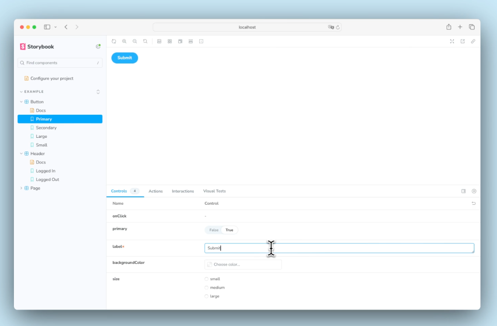

# 8. **UI 컴포넌트 탐색기**


     - 단위 테스트 (`jest`): 실행 속도가 빠르지만 실제 환경과의 유사성이 낮다.
     - E2E 테스트 (`playwright`): 실행 속도가 느리지만 실제 환경을 재현한다.
     - 스토리북은 이 두 가지의 중간으로, UI 컴포넌트를 실시간으로 테스트하고 디버깅하는 데 유용하다.

### **스토리북 설치**

   - **설치**: 프로젝트에 스토리북을 설치하려면, 아래 명령어를 사용한다.
     ```bash
     npx storybook init
     ```
   - **실행**: 설치가 완료되면 로컬 서버에서 스토리북을 실행할 수 있다.
     ```bash
     npm run storybook
     ```

### **스토리 등록**
   - 각 UI 컴포넌트에 대해 다양한 상태를 나타내는 **스토리**를 등록한다.
   - 버튼 컴포넌트에 대해 기본, 크기별, 비활성화 상태 등을 등록할 수 있다.
   
     ```js
     // Button.stories.jsx
     import { Button } from "./Button";

     export default {
       component: Button,
       title: 'Components/Button',
       argTypes: {
        label: { control: 'text' },
        disabled: { control: 'boolean' },
      },
     };

     export const Default = {
      args: {
        label: 'Click Me',
        disabled: false,
      },
    },
 
     export const Disabled = {
       args: { disabled: true },
     };
     ```

### **3단계 깊은 병합 방식**
   - **Global**, **Component**, **Story** 3단계로 설정을 적용한다. css처럼 계단식으로 스코프가 적용된다.
     - **Global 설정**: 모든 스토리에 적용할 설정 (예: `storybook/preview.js`).
     - **Component 설정**: 각 컴포넌트에 적용할 설정.
     - **Story 설정**: 각 스토리마다 적용할 개별 설정.
     


  
### 스토리북 필수 애드온

- Controls: UI 컴포넌트의 props를 실시간으로 변경해서 디버깅할 수 있다.




- Actions: 이벤트 핸들러 호출 로그를 출력한다.

```tsx
// .storybook/preview.js
  export const parameters = {
    actions: { argTypesRegex: '^on.*' },
  };
```
- 설명: 위 설정은 on으로 시작하는 모든 argType을 자동으로 추적한다. 예를 들어, onClick, onChange 등 이벤트 핸들러를 자동으로 감지한다.
- 장점: 많은 컴포넌트에서 수십 또는 수백 개의 메소드가 있을 때, 하나하나 fn 유틸리티를 지정할 필요 없이 자동으로 액션을 추적할 수 있다.
- 단점: 스토리북에 공식문서에서는 위 패턴을 권장하지않는데, 자동으로 추적된 argType은 스토리북 API인 play function에서 spy로 사용할 수 없다고 한다.


- Viewport: 다양한 화면 크기에 따른 UI 컴포넌트 테스트를 지원한다.(반응형 뷰포트 설정)

```tsx
// src/tests/storybook.tsx
import { INITIAL_VIEWPORTS } from "@storybook/addon-viewport";

export const SPStory = {
  parameters: {
    viewport: {
      viewports: INITIAL_VIEWPORTS,
      defaultViewport: "iphone6",
    },
    screenshot: {
      viewport: {
        width: 375,
        height: 667,
        deviceScaleFactor: 1,
      },
      fullPage: false,
    },
  },
};


// Header.stories.tsx
import { SPStory } from "@/tests/storybook";

export const SPLoggedIn: Story = {
  parameters: {
    ...SPStory.parameters,
  },
};

```

### Context API에 의존하는 스토리 등록

- 데코레이터란? 각 스토리의 렌더링 함수에 적용할 wrapper다.
- React의 Context API에 의존하는 UI를 테스트할 때, Provider를 활용한 데코레이터가 유용하다.


```tsx
import { LoginUserInfoProvider } from "@/components/providers/LoginUserInfo";
import { Args, PartialStoryFn } from "@storybook/csf";

export const LoginUserInfoProviderDecorator = (
  Story: PartialStoryFn<ReactFramework, Args>
) => (
  <LoginUserInfoProvider>
  //story가 context를 통해 userinfo 참조
    <Story />
  </LoginUserInfoProvider>
);

```

-
### 웹 API에 의존하는 스토리 등록

실제 API 요청을 보내지 않고도 다양한 응답을 테스트할 수 있다. 

핸들러는 Global, Component, Story 단계에서 설정할 수 있으며, 각 단계에서의 설정 범위는 다음과 같다:


```tsx
export const parameters = {
  msw: { handlers: [handleGetMyProfile()] },
};
```

```tsx
export default {
  parameters: {
    msw: { handlers: [handleGetMyProfile()] },
  },
} as ComponentMeta<typeof Header>;

```


```tsx
export const NotLoggedIn: Story = {
  parameters: {
    msw: {
      handlers: [
        rest.get('/api/my/profile', async (_, res, ctx) => {
          return res(ctx.status(401));
        }),
      ],
    },
  },
};
```


### Play function을 활용한 인터렉션 테스트

Play function은 스토리북에서 UI 컴포넌트의 사용자 행동을 자동화하고 테스트할 수 있게 해주는 기능

버튼 클릭, 텍스트 입력 등 사용자 이벤트를 코드로 시뮬레이션할 수 있음
 

- 컴포넌트
```tsx

import { useState } from 'react';

export const HelloButton = () => {
  const [text, setText] = useState('');

  return (
    <div>
      <button onClick={() => setText('Hello World!')}>Click Me</button>
      <p>{text}</p>
    </div>
  );
};
```

- 스토리

```tsx
type Story = StoryObj<typeof HelloButton>;

export const Default: Story = {
  play: async ({ canvasElement }) => {
    const canvas = within(canvasElement);

    // 버튼을 찾고 클릭 이벤트를 실행
    const button = canvas.getByRole('button', { name: 'Click Me' });
    await userEvent.click(button);

    // 'Hello World!' 텍스트가 노출나는지 확인
    await expect(canvas.getByText('Hello World!')).toBeInTheDocument();
  },
};

```

- 로그인 관련 공식문서 예제

```tsx
//storybook 공식문서 참고
export const FilledForm: Story = {
  play: async ({ canvasElement }) => {
    const canvas = within(canvasElement);
 
    const emailInput = canvas.getByLabelText('email', {
      selector: 'input',
    });
 
    await userEvent.type(emailInput, 'example-email@email.com', {
      delay: 100,
    });
 
    const passwordInput = canvas.getByLabelText('password', {
      selector: 'input',
    });
 
    await userEvent.type(passwordInput, 'ExamplePassword', {
      delay: 100,
    });

    const submitButton = canvas.getByRole('button');
 
    await userEvent.click(submitButton);
  },
};
```

### addon-a11y를 활용한 접근성 테스트

컴포넌트 단위로 접근성에 문제가 있는지 검증하는 용도로 활용한다.


다른 파라미터들과 동일하게 원하는 스코프에 설정할 수 있다.

  ```tsx
  // .storybook/main.js
  module.exports = {
    addons: ['@storybook/addon-a11y'],
  };
  ```

  ```tsx
  export default {
  	parameters: {
      a11y: { ... },
    }
  }
  ```


  ```tsx
  export const RouteMyPosts: Story = {
    parameters: {
      a11y: {...},
      nextRouter: { pathname: "/my/posts" },
    },
  };#
  ```

-  접근성 관련 주의 사항 점검하기


 Accessibility 패널을 통해 검증된 접근성 상태를 확인할 수 있고, 결과는 Violations(빨간색 - 위반), Passes(초록색 - 통과), Incomplete(노란색 - 수정필요)로 분류됩니다.

- 일부 규칙 위반을 무효화하기

 규칙이 엄격하게 느껴지면 규칙을 무효화할 수 있는데, 3단계(전체,스토리 파일,개별스토리)설정이 가능하다.

```tsx
//파일 단위 규칙 무효화
export default {
  component: Switch,
  parameters: {
    a11y: {
      config: { rules: [{ id: 'label', enabled: false }] },
    },
  },
} as ComponentMeta<typeof Switch>;
```


-  접근성 검증 생략하기

접근성 검증 자체를 생략하고 싶은 경우, `paramter.a11y.disable`를 `true` 설정한다.

규칙 무효화와의 차이점은 접근성 자체를 검증 대상에서 제외시킨다.

```tsx
export default {
  component: Switch,
  parameters: {
    a11y: { disable: true },
  },
} as ComponentMeta<typeof Switch>;
```

<br />
