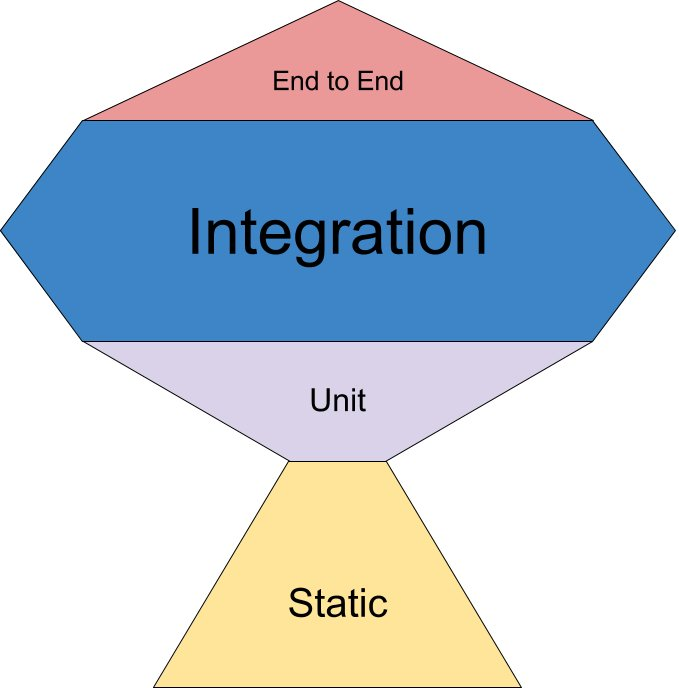

# Chapter 2. 테스트 방법과 테스트 전략

## 2.1 테스트 범위와 목적

테스트 작성법부터 배우면 오히려 상황에 맞는 테스트를 작성하는 것이 어렵게 된다. 이런 혼란을 피하기 위해 **먼저 프론트엔드 테스트의 범위와 목적을 이해해야한다**(숲을 보라는 뜻). 범위와 목적을 이해해야 테스트 자동화의 장점까지 누릴 수 있다

### 2.1.1 테스트 범위

웹 애플리케이션은 여러 모듈을 조합해 만든다(→ 반복적으로 하는 이야기). 한 가지 기능을 구현할 때도 다음과 같이 많은 모듈을 활용한다:

- 라이브러리가 제공하는 함수
- 로직을 담당하는 함수
- UI 관련 함수
- 웹 브라우저 API
- API 서버
- DB 서버

테스트를 작성할 때는 어디부터 어디까지 커버하는 테스트인지 파악해야한다. 프론트엔드 개발의 테스트 범위는 다음과 같이 크게 네 가지로 분류한다:

1. 정적 분석
    
    → TypeScript나 ESLint가 제공하는 기능을 활용하여 각 모듈의 내부 검증뿐만 아니라 인접 모듈을 연계해 사용할 때의 문제점도 검증하는 테스트
    
2. 단위 테스트
    
    → 한 가지 모듈에 한정하여 해당 모듈이 제공하는 기능을 검증하는 테스트
    
3. 통합 테스트
    
    → 모듈들의 조합으로 제공되는 기능을 검증하는 테스트
    
4. E2E 테스트
    
    → 헤드리스 브라우저와 UI 자동화 도구를 결합하여 검증하는 테스트
    

(각 테스트 범위에 대한 자세한 내용은 "2.2 프론트엔드 테스트의 범위"에서 상세히 설명된다)

### 2.1.2 테스트 목적

테스트 타입은 검증 목적에 맞게 설정해야하며, 테스트 타입마다 적절한 테스트 도구가 있다. 한 가지 도구 혹은 여러 도구를 조합해 검증하는 경우도 있다. 웹 프론트엔드의 대표적인 테스트 타입을 살펴보자:

- 기능 테스트(인터랙션 테스트)
    
    → 개발된 기능에 문제가 없는지 검증하는 테스트
    
- 비기능 테스트(접근성 테스트)
    
    → 신체적, 정신적 특성에 따른 차이 없이 동등하게 제품을 사용할 수 있는지 검증하는 테스트
    
- 회귀 테스트
    
    → 특정 시점을 기준으로 전후 차이를 비교하여 문제가 있는지 검증하는 테스트
    

(각 테스트 목적에 대한 자세한 내용은 "2.3 프론트엔드 테스트의 목적"에서 상세히 설명된다)

---

## 2.2 프론트엔드 테스트의 범위

### 2.2.1 정적 분석

(책을 빠르게 훑는게 좋을 것 같아 정리 생략)

### 2.2.2 단위 테스트

단위 테스트는 가장 기초적인 테스트이다. 테스트할 모듈이 특정 입력값을 받아 기대하는 출력값을 반환하는지 테스트한다

단위 테스트는 어떤 상황에서 예외를 발생시켜야 할지 판단할 때 도움이 된다. '이런 상황은 일어날 수 없을까? 일어난다면 어떻게 처리해야 하는가?'와 같은 거듭된 자문자답 형식의 검토 과정에서 미처 고려하지 못했던 부분을 발견할 수 있다. 즉, 단위 테스트를 통해 함수가 고려하지 못한 부분이 없는지 검증할 수 있다

### 2.2.3 통합 테스트

통합 테스트는 여러 모듈을 연동한 기능을 테스트한다. 커다란 UI 컴포넌트는 여러 모듈을 조합해 기능을 제공하며, 기능은 주로 인터랙션으로부터 시작된다. 예를 들어 다음과 같은 목록UI 컴포넌트가 있는 웹 애플리케이션을 떠올려보자:

1. 셀렉트 박스를 조작한다
2. URL 검색 쿼리가 변경된다
3. 검색 쿼리가 변경되어 데이트 취득 API가 호출된다
4. 목록 화면 내용을 갱신한다

셀렉트 박스를 조작하는 인터랙션(=1)을 시작으로 최종적으로 목록 화면 내용을 갱신하는 처리(=4)가 이뤄진다. 여기서 '1을 실행하면 4까지 실행된다'같은 테스트가 통합 테스트이다

### 2.2.4 E2E 테스트

E2E 테스트는 UI 테스트 뿐만 아니라 외부 스토리지와 같이 연동중인 하위 시스템을 포함하는 테스트이다. 입력 내용에 따라 저장된 값이 갱신되기 때문에 UI는 물론 연동된 외부 기능이 정상적으로 작동하는지 검증할 수 있다

---

## (추가정리)통합 테스트와 E2E 테스트의 차이

두 테스트 모두 통합된 기능을 평가한다는 점에서 테스트 범위의 경계가 모호하게 느껴진다. 하지만 두 테스트는 목적, 범위, 실행 환경에서 분명한 차이가 있다

### 통합 테스트

1. **테스트 범위**
    - 여러 단위(unit)나 모듈
    - 테스트 피라미드에서 중간에 위치한다
2. **검증 목적**
    - "서로 다른 요소들의 결합"이 정상 동작하는가??
    - 여러 단위(unit)나 모듈을 통합 시, 이들이 상호 작용할 때 정상 동작하는지를 검증한다
    - 컴포넌트 혹은 모듈 사이에 발생하는 의존성, 데이터 흐름, 결합 관계 등을 점검한다
    - 예를 들어 React 컴포넌트간 상호작용, API 호출 로직과 실제 화면의 연결 등 특정 부분들이 제대로 "통합"되어있는지를 점검한다
3. **테스트 환경**
    - Mocking을 통해 이루어지는 경우가 빈번하다(ex. Mock 서버를 이용하여 API와의 상호작용 테스트하고, DB 호출은 Stub 처리하는 식)
    - 사용자 이벤트(클릭, 입력 등)를 트리거 하고, 그 결과가 예상대로 UI에 반영되는지 확인한다
    - 빠르게 실행되며, 실패 시 문제 지점을 쉽게 추적할 수 있다
    - 사용하는 툴) Jest + React Testing Library, Vitest 등

### E2E 테스트

1. **테스트 범위**
    - 시스템 전반
    - 테스트 피라미드에서 최상단에 위치한다
2. **검증 목적**
    - "전체 시스템 레벨"에서 정상 동작하는가??
    - 시스템 전체의 동작과 사용자 경험을 최종적으로 확인한다
    - 실제 사용자가 브라우저에서 어떤 흐름으로 들어와서 어떤 기능을 수행하는지, 그리고 그 결과가 시스템 전반에서 올바르게 처리되어 최종적으로 기대한 값(화면, 응답)을 반환하는지 확인한다
    - 즉, 유저 플로우가 문제없이 작동하는지를 점검한다
3. **테스트 환경**
    - 백엔드, DB, 인증 시스템, 외부 API 등 실제 운영 환경에 가까운 요소들을 그대로 사용해 검증하는 경우가 많다
    - 가급적 Mocking이나 Stubbing은 최소화 하고 전체 시스템이 실제로 연결되어있는 상태에서 테스트한다
    - 예를 들어 [로그인 → 상품 검색 → 결제 → 로그아웃] 시나리오 전체를 실제 사용자처럼 실행해보며 예외없이 성공하는지 본다
    - 느리게 실행되며, 외부 서버/인프라 문제로 실패할 수 있다
    - 사용하는 툴) Cypress, Playwright, Selenium 등으로 브라우저 자동화를 수행하며 시나리오 기반으로 순차적으로 동작을 검증한다

---

## 2.3 프론트엔드 테스트의 목적

### 2.3.1 기능 테스트(인터랙션 테스트)

프론트엔드의 주요 개발 대상은 사용자가 조작할 UI 컴포넌트다. UI 컴포넌트는 사용자가 조작하면 상태를 변경하는 동시에 화면을 갱신한다. 이와 같은 UI 컴포넌트 특성으로 인해 웹 프론트엔드의 **기능 테스트**는 대부분 **인터랙션 테스트**이다(이 책에서 다루는 대부분의 테스트 코드 또한 인터랙션 테스트이다)

인터랙션 테스트라고 하면 헤드리스 브라우저를 통해 UI 자동화 테스트를 떠오를 것이다. 하지만 리액트와 같은 UI 라이브러리로 구현된 UI 컴포넌트에는 브라우저 없이도 테스트할 수 있는 가상 브라우저 환경이 있다(자세한 내용은 3장에서 다룬다)

실제 브라우저가 없어도 가능한 인터랙션 테스트 사례이다:

- 버튼을 클릭하였을 때 콜백 함수가 호출됨
- 문자를 입력하면 전송 버튼이 활성화됨
- 로그아웃 버튼을 클릭하면 로그인 화면으로 이동함

물론 가상 브라우저 만으로는 스크롤이나 세션 스토리지 같은 기능은 테스트할 수 없다. 실제 브라우저가 필요한 인터랙션 테스트 사례이다:

- 무한 스크롤
- 세션 스토리지에 저장된 값을 불러온다

### 2.3.2 비기능 테스트(접근성 테스트)

접근성 테스트는 비기능 테스트의 한 종류다. "키보드만으로 웹사이트를 이용할 수 있는가", "명암비가 시인성에 문제는 없는가"와 같은 검증 항목이 있다

### 2.3.3 시각적 회귀 테스트

시각적 회귀 테스트에서는 헤드리스 브라우저에 그려진 내용을 캡쳐하여 캡쳐된 이미지 간 차이를 검증한다. 초기에 렌더링된 상태만 캡쳐하여 비교하는 것에 그치지 않고 사용자 조작으로 변경된 화면까지 캡쳐하여 비교한다

시각적 회귀 테스트 실제 사례이다: 

- 버튼 스타일의 차이 유무
- 메뉴 바를 열었을 때 화면의 차이 유무
- 렌더링된 화면의 차이 유무

---

## 2.4 테스트 전략 모델

테스트 피라미드에서 위로 갈수록 실제 제품과 유사한 테스트가 가능하지만 실행 시간이 길고 비용이 많이 소모되며 안정성이 낮다

### 2.4.1 아이스크림 콘과 테스트 피라미드

하층부 테스트의 비중이 높을수록 더욱 안정적이고 가성비 높은 테스트가 가능하다. 상층부 테스트는 실행 시간이 길어서 신속성이 떨어지는 반면에 하층부 테스트는 실행 시간이 짧아 신속성이 높고, 신속성이 높기에 자주 실행할 수 있어서 안정성 또한 높기 때문이다. 그래서 프론트엔드 테스트 자동화에도 아이스크림 콘 모델(=상층부 집중)보다 테스트 피라미드(=하층부 집중)가 더 우수한 전략이라는 의견이 지배적이다

### 2.4.2 테스팅 트로피

테스팅 트로피는 이 책에서 중점적으로 다루는 테스트 전략모델이다. 이 모델의 핵심 아이디어는 **통합 테스트 비중이 가장 높아야 한다**는 것이다

프론트엔드 개발에서 단일 UI 컴포넌트로 구현되는 기능은 거의 없다. 예를 들어 버튼을 누르면 외부 API를 호출하는 기능도 여러 컴포넌트의 조합으로 구현된다. 또한 프론트엔드 기능은 버튼을 누르는 것과 같은 사용자 조작에서 시작한다. 테스팅 트로피에는 사용자 조작을 기점으로 한 통합 테스트의 비중이 높을수록 더욱 우수한 테스트 전략이라는 의도가 있다

---

## 2.5 테스트 전략 계획

테스트 전략 모델을 참고해 프로젝트에 최적인 전략을 수립하려면 판단 기준이 있어야 한다. 이번 절에서는 판단 기준으로 참고가 될 만한 사례들을 살펴보겠다

### 2.5.1 사례1) 리팩토링을 해야할 경우

테스트 코드가 없으면 리팩토링을 시작하기 불안할 수 있다

이때 **통합 테스트**의 양을 늘리면 안심하고 리팩토링할 수 있는 기능도 많아진다. 점진적으로 테스트를 늘리면서 리팩토링을 실시하면 더욱 안정된 테스트 피라미드 모델을 만들 수 있다

### 2.5.2 사례2) 반응형으로 제작된 프로젝트

반응형 웹은 하나의 파일로 여러 화면(모바일, PC 등)을 제공한다. 이런 경우 PC용 디자인만 수정하려고 했으나 모바일 디자인까지 수정되는 상황이 발생한다

반응형 웹은 테스팅 라이브러리만으로 세밀한 테스트가 어렵다. 특히 반응형처럼 디바이스간 서로 다른 스타일을 제공하는 경우, CSS가 적용된 렌더링 결과를 검증할 브라우저 테스트가 필요하다. 이런 상황에서 실시하는 테스트가 브라우저를 사용한 **시각적 회귀 테스트**이다

스토리북은 UI 컴포넌트 단위로 시각적 회귀 테스트가 가능하다. 반응형으로 프로젝트를 제작해야 한다면 스토리북을 사용해서 테스트를 작성하는 것이 효율적이다(자세한 내용은 8장, 9장에서 설명)

### 2.5.3 사례3) 데이터베이스를 포함한 E2E 테스트가 필요한 경우

Mock 서버가 아닌 실제 웹 API 서버를 사용해서 E2E 테스트를 하고 싶다면 테스트용 스테이징 환경을 사용해야 한다. E2E 테스트는 테스트 엔지니어가 수동으로 하는 경우가 많고, 브라우저를 사용한 UI 자동화 방식으로 테스트하는 경우도 있다(주의: 아이스크림 콘 모델에 가까운 테스트 전략이 되기 쉽다. 명확한 목적을 가지고 작은 범위의 테스트로도 충분한지를 먼저 검토해야 한다)

스테이징 환경을 만들지 않고, 테스트할 시스템을 컨테이너화 해 CI 환경에서 실행하여 테스트할 수도 있다(자세한 내용은 10장에서 설명)