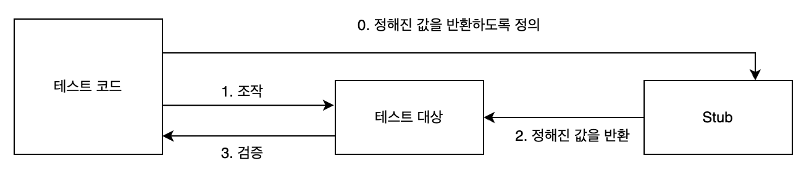
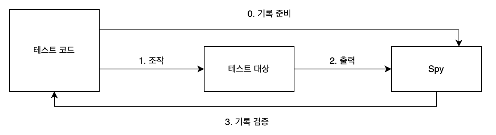
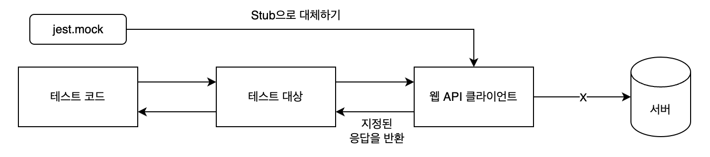

# Chapter 4. Mock 객체

## 4.1 Mock 객체를 사용하는 이유

웹 API를 사용하면 "성공하는 경우"뿐만 아니라 "실패하는 경우"도 테스트해야 한다

**Mock 객체를 사용한 테스트는 웹 API 자체가 아니라 취득한 데이터에 대한 처리**라는 것을 명심하자

테스트를 수행하기 위해 웹 API 서버가 테스트 환경에 반드시 필요한 것은 아니다. 이때 취득한 데이터 대역으로 사용되는 것이 Mock 객체이다

### 4.1.1 Mock 객체 용어

Stub, Spy 등은 Mock 객체를 상황에 따라 세분화한 객체의 명칭이다. Stub, Spy는 개발 언어에 상관없이 테스트 자동화 관련 문헌에서 정의한 용어이다

### **Stub**

**Stub**은 **미리 정의된 응답을 반환하는 객체**이다. 쉽게 말해 특정 함수를 실제로 실행시키지 않고 더미 데이터를 반환하는 역할을 한다

"웹 API에서 이런 값을 반환받았을 때는 이렇게 작동해야 한다"와 같은 테스트에 Stub을 사용한다. 이때 테스트 대상이 Stub에 접근하면 Stub은 정해진 값을 반환한다:

```tsx
const getUserData = jest.fn(() => ({ id: 1, name: "Tico" }));

test("getUserData는 정해진 데이터를 반환해야 한다", () => {
  expect(getUserData()).toEqual({ id: 1, name: "Tico" });
});
```



### Spy

Spy는 기존 함수의 동작을 유지하면서 해당 함수가 어떻게 호출되었는지 추적할 수 있는 객체이다. 실제로 함수가 실행되며 그 함수가 몇 번 호출되었는지, 어떤 인자로 호출되었는지를 확인할 수 있도록 감시(Spy)하는 역할을 한다

Spy는 테스트 대상 외부의 출력을 검증할 때 사용한다. 대표적인 경우가 인수로 받은 콜백 함수를 검증하는 것이다. 콜백 함수가 실행된 횟수, 실행시 사용한 인수 등을 기록하기 때문에 의도대로 콜백이 호출되었는지 검증할 수 있다

- (추가정리)`spyOn`이란??
    
    특정 객체의 메소드 호출을 추적, 감시하기 위해 사용된다. 주로 메소드가 몇 번 호출됐는지, 호출된 인자는 무엇인지, 실행 결과가 예상대로 나오는지 검증할 때 유용하다
    
    ```tsx
    jest.spyOn(someObject, someMethod)
    ```
    
    위의 코드는 `someMethod` 메소드를 **스파이**로 감싸며, `someMethod`가 호출될 때마다 해당 호출에 대한 정보(인자, 반환값 등)를 기록한다
    
    예시:
    
    ```tsx
    const object = {
      greet: (name: string) => `Hello, ${name}!`
    };
    
    test("greet 메소드 추적", () => {
      const spy = jest.spyOn(object, "greet");
    
      // greet 메소드 호출
      const result = object.greet("Tico");
    
      // greet 메소드가 의도대로 호출되었는지 확인
      // 아래 네 개의 expect를 모두 통과해야 pass할 수 있다
      expect(spy).toHaveBeenCalled();  // ✅ 호출 여부 확인
      expect(spy).toHaveBeenCalledTimes(1);  // ✅ 호출 횟수 확인
      expect(spy).toHaveBeenCalledWith("Tico"); // ✅ 호출 시 인자 확인
      expect(result).toBe("Hello, Tico!"); // ✅ 반환값 확인
    
      spy.mockRestore();  // spy를 원래 동작으로 복원
    });
    ```
    



---

## 4.2 Mock 모듈을 활용한 Stub

### 4.2.1 ~ 4.2.5 내용 정리

- `jest.mock("greet")`과 같이 테스트 대상 모듈에 대하여 `jest.mock`을 호출할 경우 테스트할 모듈들을 대체하게 되어 테스트 대상 모듈의 구현부를 실행할 수 없다:
    
    ```tsx
    import { greet } from "./greet";
    
    jest.mock("./greet");
    
    test("인사말을 반환하지 않는다(원래 구현과 다르게)", () => {
      expect(greet("Taro")).toBe(undefined);  // ❌pass되어선 안되는데 pass된다
    });
    ```
    
- 테스트 대상 모듈의 구현부 원본을 그대로 사용하려면 `jest.requireActual` 함수와 스프레드 문법을 사용해야 한다:
    
    ```tsx
    jest.mock("./greet", () => ({
      ...jest.requireActual("./greet"),
      sayGoodBye: (name: string) => `Good bye, ${name}.`,
    }));
    ```
    
    `sayGooBye`는 테스트 코드 내에서 직접 구현부를 구현하기 위해 덮어씌웠다
    
- 라이브러리를 대체할 수도 있다:
    
    ```tsx
    jest.mock("next/router", () => require("next-router-mock"))
    ```
    
- **Q1)** `jest.mock`의 역할은?? 왜 굳이 `jest.mock`을 사용하여 테스트 함수의 구현부를 사용하지 않는가??
    
    **GPT-4o의 답변)** `jest.mock("greet")`을 호출하면 `"greet"` 모듈을 Mock으로 대체하여 테스트 환경에서 특정한 동작을 수행하도록 만들 수 있기 때문에 사용한다. **원래 함수가 제대로 동작하는지 테스트하는 것이 아니라, “어떻게 호출되었는지”만 확인하는 테스트하는 목적이며, 함수가 “제대로 호출되는지”만 테스트하는 경우에 유용**하다(원래 함수의 구현을 유지하고 싶다면 Spy를 사용해야 한다)
    
    주요 목적은 다음과 같다:
    
    - **실제 모듈을 호출하지 않고 테스트 가능**
        - 예를 들어, `"greet"` 모듈이 복잡한 로직을 포함하고 있거나 외부 API를 호출한다면 테스트에서 이를 피하고 단순한 값을 반환하도록 할 수 있음
        - 원하는 값을 반환하도록 설정 가능(`mockReturnValue()`, `mockReturnValueOnce()`)
    - **테스트 속도 향상 및 의존성 제거**
        - 실제 "greet" 함수가 DB나 네트워크 요청을 포함하면 테스트가 느려질 수 있다
        - Mock을 사용하면 DB 접근 없이도 테스트를 빠르게 실행할 수 있다
    - **함수의 호출 여부 및 인자 검증 가능**
        - 함수가 **얼마나 호출되었는지**, 어떤 **인자로 호출되었는지** 확인 가능하다
    
    ---
    
    **📌 실제 greet.js 파일**
    
    ```jsx
    export function greet(name) {
      return `Hello, ${name}!`;
    }
    ```
    
    ```jsx
    import { greet } from "greet";
    
    // Mock 설정: greet 함수가 항상 "Mocked Hello!"를 반환하도록 변경
    jest.mock("greet", () => ({
      greet: jest.fn(() => "Mocked Hello!"),
    }));
    
    test("greet 함수가 Mocked Hello!를 반환해야 한다", () => {
      expect(greet("Alice")).toBe("Mocked Hello!");
    });
    ```
    
    - `jest.mock("greet")`을 사용하면 `greet()` 함수가 실제 구현되지 않고, Jest의 Mock 함수로 대체됨
    - `jest.fn(() => "Mocked Hello!")`을 사용해 `greet` 함수가 `"Mocked Hello!"`를 반환하도록 설정
    - 이렇게 하면 `greet` 함수의 실제 구현을 실행하지 않고, 원하는 값을 반환하도록 강제할 수 있음.
- **Q2)** `next/router`를 `next-router-mock`으로 대체하는 이유는??
    
    **GPT-4o의 답변)** `next/router`는 Next.js에서 클라이언트 측 라우팅을 제공하는 모듈이다. 하지만 Jest 환경은 Node.js의 환경을 사용하므로, Next.js의 실제 `next/router`를 사용할 수 없거나, 이를 사용하면 **테스트가 어렵거나 불안정해질 수 있다**
    
    이를 해결하기 위해 `next-router-mock`을 사용하여 **테스트 환경에서 `next/router`를 대체(mock)** 한다(`next-router-mock`은 Jest 환경에서도 Next.js의 라우터를 **흉내 낼 수 있도록** 해주는 라이브러리)
    
    **🚨** 발생할 수 있는 문제 예시:
    
    - `next/router`는 브라우저 관련 API (window, history)를 사용 → Jest 환경에서 동작 불가
    - `useRouter()`를 호출하면 Next.js 내부에서 동작하는 라우터 상태가 필요 → Jest 환경에서는 존재하지 않음
    - `push()`, `replace()`, `pathname` 등의 값 변경이 어려워 테스트가 힘들어짐

---

## 4.3 웹 API Mock 객체 기초

웹 프론트 애플리케이션에서 웹 API 서버에게 데이터를 요청하고 응답받아 화면을 갱신하는 작업은 필수이다. 이러한 통신작업에 대한 **테스트를 수행할 때에는 웹 API 클라이언트(=웹 프론트 애플리케이션에서 백엔드 API와 통신하는 코드나 라이브러리)를 Stub으로 대체하여 수행한다**. 왜냐하면 Stub으로 대체하면 실제 서버 없이도 데이터 취득과 관련된 로직을 테스트할 수 있고, 응답 전후의 관련 코드를 검증할 수 있기 때문이다



### 4.3.1 테스트할 함수

`getGreet` 함수는 사용자 정보를 취득하여 인삿말을 반환하는 함수이다:

```tsx
export async function getGreet() {
  const data = await getMyProfile();
  if (!data.name) {
    // 1. name이 없으면 하드코딩된 인사말을 반환한다.
    return `Hello, anonymous user!`;
  }
  // 2. name이 있으면 name을 포함한 인사말을 반환한다.
  return `Hello, ${data.name}!`;
}
```

`getGreet` 함수는 `getMyProfile`를 사용하는데, `getMyProfile`은 `fetch` API를 사용하여 서버와 통신하므로 "웹 API 클라이언트"이다:

```tsx
/* fetchers/type.ts */
export type Profile = {
  id: string;
  name?: string;
  age?: number;
  email: string;
};
```

```tsx
/* fetchers/index.ts */
// HTTP 요청을 통해 응답을 반환받는 웹 클라이언트 API
export function getMyProfile(): Promise<Profile> {
  return fetch("https://myapi.testing.com/my/profile").then(async (res) => {
    const data = await res.json();
    if (!res.ok) {
      throw data;
    }
    return data;
  });
}
```

이제 `getMyProfile`을 Stub으로 대체하여, 실제 서버 없이 데이터 취득과 관련된 로직을 테스트하자

### 4.3.2 웹 API 클라이언트 Stub 구현

앞서 설명한 것처럼 테스트를 수행할 때는 "웹 API 클라이언트"가 정해진 값을 반환해야 하므로, 함수 `getMyProfile`을 Stub으로 대체한다:

```tsx
// fetchers/index.ts 모듈에서 export한 모든 식별자를 하나의 객체 Fetchers의 프로퍼티로 묶어서 import한다
import * as Fetchers from "../fetchers";

...

// 객체 Fetchers에서 getMyProfile이라는 메소드에 대한 감시 시작
jest.spyOn(Fetchers, "getMyProfile")
```

### 4.3.3 데이터 취득 성공을 재현한 테스트

- (선행지식)`mockResolvedValueOnce(기대값)`란??
    
    `mockResolvedValueOnce(기대값)`는 **비동기 메소드**가 `resolve` 되었을 때, **한 번만 반환할 기대값을 설정**하는 메소드이다
    
    즉 `mockResolvedValueOnce`를 통해 `someMethod`의 실제 구현부와 관계없이 `someMethod`를 호출할 때 지정한 값을 반환시킬 수 있다:
    
    ```tsx
    const spy = jest.spyOn(someObject, someMethod).mockResolvedValueOnce(expectedResponse)
    ```
    
    `someMethod`가 호출되면, `mockResolvedValueOnce`가 설정한 기대값 `expectedResponse`가 `Promise.resolve(expectedResponse)`로 감싼 형태의 값이 단 한번만 반환된다
    
    **`Promise.resolve()`로 깜싸는 이유**: 만일 `Promise.resolve(expectedResponse)`가 아닌 `expectedResponse`라는 값 자체를 그대로 반환했다면 비동기 호출에 관한 테스트 수행을 할 수 없기 때문에 `Promise.resolve()`로 감싸준 값을 반환해야만 한다
    

웹 클라이언트 API가 취득 성공(resolve)하였을 때에 대한 테스트를 수행할 수 있다

웹 클라이언트 API인 `getMyProfile` 함수의 HTTP 요청이 성공(resolve)했을 때 응답받을 객체를 `mockResolvedValueOnce`를 통해 지정한다:

```tsx
/* src/04/03/index.test.ts */
// getMyProfile 함수가 응답할 것으로 기대하는 객체 정의
const expectedResponse = {
  id: "xxxxxxx-123456",
  email: "tico@gmail.com",
  name: "tico"
}

test((...), async () => {
	...
	jest.spyOn(Fetchers, "getMyProfile").mockResolvedValueOnce(expectedResponse)
})
```

이렇게 하면 실제 `getMyProfile`의 구현부와 관계없이 `getMyProfile`가 실행될 때, `mockResolvedValueOnce`에 의해 `Promise.resolve(expectedResponse)`가 반환된다(출처: [Jest Docs - Mock Functions, mockFn.mockResolvedValueOnce(value)](https://jestjs.io/docs/mock-function-api#mockfnmockresolvedvalueoncevalue))

이제 다음과 같이 단언문을 작성하여 테스트를 수행할 수 있다:

```tsx
test("데이터 취득 성공한 경우 && 사용자 이름이 있는 경우", async () => {
  jest.spyOn(Fetchers, "getMyProfile").mockResolvedValueOnce(expectedResponse)
  await expect(getGreet()).resolves.toBe("Hello, tico!")
})
```

위의 단언문 코드를 설명하자면:

1. `mockResolvedValueOnce`가 "`getMyProfile`을 호출하였을 때 한 번만 반환할 값"을 `expectedResponse`로 지정하였다
2. `getGreet`가 호출된다
3. `getGreet` 내부에서 `getMyProfile`을 호출한다
4. `getMyProfile`은 `mockResolvedValueOnce`에 의해 지정된 값 `Promise.resolve(expectedResponse)`를 반환한다
5. `getGreet`의 로직 수행 && 결과값 반환
6. `.resolves.toBe` 매처를 통해 결과값 검증한다

### 4.3.4 데이터 취득 실패를 재현한 테스트

웹 클라이언트 API가 취득 실패(reject)하였을 때에 대한 테스트를 수행할 수 있다

웹 클라이언트 API인 `getMyProfile` 함수는 HTTP 요청 후 데이터 취득이 실패한 경우(=HTTP 상태 코드가 200~299외의 값인 경우) 예외를 발생시킨다. 이때 예외 처리로 `throw`할 에러 객체를 `mockRejectedValueOnce`를 통해 지정한다:

```tsx
/* fetchers/fixture.ts */
// 대체된 getMyProfile 함수가 throw할 것으로 기대하는 객체 정의
export const httpError: HttpError = {
  err: { message: "internal server error" },
};
```

```tsx
/* src/04/03/index.test.ts */
import { httpError } from "../fetchers/fixtures";

test((...), async () => {
	...
	jest.spyOn(Fetchers, "getMyProfile").mockRejectedValueOnce(httpError);
})
```

이렇게 하면 실제 `getMyProfile`의 구현부와 관계없이 `getMyProfile`가 실행될 때, `mockRejectedValueOnce`에 의해 `Promise.reject(httpError)`가 반환된다(출처: [Jest Docs - Mock Functions, mockFn.mockRejectedValueOnce(value)](https://jestjs.io/docs/mock-function-api#mockfnmockrejectedvalueoncevalue))

이제 다음과 같이 단언문을 작성하여 테스트를 수행할 수 있다:

```tsx
test("데이터 취득 실패 시", async () => {
  // getMyProfile이 reject됐을 때의 값을 재현
  jest.spyOn(Fetchers, "getMyProfile").mockRejectedValueOnce(httpError);
  await expect(getGreet()).rejects.toMatchObject({
    err: { message: "internal server error" },
  });
});
```

- `getGreet()`의 반환값이 Rejected Promise인지 확인한다
- 반환받은 Rejected Promise를 `.rejects.toMatchObject` 매처로 `err: { message: "internal server error" }`와 동일한지 검증한다
- **Q1)** 왜 `toMatchObject` 매처에 직접 `httpError`를 넘겨주지 않았을까??
    
    검증 목적이 `mockRejectedValueOnce`를 통해 지정한 `httpError`와 동일한 객체를 `reject`하는지 보고 싶은 것이라면 `httpError`를 직접 넘겨주는게 맞지 않나??
    
- **Q2)** `toMatchObject` 매처에 빈 객체(`{}`)를 넣으면 pass가 된다. pass되면 안되는거 아닌가??
    
    A) `toMatchObject` 매처는 **객체의 부분 일치(partial match)** 를 확인하는 매처이다. 즉, **"주어진 객체에 특정 프로퍼티가 포함되어 있는지"** 를 확인하는 것이지, **전체 객체가 동일한지 비교하는 것이 아니다**([출처: Jest Docs - Expect, .toMatchObject(object)](https://jestjs.io/docs/expect#tomatchobjectobject))
    

만일 실제로 예외가 발생하고 있는지까지 점검하려면 다음과 같이 작성할 수 있다:

```tsx
test("데이터 취득 실패 시 에러가 발생한 데이터와 함께 예외가 throw된다", async () => {
  expect.assertions(1);
  jest.spyOn(Fetchers, "getMyProfile").mockRejectedValueOnce(httpError);
  try {
    await getGreet();
  } catch (err) {
    expect(err).toMatchObject(httpError);
  }
});
```

- `try-catch`문을 통해 `getGreet()`가 실제로 에러를 `throw`하도록 한다
- 실제 `throw`된 에러를 `.toMatchObject` 매처로 직접 검증한다

---

## 4.4 웹 API Mock 객체 생성 함수

응답 데이터를 대체하는 Mock 객체 생성 함수의 사용 방법을 살펴볼 것이다

### 4.4.1 테스트할 함수

`getMyArticleLinksByCategory` 함수는 로그인한 사용자가 작성한 기사의 링크 목록을 취득하는 함수이다. 이 함수는 특정 태그와 일치하는 목록들만 필터링하여 반환한다:

```tsx
export async function getMyArticleLinksByCategory(category: string) {
  // 데이터 취득 함수(Web API 클라이언트)
  const data = await getMyArticles();
  // 취득한 데이터 중 지정한 태그를 포함한 기사만 골라낸다.
  const articles = data.articles.filter((article) =>
    article.tags.includes(category)
  );
  if (!articles.length) {
    // 해당되는 기사가 없으면 null을 반환한다.
    return null;
  }
  // 해당되는 기사가 있으면 목록용으로 가공해서 데이터를 반환한다.
  return articles.map((article) => ({
    title: article.title,
    link: `/articles/${article.id}`,
  }));
}
```

`getMyArticleLinksByCategory` 함수는 `getMyArticles`를 사용하는데, `getMyArticles`는 `fetch` API를 사용하여 서버와 통신하므로 "웹 API 클라이언트"이다:

```tsx
/* fetchers/type.ts */
export type Article = {
  id: string;
  createdAt: string;
  tags: string[];
  title: string;
  body: string;
};

export type Articles = {
  articles: Article[];
};
```

```tsx
/* fetchers/index.ts */
// HTTP 요청을 통해 응답을 반환받는 웹 클라이언트 API
export function getMyArticles(): Promise<Articles> {
  return fetch("https://myapi.testing.com/my/articles").then(async (res) => {
    const data = await res.json();
    if (!res.ok) {
      throw data;
    }
    return data;
  });
}
```

### 4.4.2 Mock 객체 생성 함수

우선 `getMyArticles`가 응답으로 반환할 Fixture(=응답을 재현하기 위한 테스트용 데이터)를 생성하자:

```tsx
export const getMyArticlesData: Articles = {
  articles: [
    {
      id: "howto-testing-with-typescript",
      createdAt: "2022-07-19T22:38:41.005Z",
      tags: ["testing"],
      title: "타입스크립트를 사용한 테스트 작성법",
      body: "테스트 작성 시 타입스크립트를 사용하면 테스트의 유지 보수가 쉬워진다",
    },
    {
      id: "nextjs-link-component",
      createdAt: "2022-07-19T22:38:41.005Z",
      tags: ["nextjs"],
      title: "Next.js의 링크 컴포넌트",
      body: "Next.js는 화면을 이동할 때 링크 컴포넌트를 사용한다",
    },
    {
      id: "react-component-testing-with-jest",
      createdAt: "2022-07-19T22:38:41.005Z",
      tags: ["testing", "react"],
      title: "제스트로 시작하는 리액트 컴포넌트 테스트",
      body: "제스트는 단위 테스트처럼 UI 컴포넌트를 테스트할 수 있다",
    },
  ],
};
```

다음으로 Mock 객체 생성 함수를 사용하자. Mock 객체 생성함수는 테스트에 필요한 설정한 최소한의 매개변수로 교체할 수 있게 만드는 유틸리티 함수이다:

```tsx
// status는 HTTP 상태 코드를 의미한다
function mockGetMyArticles(status = 200) {
  if (status > 299) {
    return jest
      .spyOn(Fetchers, "getMyArticles")
      .mockRejectedValueOnce(httpError);
  }
  return jest
    .spyOn(Fetchers, "getMyArticles")
    .mockResolvedValueOnce(getMyArticlesData);
}
```

`mockGetMyArticles`과 같은 유틸리티 함수를 사용하면 테스트할 때마다 jest.spyOn을 작성하지 않아도 되어 한결 편하게 설정할 수 있다:

```tsx
// 데이터 취득 성공을 재현
test("...", async () => {
  mockGetMyArticles()
})

// 데이터 취득 실패를 재현
test("...", async () => {
  mockGetMyArticles(500)
})
```

### 4.4.3 데이터 취득 성공을 재현한 테스트

```tsx
test("지정한 태그를 포함한 기사가 한 건도 없으면 null을 반환한다", async () => {
  mockGetMyArticles();
  const data = await getMyArticleLinksByCategory("playwright");
  expect(data).toBeNull();
});
```

위의 코드를 설명하자면:

1. `mockGetMyArticles`에 의해 Mock 객체가 생성된다
2. `getMyArticleLinksByCategory` 내부의 `getMyArticles`가 호출된다. 이때 Mock 객체가 설정한 Fixture인 `getMyArticlesData`가 반환된다
3. Fixture에서 `"playwright"` 라는 태그가 포함된 기사 링크를 찾는다(but, 존재하지 않음)
4. `getMyArticleLinksByCategory`는 `null`을 반환하여 `data`에 할당한다
5. `.toBeNull` 매처를 통해 결과값 검증한다

### 4.4.4 데이터 취득 실패를 재현한 테스트

앞서 정의한 `mockGetMyArticles`의 인수로 300이상의 `status` 값을 넘겨주면 실패 응답을 재현할 수 있다:

```tsx
test("데이터 취득에 실패하면 reject된다", async () => {
  mockGetMyArticles(500);
  await getMyArticleLinksByCategory("testing").catch((err) => {
    expect(err).toMatchObject({
      err: { message: "internal server error" },
    });
  });
});
```

`Promise.prototype.catch`를 사용하여 에러 처리를 하였다

---

## 4.5 Mock 함수를 Spy로 활용하기

이번에는 Jest의 Mock 함수(=가짜 함수)로 Spy를 구현하는 방법을 살펴보자

Spy는 테스트 대상에 발생한 입출력을 기록하는 객체이다. Spy에 기록된 값을 검증하면 의도한 대로 기능이 작동하는지 확인할 수 있다

- Q) `jest.fn`을 왜 사용할까?? 실제 프로덕션에서 사용하지 않을 가상의 함수를 생성하여 테스트가 유용해 보이지 않는다
    
    GPT-4o의 답변) 다음과 같은 상황에서 쓸 수 있다
    
    1. **콜백 함수가 제대로 호출되는지 확인할 때**
        
        ```tsx
        function handleClick(callback) {
          callback("clicked");
        }
        
        test("버튼 클릭 시 콜백이 실행된다", () => {
          const mockCallback = jest.fn(); // 가짜 함수 생성
        
          handleClick(mockCallback);
        
          expect(mockCallback).toHaveBeenCalled(); // ✅ 콜백이 호출되었는지 확인
          expect(mockCallback).toHaveBeenCalledWith("clicked"); // ✅ 특정 값과 함께 호출되었는지 확인
        });
        ```
        
    2. **외부 의존성이 있는 함수를 대체할 때**
        
        테스트 환경에서 **데이터베이스, API, 파일 시스템 같은 실제 서비스와 직접 상호작용하면 문제가 될 수 있다**. 이런 외부 의존성을 `jest.fn()`으로 대체하면, 테스트가 더 빠르고 안정적이다:
        
        ```tsx
        const fetchData = jest.fn().mockResolvedValue({ data: "mocked" });
        
        test("fetchData가 데이터를 반환한다", async () => {
          const result = await fetchData(); // 실제 API 요청 없이 Mock 데이터 반환
        
          expect(result).toEqual({ data: "mocked" }); // ✅ API 호출 없이 예상된 데이터 검증
        });
        ```
        
    3. **복잡한 함수 실행을 피하고, 테스트를 단순하게 만들 때**
        
        계산이 복잡하거나 실행 시간이 긴 함수의 결과값을 `jest.fn()`의 반환 값으로 대체하면 테스트가 더 빠르다:
        
        ```tsx
        const complexFunction = jest.fn().mockImplementation(() => "mocked result");
        
        test("복잡한 함수가 예상된 값을 반환하는지 확인", () => {
          expect(complexFunction()).toBe("mocked result");
        });
        ```
        

### 4.5.1 실행여부 검증

`jest.fn`을 사용하여 Mock 함수를 작성한다. 작성한 Mock 함수는 테스트 코드에서 함수로 사용하며, `toBeCalled` 매처를 사용하여 실행 여부를 검증할 수 있다:

```tsx
test("Mock 함수가 실행됐다", () => {
  const mockFn = jest.fn();
  mockFn();
  expect(mockFn).toBeCalled();
});

test("Mock 함수가 실행되지 않았다", () => {
  const mockFn = jest.fn();
  expect(mockFn).not.toBeCalled();
});
```

### 4.5.2 실행 횟수 검증

`toHaveBeenCalledTimes` 매처를 사용하여 함수가 몇 번 호출됐는지 검증할 수 있다:

```tsx
test("Mock 함수의 실행 횟수를 기록한다", () => {
  const mockFn = jest.fn();
  mockFn();
  expect(mockFn).toHaveBeenCalledTimes(1);
  mockFn();
  expect(mockFn).toHaveBeenCalledTimes(2);
});
```

### 4.5.3 실행 시 인수 검증

Mock 함수는 실행 시 인수도 기록한다:

```tsx
test("목 함수는 실행 시 인수를 기록한다", () => {
  const mockFn = jest.fn();
  function greet(message: string) {
    mockFn(message); // 인수를 받아 실행된다.
  }
  greet("hello"); // "hello"를 인수로 실행된 것이 mockFn에 기록된다.
  expect(mockFn).toHaveBeenCalledWith("hello");
});
```

### 4.5.4 Mock 함수를 Spy로 활용하는 방법

테스트 대상 함수의 파라미터에 콜백 함수가 있을 때, Mock 함수를 Spy로 활용하여 테스트를 수행할 수 있다

테스트 대상인 `greet` 함수를 살펴보자:

```tsx
export function greet(name: string, callback?: (message: string) => void) {
  callback?.(`Hello! ${name}`);
}
```

단언문을 작성해보자:

```tsx
test("Mock 함수를 테스트 대상의 인수로 사용할 수 있다", () => {
  const mockFn = jest.fn();
  greet("Jiro", mockFn);
  expect(mockFn).toHaveBeenCalledWith("Hello! Jiro");
});

```

`greet`의 콜백 함수로 `mockFn`이 넘어가고, 실제로 `greet`가 `mockFn("Hello! Jiro")`을 호출하는지 `toHaveBeenCalledWith` 매처로 테스트하여 호출 동작이 정상인지 검증할 수 있다

### 4.5.5 실행 시 인수가 객체일 때의 검증

테스트 대상 함수의 파라미터에 원시형이 아닌 배열이나 객체가 있을 때, Mock 함수를 활용하여 테스트를 수행할 수 있다

테스트 대상인 `checkConfig` 함수를 살펴보자:

```tsx
const config = {
  mock: true,
  feature: { spy: true },
};

export function checkConfig(callback?: (payload: object) => void) {
  callback?.(config);
}
```

단언문을 작성해보자:

```tsx
test("Mock 함수는 실행 시 인수가 객체일 때에도 검증할 수 있다", () => {
  const mockFn = jest.fn();
  checkConfig(mockFn);
  expect(mockFn).toHaveBeenCalledWith({
    mock: true,
    feature: { spy: true },
  });
});
```

`checkConfig`의 콜백 함수로 `mockFn`이 넘어가고, 실제로 `checkConfig`가 `mockFn(config)`을 호출하는지 `toHaveBeenCalledWith` 매처로 테스트하여 호출 동작이 정상인지 검증할 수 있다

이때 객체의 프로퍼티 개수가 너무 많다면 일부만 검증할 수 밖에 없다. `expect.objectContaining`이라는 보조 함수를 사용하여 객체의 일부만 검증할 수 있다:

```tsx
test("expect.objectContaining를 사용한 부분 검증", () => {
  const mockFn = jest.fn();
  checkConfig(mockFn);
  expect(mockFn).toHaveBeenCalledWith(
    expect.objectContaining({
      feature: { spy: true },  // 프로퍼티의 일부만 검증
    })
  );
});
```

실무에서는 지금까지 설명한 기법들을 활용하여 "폼에 특정 인터랙션이 발생하면 응답으로 받은 값은 ~~이다"같은 테스트를 자주 작성한다(자세한 내용은 6장 이후에 살펴볼 것)

---

## 4.6 웹 API Mock 객체의 세부 사항

이전 까지는 Stub과 Spy를 사용한 테스트 작성법을 살펴보았다. 이번에는 입력 값을 검증한 후 응답 데이터를 교체하는 Mock 객체의 구현 방법을 자세히 알아본다

### 4.6.1 테스트할 함수

일반적으로 백엔드는 전달받은 데이터를 저장하기 전에 유효성 검사를 실시한다. `checkLength`는 이러한 유효성 검사를 재현한 함수이다:

```tsx
export function checkLength(value: string) {
  if (value.length === 0) {
    throw new ValidationError("한 글자 이상의 문자를 입력해주세요");
  }
}
```

### 4.6.2 Mock 객체 생성 함수 만들기

```tsx
function mockPostMyArticle(input: ArticleInput, status = 200) {
  if (status > 299) {
    return jest
      .spyOn(Fetchers, "postMyArticle")
      .mockRejectedValueOnce(httpError);
  }
  try {
    checkLength(input.title);
    checkLength(input.body);
    return jest
      .spyOn(Fetchers, "postMyArticle")
      .mockResolvedValue({ ...postMyArticleData, ...input });
  } catch (err) {
    return jest
      .spyOn(Fetchers, "postMyArticle")
      .mockRejectedValueOnce(httpError);
  }
}
```

`mockPostMyArticle`는 일전에 보았던 `mockGetMyArticles` 함수와 마찬가지로 Mock 객체를 생성한다. 주목할 점은 정상 유저의 입력 값(`input`)에 대한 유효성 검사를 추가로 수행한다는 것이다

### 4.6.3 테스트 준비

유저의 입력 값(`input`)을 동적으로 생성할 수 있도록 팩토리 함수를 만든다:

```tsx
function inputFactory(input?: Partial<ArticleInput>) {
  return {
    tags: ["testing"],
    title: "타입스크립트를 사용한 테스트 작성법",
    body: "테스트 작성 시 타입스크립트를 사용하면 테스트의 유지 보수가 쉬워진다",
    ...input,
  };
}
```

`inputFactory`에 인수를 넘기지 않으면, 유효성 검사를 통과하는 객체(디폴트값)를 반환한다:

```tsx
// 유효성 검사를 통과하는 객체 반환
const input = inputFactory();

// 유효성 검사를 통과하지 못하는 객체 반환
const input = inputFactory({ title: "", body: "" });
```

### 4.6.4 유효성 검사 성공 재현 테스트

준비한 `inputFactory` 함수와  `mockPostMyArticle` 함수로 테스트를 작성한다:

```tsx
test("유효성 검사에 성공하면 성공 응답을 반환한다", async () => {
  // 유효성 검사에 통과하는 입력을 준비한다.
  const input = inputFactory();
  // 입력값을 포함한 성공 응답을 반환하는 Mock 객체를 만든다.
  // 유효성 검사를 통과하였으므로 resolve된 응답을 반환한다
  const mock = mockPostMyArticle(input);
  // input을 인수로 테스트할 함수를 실행한다.
  const data = await postMyArticle(input);
  // 취득한 데이터에 입력 내용이 포함됐는지 검증한다.
  expect(data).toMatchObject(expect.objectContaining(input));
  // Mock 함수가 호출됐는지 검증한다.
  expect(mock).toHaveBeenCalled();
});
```

이번 테스트는 "응답에 입력 내용이 포함됐는가"와 "Mock 객체 생성 함수가 호출 되었는가"를 중점적으로 검증한다

성공 응답이란?) 데이터 취득이 성공한 경우(=`status` 값이 `300`미만일 때)의 응답을 의미한다. 응답값을 `resolve`했는지, `reject`했는지 여부와는 관계가 없다

### 4.6.5 유효성 검사 실패 재현 테스트

```tsx
test("유효성 검사에 실패하면 reject된다", async () => {
  expect.assertions(2);
  // 유효성 검사에 통과하지 못하는 입력을 준비한다.
  const input = inputFactory({ title: "", body: "" });
	// 입력값을 포함한 성공 응답을 반환하는 Mock 객체를 만든다.
	// 유효성 검사를 통과하지 못하였으므로 reject된 응답을 반환한다
  const mock = mockPostMyArticle(input);
  // 유효성 검사에 통과하지 못하고 reject됐는지 검증한다.
  await postMyArticle(input).catch((err) => {
    // 에러 객체가 reject됐는지 검증한다.
    expect(err).toMatchObject({ err: { message: expect.anything() } });
    // Mock 함수가 호출됐는지 검증한다.
    expect(mock).toHaveBeenCalled();
  });
});
```

Mock 객체는 성공 응답을 반환하지만, 입력값(`input`)은 유효성 검사에서 통과하지 못한다. 따라서 이번 테스트는 "응답이 `reject` 되었는가"와 "Mock 객체 생성 함수가 호출 되었는가"를 중점적으로 검증한다

### 4.6.6 데이터 취득 실패 재현 테스트

```tsx
test("데이터 취득에 실패하면 reject된다", async () => {
  expect.assertions(2);
  // 유효성 검사에 통과하는 입력값을 준비한다.
  const input = inputFactory();
	// 실패 응답을 반환하는 Mock 객체를 만든다.
	// 데이터 취득이 실패하였으므로 reject된 응답을 반환한다
  const mock = mockPostMyArticle(input, 500);
  // reject됐는지 검증한다.
  await postMyArticle(input).catch((err) => {
    // 에러 객체가 reject됐는지 검증한다.
    expect(err).toMatchObject({ err: { message: expect.anything() } });
    // Mock 함수가 호출됐는지 검증한다.
    expect(mock).toHaveBeenCalled();
  });
});
```

입력값(`input`)은 유효성 검사를 통과하지만, Mock 객체는 데이터 취득에 실패하였다. 따라서 이번 테스트는 "응답이 reject 되었는가"와 "Mock 객체 생성 함수가 호출 되었는가"를 중점적으로 검증한다

이 밖에 네트워크 계층을 Mock 객체로 만드는 방법도 있다. 네트워크 계층의 입력값을 검증할 수 있기 때문에 더욱 세밀하게 Mock 객체를 구현할 수 있다(7장에서 자세히 살펴볼 것)

---

## 4.7 현재 시각에 의존하는 테스트

테스트 대상이 현재 시각에 의존하는 로직이라면, 테스트 실행 결과 또한 실행 시각에 의존하게 된다. 이렇게 되면 "특정 시간대에는 CI의 테스트 자동화"가 실패하는 불안정한 테스트가 된다. 이때 테스트 실행 환경의 현재 시각을 고정하여 언제 실행하더라도 같은 테스트 결과를 얻을 수 있다

### 4.7.1 테스트할 함수

`greetByTime`은 아침, 점심, 저녁마다 다른 인사말을 반환하는 함수이다:

```tsx
export function greetByTime() {
  const hour = new Date().getHours();
  if (hour < 12) {
    return "좋은 아침입니다";
  } else if (hour < 18) {
    return "식사는 하셨나요";
  }
  return "좋은 밤 되세요";
}
```

이 함수는 실행 시각에 영향을 받는다

### 4.7.2 현재 시각 고정하기

테스트 실행 환경의 현재 시각을 임의의 시각으로 고정하려면 다음과 같은 함수를 사용한다:

- `jest.useFakeTimers`
    
    → Jest가 가짜 타이머를 사용하도록 지시하는 함수
    
- `jest.setSystemTime`
    
    → 가짜 타이머에서 사용할 현재 시각을 설정하는 함수
    
- `jest.useRealTimers`
    
    → Jest가 실제 타이머를 사용하도록 원상 복구하는 함수
    

### 4.7.3 설정과 파기

테스트를 실행하기 전에 공통으로 설정해야 할 작업이 있거나 테스트 종료 후에 공통으로 파기하고 싶은 작업이 있을 때 다음 메소드를 사용한다:

- **설정**: `beforeAll`, `beforeEach`를 사용한다
- **파기**: `afterAll`, `afterEach`를 사용한다