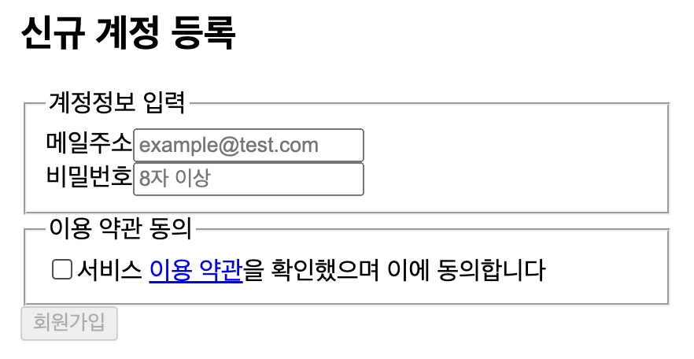
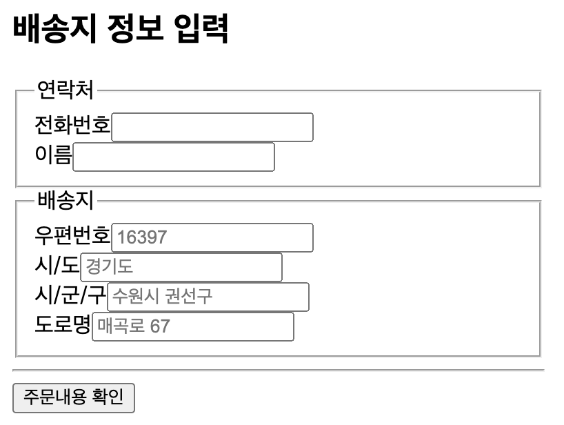
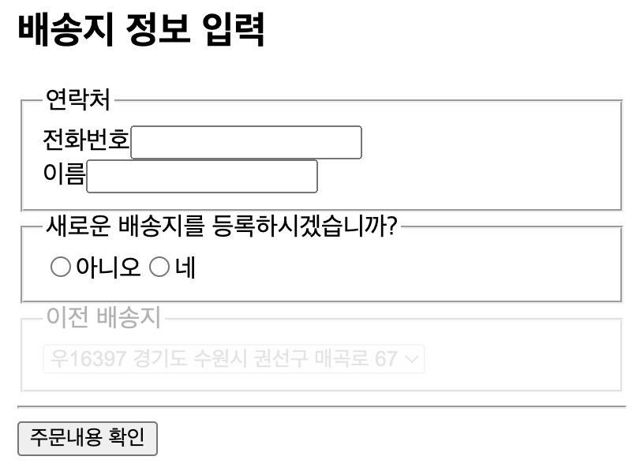
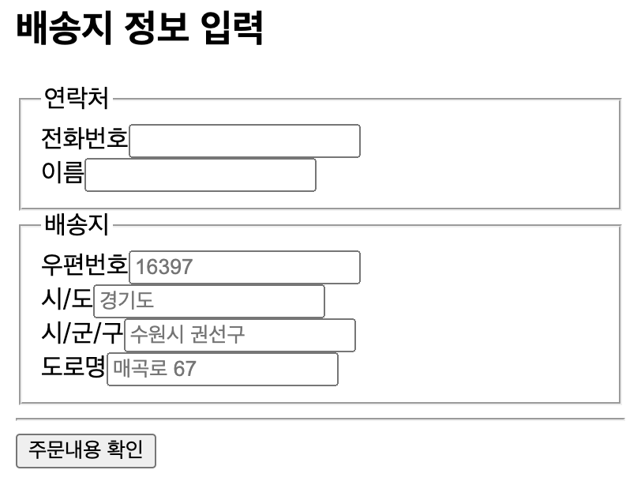
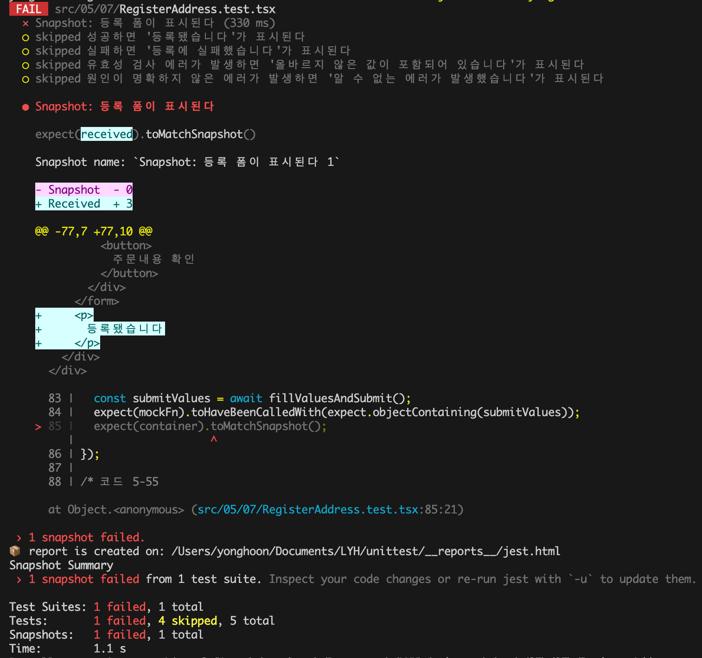
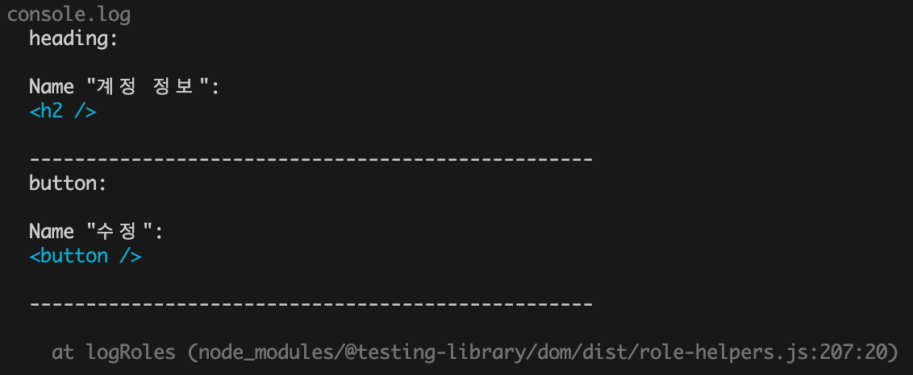

# Chapter 5. UI 컴포넌트 테스트

## 5.1 UI 컴포넌트 테스트 기초 지식

### 5.1.1 MPA와 SPA의 차이점

(이미 숙지한 내용이기에 정리 생략)

### 5.1.2 UI 컴포넌트 테스트

UI 컴포넌트의 대표적인 기능들은 다음과 같다:

- 데이터를 렌더링 하는 기능
- 사용자의 입력을 전달하는 기능
- 웹 API와 연동하는 기능
- 데이터를 동적으로 변경하는 기능

이 기능들은 테스트를 통해 "의도한 대로 작동하고 있는가"와 "문제가 생긴 부분이 없는가"를 확인해야 한다

### 5.1.3 웹 접근성 테스트

UI 컴포넌트 테스트는 기본적인 기능의 테스트 뿐만 아니라 웹 접근성 품질 향상에도 도움이 된다

---

## 5.2 라이브러리 설치

5장부터는 UI 컴포넌트 테스트에 필요한 라이브러리를 추가해 테스트를 작성한다:

- `jest-environment-jsdom`
- `@testing-library/react`
- `@testing-library/jest-dom`
- `@testing-library/user-event`

### 5.2.1 UI 컴포넌트 테스트 환경 구축

UI 컴포넌트 테스트는 UI를 조작하여 이로인해 발생한 결과를 검증하는 테스트이다. UI를 조작하려면 DOM API가 필요하지만, Jest가 실행되는 환경인 Node.js는 DOM API를 지원하지 않는다. 이 문제를 해결하려면 `jsdom`이 필요하다

기본적인 테스트 환경은 `jest.config.ts`의 `testEnvironment`에 지정한다. 최신 버전의 Jest는 기존의 `jsdom`을 개선한 `jest-environment-jsdom`을 사용하기 때문에, 다음과 같이 별도로 설치하여 지정해주어야 한다:

```tsx
/* jest.config.ts */
module.exports = {
  testEnvironment: "jest-environment-jsdom",
};
```

- `testEnvironment`란
    
    The test environment that will be used for testing. The default environment in Jest is a Node.js environment. If you are building a web app, you can use a browser-like environment through [`jsdom`](https://github.com/jsdom/jsdom) instead(출처: Jest Docs - Configuring Jest, `testEnvironment`)
    

만일 Next.js 애플리케이션처럼 서버와 클라이언트 코드가 공존하는 경우에는 다음과 같은 주석을 테스트 파일 첫 줄에 작성해 파일별로 다른 테스트 환경을 사용하도록 설정할 수 있다:

```tsx
/**
 * @jest-environment jest-environment-jsdom
 */
```

### 5.2.2 테스팅 라이브러리

테스팅 라이브러리는 UI 컴포넌트를 테스트하는 라이브러리이다. 크게 세 가지 역할을 담당한다:

- UI 컴포넌트를 렌더링 한다
- 렌더링된 엘리먼트에서 임의의 자식 엘리먼트를 취득한다
- 렌더링된 엘리먼트에 인터랙션을 일으킨다

테스팅 라이브러리를 사용할 때는 유저가 실제로 인터랙션 할 때(ex. 버튼 클릭, 키보드 입력, 마우스 호버)와 유사하게 테스트를 작성할 것을 권장한다

### 5.2.3 UI 컴포넌트 테스트용 매처 확장

DOM 상태를 검증할 때는 Jest 매처만으로는 부족하다. 이때 `@testing-library/jest-dom`을 사용한다. 해당 라이브러리는 커스텀 매처라는 Jest의 확장 기능을 제공한다. 이 라이브러리를 추가하면 UI 컴포넌트를 쉽게 테스트할 수 있는 여러 매처를 사용할 수 있다

### 5.2.4 사용자 입력 시뮬레이션 라이브러리

테스팅 라이브러리는 문자 입력등의 이벤트를 발생시키고자 fireEvent API를 제공한다. 하지만 fireEvent API는 DOM 이벤트를 발생시킬 뿐이기 때문에, 실제 사용자의 입력에 가깝게 시뮬레이션이 가능한 `@testing-library/user-event`를 추가로 사용하는 것이 좋다

---

## 5.3 처음 시작하는 UI 컴포넌트 테스트

UI 컴포넌트 테스트는 기본적으로 테스트할 컴포넌트를 렌더링하고, 임의의 DOM을 취득한 후 DOM에 입력을 발생시키는 방식으로 진행된다

### 5.3.1 테스트할 UI 컴포넌트

```tsx
/* 05/03/Form.tsx */
type Props = {
  name: string;
  onSubmit?: (event: React.FormEvent<HTMLFormElement>) => void;
};
export const Form = ({ name, onSubmit }: Props) => {
  return (
    <form
      onSubmit={(event) => {
        event.preventDefault();
        onSubmit?.(event);
      }}
    >
      <h2>계정 정보</h2>
      <p>{name}</p>
      <div>
        <button>수정</button>
      </div>
    </form>
  );
};
```

### 5.3.2 UI 컴포넌트 렌더링

테스팅 라이브러리의 `render` 함수를 사용하여 테스트할 UI 컴포넌트를 렌더링할 수 있다:

```tsx
/* Form.test.tsx */
test("이름을 표시한다", () => {
  render(<Form name="taro" />);
});
```

### 5.3.3 특정 DOM 엘리먼트 취득하기

**`screen.getByText` 함수는 일치하는 문자열을 가진 한 개의 텍스트 엘리먼트를 찾는 API**로, 엘리먼트를 발견하면 해당 엘리먼트의 참조값을 반환한다. 만일 여러 개의 엘리먼트가 일치할 경우 첫 번째 엘리먼트를 반환한다(=DOM에서 위쪽에 있는 엘리먼트가 선택된다):

```tsx
// ✅PASS
test("이름을 표시한다", () => {
  render(<Form name="tico" />);
  screen.getByText("tico")  // DOM 엘리먼트에 대한 참조값 반환
});
```

만약 일치하는 텍스트 엘리먼트를 찾지 못하면 Error가 발생한다

```tsx
// ❌FAIL
test("이름을 표시한다", () => {
  render(<Form name="taro" />);
  screen.getByText("없는 텍스트")  // ❌TestingLibraryElementError: Unable to find...
});
```

### 5.3.4 단언문 작성

`toBeInTheDocument()`는 "해당 엘리먼트가 DOM에 존재하는가"를 검증하는 커스텀 매처이다. 이 매처를 사용한 단언문을 통해 "props에 넘겨준 이름이 표시되었는가"를 검증할 수 있다:

```tsx
// ✅PASS
test("이름을 표시한다", () => {
  render(<Form name="tico" />);
  expect(screen.getByText("tico")).toBeInTheDocument()
});
```

`toBeInTheDocument`는 `@testing-library/jest-dom` 라이브러리의 매처임에도 불구하고, import 하지 않고 있다. 이는 `jest.setup.ts`(모든 테스트에 적용할 설정 파일)에서 import하고 있기 때문이다:

```tsx
/* jest.setup.ts */
import "@testing-library/jest-dom";
import React from "react";

global.React = React;
```

해당 설정만으로도 모든 테스트 파일에서 커스텀 매처를 사용할 수 있다

### 5.3.5 특정 DOM 엘리먼트를 역할로 취득하기

`screen.getByRole` 함수는 특정 역할(role)과 일치하는 DOM 엘리먼트의 참조값을 반환한다:

```tsx
// ✅PASS
test("button role을 가진 엘리먼트를 찾는다", () => {
  render(<Form name="tico" />);
  expect(screen.getByRole("button"));
});
```

`<Form />` 컴포넌트에는 `role="button"`이 없음에도 불구하고 `<button>`이 포함되었기 때문에 위의 코드는 통과한다. 이는 테스팅 라이브러리가 암묵적 역할이라는 식별자(??)를 지원하기 때문이다(*Queries for elements with the given role. Default roles are taken into consideration e.g. `<button />` has the `button` role without explicitly setting the role attribute - 출처: [Testing Library Docs - ByRole](https://testing-library.com/docs/queries/byrole#api)*)

만약 일치하는 엘리먼트를 찾지 못하면 Error가 발생한다:

```tsx
// ❌FAIL
test("tooltip role을 가진 엘리먼트를 찾는다", () => {
  render(<Form name="tico" />);
  expect(screen.getByRole("tooltip"));  // ❌TestingLibraryElementError: Unable to find...
});
```

### 5.3.6 heading이 포함된 단언문

`getByRole("heading")`을 실행하면 `<h2>`의 참조를 취득할 수 있다. `h1` ~ `h6`는 `heading` 이라는 암묵적 역할을 가지기 때문이다:

```tsx
// ✅PASS
test("heading role을 가진 엘리먼트를 찾는다", () => {
  render(<Form name="taro" />);
  expect(screen.getByRole("heading"));
});
```

이제 위에서 취득한 엘리먼트에 원하는 텍스트가 포함되었는지 테스트해보자. 텍스트 포함 여부는 `toHaveTextContent`라는 매처로 검증할 수 있다:

```tsx
// ✅PASS
test("heading role을 가진 엘리먼트에 '계정 정보'가 표시됐는지 확인한다", () => {
  render(<Form name="taro" />);
  expect(screen.getByRole("heading")).toHaveTextContent("계정 정보")
});
```

테스팅 라이브러리는 암묵적 역할을 활용한 쿼리를 우선적으로 사용하도록 권장한다

### 5.3.7 이벤트 핸들러 호출 테스트

이벤트 핸들러 호출은 함수를 단위 테스트할 때와 동일하게 Mock 함수로 검증한다

버튼을 클릭해야 `onSubmit` 이벤트가 발생한다. 하지만 테스트 환경에서는 직접 버튼을 클릭할 수 없다. 이때 `fireEvent.click`을 사용해 버튼 클릭을 재현할 수 있다:

```tsx
// ✅PASS
test("버튼을 클릭하면 이벤트 핸들러가 실행된다", () => {
  const mockFn = jest.fn();
  render(<Form name="taro" onSubmit={mockFn} />);
  fireEvent.click(screen.getByRole("button"));
  expect(mockFn).toHaveBeenCalled();
});
```

이와 같이 `fireEvent`를 사용하면 DOM 이벤트 발생이 가능해진다

---

## 5.4 아이템 목록 UI 컴포넌트 테스트

### 5.4.1 테스트할 UI 컴포넌트

기사 목록을 표시하는 컴포넌트이다:

```tsx
/* 05/04/ArticleList.tsx */
import { ArticleListItem, ItemProps } from "./ArticleListItem";

type Props = {
  items: ItemProps[];
};

export const ArticleList = ({ items }: Props) => {
  return (
    <div>
      <h2>기사 목록</h2>
      {items.length ? (
        <ul>
          {items.map((item) => (
            <ArticleListItem {...item} key={item.id} />
          ))}
        </ul>
      ) : (
        <p>게재된 기사가 없습니다</p>
      )}
    </div>
  );
};

```

이 컴포넌트에 대한 테스트는 아이템이 존재하는 경우와 존재하지 않는 경우의 분기 처리에 중점을 두어야 한다:

- 아이템이 존재하면) 목록이 렌더링 되어야 한다
- 아이템이 존재하지 않는다면) "게재된 기사가 없습니다"를 렌더링한다

### 5.4.2 목록에 표시된 내용 테스트

테스트용 데이터는 다음의 배열이다:

```tsx
/* 05/04/fixture.ts */
import { ItemProps } from "./ArticleListItem";

export const items: ItemProps[] = [
  {
    id: "howto-testing-with-typescript",
    title: "타입스크립트를 사용한 테스트 작성법",
    body: "테스트 작성 시 타입스크립트를 사용하면 테스트의 유지 보수가 쉬워진다",
  },
  {
    id: "nextjs-link-component",
    title: "Next.js의 링크 컴포넌트",
    body: "Next.js는 화면을 이동할 때 링크 컴포넌트를 사용한다",
  },
  {
    id: "react-component-testing-with-jest",
    title: "제스트로 시작하는 리액트 컴포넌트 테스트",
    body: "제스트는 단위 테스트처럼 UI 컴포넌트를 테스트할 수 있다",
  },
];

```

이제 목록에 데이터가 렌더링 되는지 확인해보자:

```tsx
/* 05/04/ArticleList.test.tsx */
// ✅PASS
test("items의 수만큼 목록을 표시한다", () => {
  render(<ArticleList items={items} />);
  expect(screen.getAllByRole("listitem")).toHaveLength(3);
});
```

`getAllByRole`은 지정한 역할과 일치하는 모든 엘리먼트를 배열로 가져온다. 예를 들어 `<li>`는 `"listitem"`이라는 암묵적 역할을 하기 때문에 `getAllByRole("listitem")`으로 모든 `<li>` 엘리먼트를 가져올 수 있다

- **Q)** `getAllByRole("listitem")`을 통해 `<li>` 엘리먼트를 가져올 수 있는 이유는?? `"listitem"`이라는 것은 무엇이며, 어디서 유래 되었는가
    
    **GPT-4o의 답변)** React Testing Library의 `getAllByRole("listitem")`은 **HTML 엘리먼트의 ARIA 역할(Role)을 기반으로 엘리먼트를 찾기 때문에 가능하다**
    
    즉, `<li>` 엘리먼트가 **자동으로 `"listitem"` 역할을 가지기 때문에** 이 메서드를 통해 가져올 수 있다
    

하지만 테스트가 충분하지는 않다. 왜냐하면 우리가 현재 검증하려고 하는 것은 "목록이 정상적으로 렌더링 됐는가"이기 때문에, "`<ul>` 엘리먼트가 렌더링 되었는가"를 검증해야하기 때문이다. 이때 `<ul>` 엘리먼트는 `"list"`라는 암묵적 역할을 하므로 `screen.getByRole("list")`를 통해 엘리먼트를 가져올 수 있다:

```tsx
// ✅PASS
test("목록을 표시한다", () => {
  render(<ArticleList items={items} />);
  const list = screen.getByRole("list");
  expect(list).toBeInTheDocument()
})
```

### 1️⃣ within 함수로 범위 좁히기

큰 컴포넌트를 다룰 때는 테스트 대상이 아닌 엘리먼트들이 `"listitem"`의 대상이 되어 `getAllByRol`의 반환값에 포함될 수 있다. 따라서 취득한 `list` 엘리먼트로 범위를 좁혀 여기에 포함된 `"listitem"` 엘리먼트의 갯수를 검증해야 한다. 이때 대상 범위를 좁히기 위해 사용하는 것이 `within` 함수이다. `within` 함수의 반환값에는 `screen`과 동일하게 엘리먼트를 가져온다:

```tsx
// ✅PASS
test("items의 수만큼 목록을 표시한다", () => {
  render(<ArticleList items={items} />);
  const list = screen.getByRole("list");
  expect(list).toBeInTheDocument();
  expect(within(list).getAllByRole("listitem")).toHaveLength(3);
});
```

### 5.4.3 목록에 표시할 내용이 없는 상황에서의 테스트

목록에 렌더링할 데이터가 없으면 "게재된 기사가 없습니다"를 렌더링해야만 한다. 이를 검증하는 테스트를 작성해보자:

```tsx
// ✅PASS
test("목록에 표시할 데이터가 없으면 '게재된 기사가 없습니다'를 표시한다", () => {
  // 빈 배열을 items에 할당하여 목록에 표시할 데이터가 없는 상황을 재현한다.
  render(<ArticleList items={[]} />);
  // 존재하지 않을 것으로 예상하는 엘리먼트의 취득을 시도한다.
  const list = screen.queryByRole("list");
  // list가 존재하지 않는다.
  expect(list).not.toBeInTheDocument();
  // list가 null이다.
  expect(list).toBeNull();
  // '게재된 기사가 없습니다'가 표시됐는지 확인한다.
  expect(screen.getByText("게재된 기사가 없습니다")).toBeInTheDocument();
});
```

지금까지 사용한 `getByRole`이나 `getByLabelText`는 존재하지 않는 엘리먼트를 가져오려하면 오류가 발생한다. 그렇기 때문에 "존재하지 않는" 엘리먼트를 테스트하려면 `queryBy` 접두사를 붙인 API를 사용해야만 한다

`queryByRole`는 가져올 엘리먼트가 없으면 `null`을 반환한다. 이를 `not.toBeInTheDocument` 또는 `toBeNull` 매처로 검증할 수 있다

### 5.4.4 <ArtivleListItem /> 컴포넌트 테스트

목록 컴포넌트는 개별 아이템 컴포넌트인 `<ArtivleListItem />`으로 구성되어있다. `<ArtivleListItem />`은 props로 받은 `id`를 사용해 `더 알아보기` 링크에 연결할 URL을 만든다:

```tsx
/* 05/04/ArticleListItem.tsx */
export type ItemProps = {
  id: string;
  title: string;
  body: string;
};

export const ArticleListItem = ({ id, title, body }: ItemProps) => {
  return (
    <li>
      <h3>{title}</h3>
      <p>{body}</p>
      <a href={`/articles/${id}`}>더 알아보기</a>
    </li>
  );
};

```

이제 테스트를 수행해보자:

```tsx
// ✅PASS
test("링크에 id로 만든 URL을 표시한다", () => {
  render(<ArticleListItem {...item} />);
  expect(screen.getByRole("link", { name: "더 알아보기" })).toHaveAttribute(
    "href",
    "/articles/howto-testing-with-typescript"
  );
});
```

`더 알아보기` 라는 문자열 링크의 `href` 속성이 `id`로 만들어진 URL인지 확인하기 위해 `toHaveAttribute`로 테스트하였다

테스팅 라이브러리는 "사용자 입력을 제약없이 재현한다"는 원칙이 있다. 그러므로 엘리먼트 가져오기 API는 이러한 원칙에 따라 다음과 같은 우선 순위를 두고 사용할 것을 권장한다(이 책의 코드도 테스팅 라이브러리의 원칙에 따라 작성하였다):

1. **모두가 접근 가능한 쿼리일 것**
    
    신체적, 정신적 특성에 따른 차이 없이 접근할 수 있는 쿼리를 의미한다. 시각적으로 인지한 것과 스크린 리더 등의 보조 기기로 인지한 것이 동일하다는 것을 증명할 수 있다:
    
    - `getByRole`
    - `getByLabelText`
    - `getByPlaceholderText`
    - `getByText`
    - `getByDisplayValue`
2. **시맨틱 쿼리**
    
    공식 표준에 기반한 속성을 사용하는 쿼리를 의미한다. 시맨틱 쿼리를 사용할 때는 브라우저나 보조 기기에 따라 상당히 다른 결과가 나올 수 있으니 주의해야 한다:
    
    - `getByAltText`
    - `getByTitle`
3. **테스트 ID**
    
    테스트용으로 할당된 식별자를 의미한다. 역할이나 문자 컨텐츠를 활용한 쿼리를 사용할 수 없거나 의도적으로 의미 부여를 피하고 싶을 때만 사용할 것을 권장한다:
    
    - `getByTestId`

---

## 5.5 인터랙티브 UI 컴포넌트 테스트

### 5.5.1 테스트할 UI 컴포넌트



```tsx
/* 05/05/Form.tsx */
import { useId, useState } from "react";
import { Agreement } from "./Agreement";
import { InputAccount } from "./InputAccount";

export const Form = () => {
  const [checked, setChecked] = useState(false);
  const headingId = useId();
  return (
    <form aria-labelledby={headingId}>
      <h2 id={headingId}>신규 계정 등록</h2>
      <InputAccount />
      <Agreement
        onChange={(event) => {
          setChecked(event.currentTarget.checked);
        }}
      />
      <div>
        <button disabled={!checked}>회원가입</button>
      </div>
    </form>
  );
};
```

테스트할 UI 컴포넌트는 신규 계정 등록을 위한 `<Form />` 컴포넌트이다. 메일 주소와 비밀번호를 입력하여 회원 가입을 요청할 수 있으며, 이때 약관 동의 체크 박스에 체크해야만 요청할 수 있다

`<Form />` 컴포넌트의 하위 컴포넌트인 `<Agreement />`는 다음과 같다:

```tsx
/* 05/05/Agreement.tsx */
type Props = {
  onChange?: React.ChangeEventHandler<HTMLInputElement>;
};

export const Agreement = ({ onChange }: Props) => {
  return (
    <fieldset>
      <legend>이용 약관 동의</legend>
      <label>
        <input type="checkbox" onChange={onChange} />
        서비스&nbsp;<a href="/terms">이용 약관</a>을 확인했으며 이에 동의합니다
      </label>
    </fieldset>
  );
};
```

약관 동의 체크박스를 클릭하면 `onChange`에 할당된 이벤트 핸들러가 콜백 함수로 호출된다

### 1️⃣ 접근 가능한 이름 테스트하기

- **선행 지식)** "접근 가능한 이름"이란
    
    **GPT-4o의 답변 + 5.9.4절 내용)**
    
    - **접근 가능한 이름(Accessible Name)은 웹 엘리먼트가 스크린 리더 등 보조 기술에서 어떻게 읽히는지를 결정하는 이름**이다. 쉽게 말해, **사용자가 엘리먼트를 인식할 수 있도록 브라우저가 제공하는 "공식적인 이름"**이라고 보면 된다
    - 접근 가능한 이름은 다양한 요인의 영향을 받으며, 구체적으로는 Accessible Name and Description Computation 1.2라는 W3C 사양에 근거해 결정된다
    - `` 엘리먼트의 경우 `alt` 속성을 통해 할당한다
    - 예시:
        
        ```tsx
        <button>로그인</button>
        ```
        
        - `<button>` 엘리먼트의 **접근 가능한 이름은 "로그인"이다**
        - `getByRole("button", { name: "로그인" })`으로 찾을 수 있다

`<fieldset>` 엘리먼트는 `"group"`이라는 암묵적 역할을 한다. `<legend>`는 `<fieldset>`의 하위 엘리먼트로서 그룹에 제목을 붙이는 데 사용한다

테스트 코드는 다음과 같다:

```tsx
/* Agreement.test.tsx */
// ✅PASS
// "name: '이용 약관 동의'"는 fieldset 내부의 <legend>에서 가져온 텍스트이어야 함
test("fieldset의 접근 가능한 이름을 legend에서 가져온다", () => {
  render(<Agreement />);
  expect(
    screen.getByRole("group", { name: "이용 약관 동의" })
  ).toBeInTheDocument();
});
```

위의 테스트 코드는 `<legend>`에 있는 문자(=`"이용 약관 동의"`)를 `<fieldset>`의 접근 가능한 이름(accessible name)으로 사용할 수 있는지 검증하는 테스트이다. Testing Library가`<legend>`에 있는 문자를 가져올 수 있는 이유는 `<fieldset>`의 하위 엘리먼트로 `<legend>` 엘리먼트가 있다면 해당 그룹의 접근 가능한 이름으로 암묵적으로 할당되기 때문이다(Testing Library는 웹 표준을 따르는 브라우저의 접근성 트리(Accessibility Tree)를 기반으로 동작한다)

주의) 다음 UI 컴포넌트에 동일한 테스트 코드를 적용할 수 없다:

```tsx
export const Agreement = ({ onChange }: Props) => {
  return (
    <div>
      <legend>이용 약관 동의</legend>
      <label>
        <input type="checkbox" onChange={onChange} />
        서비스&nbsp;<a href="/terms">이용 약관</a>을 확인했으며 이에 동의합니다
      </label>
    </div>
  );
};
```

왜냐하면 접근성에서 `<div>` 엘리먼트는 역할을 가지지 않으므로 하나의 그룹으로서 식별할 수 없기 때문이다

이와 같이 UI 컴포넌트에 테스트를 곁들이면 자연스럽게 접근성을 고려하게 된다

### 2️⃣ 체크 박스의 초기 상태 테스트하기

체크 박스의 체크 상태는 커스텀 매처인 `toBeChecked`로 검증한다:

```tsx
/* Agreement.test.tsx */
// ✅PASS
test("체크 박스가 체크되어 있지 않습니다", () => {
  render(<Agreement />);
  expect(screen.getByRole("checkbox")).not.toBeChecked();
});
```

### 5.5.2 계정 정보 입력 컴포넌트 테스트

이번에 테스트해볼 컴포넌트는 회원가입 시 필요한 메일 주소와 비밀번호를 입력하는 UI 컴포넌트인 `<InputAccount />`이다:

```tsx
/* InputAccount.tsx */
export const InputAccount = () => {
  return (
    <fieldset>
      <legend>계정정보 입력</legend>
      <div>
        <label>
          메일주소
          <input type="text" placeholder="example@test.com" />
        </label>
      </div>
      <div>
        <label>
          비밀번호
          <input type="password" placeholder="8자 이상" />
        </label>
      </div>
    </fieldset>
  );
};
```

### 1️⃣ 메일 주소 입력 테스트하기

문자열 입력은 `@testing-library/react`의 `fireEvent`로도 재현할 수 있다. 하지만 이번에는 실제 사용자 작동에 가깝게 입력을 재현하는 `@testing-library/user-event`를 사용한다:

```tsx
/* InputAccount.test.tsx */

// 테스트 파일 작성 초기에 설정
const user = userEvent.setup();

test("메일주소 입력란", async () => {
  render(<InputAccount />);
  const textbox = screen.getByRole("textbox", { name: "메일주소" });  // 메일주소 입력란 가져오기
  const value = "taro.tanaka@example.com";
  await user.type(textbox, value);  // textbox에 value를 입력
  expect(screen.getByDisplayValue(value)).toBeInTheDocument();  // 초깃값이 입력된 폼 요소가 존재하는지 검증
});
```

위의 테스트 코드의 동작을 살펴보자:

1. `userEvent.setup()`으로 API를 호출할 `user` 인스턴스를 생성하고, 테스트를 수행할 때마다 `user`를 통해  입력이 발생하도록 할 것이다
2. `screen.getByRole("textbox")`로 메일주소 입력 엘리먼트인 `<input type="text" />`를 가져온다
3. `<input />` 엘리먼트에 `user.type` API로 입력을 재현한다. 이때 `userEvent`를 사용한 모든 인터랙션은 입력이 완료될 때까지 기다려야 하는 비동기 처리이므로, `await`를 사용해 입력이 완료될 때까지 기다린다
4. `screen.getByDisplayValue`로 초기값이 입력 폼 엘리먼트가 존재하는지 검증하고 테스트를 마친다

### 2️⃣ 비밀번호 입력 테스트하기

```tsx
/* InputAccount.test.tsx */
// ❌FAIL(TestingLibraryElementError: Unable to find an accessible element with the role "textbox" and name "비밀번호")
test("비밀번호 입력란", async () => {
  render(<InputAccount />);
  const password = screen.getByRole("textbox", { name: "비밀번호" });  // "textbox" 역할을 하는 동시에 "비밀번호" 레이블을 가진 엘리먼트를 찾을 수 없다
  const value = "abcd1234";
  await user.type(password, value);
  expect(screen.getByDisplayValue(value)).toBeInTheDocument();  // 초깃값이 입력된 폼 요소가 존재하는지 검증
});
```

메일 주소 입력 테스트와 마찬가지로 작성하였고, 성공할 것 같지만 오류가 발생하며 실패한다. 실패한 이유는 `<input type="password" />`가 역할을 가지지 않기 때문이다. 이 요소는 `"textbox"`라는 역할을 가진 것으로 자주 오해받는다

이렇게 역할을 가지지 않는 엘리먼트를 가져오는 대체 수단으로 `placeholder` 값을 참조하는 `getByPlaceHolderText`를 사용해야 한다:

```tsx
/* InputAccount.test.tsx */
// ✅PASS
test("비밀번호 입력란", async () => {
  render(<InputAccount />);
  expect(() => screen.getByPlaceholderText("8자 이상")).not.toThrow();
  expect(() => screen.getByRole("textbox", { name: "비밀번호" })).toThrow();
});
```

완성된 테스트 코드는 다음과 같다:

```tsx
/* InputAccount.test.tsx */
// ✅PASS
test("비밀번호 입력란", async () => {
  render(<InputAccount />);
  const password = screen.getByPlaceholderText("8자 이상");
  const value = "abcd1234";
  await user.type(password, value);
  expect(screen.getByDisplayValue(value)).toBeInTheDocument();
});
```

### 5.5.3 신규 회원가입 폼 테스트

마지막으로 테스트할 컴포넌트는 `<Form />` 이다:

```tsx
/* Form.tsx */
import { useId, useState } from "react";
import { Agreement } from "./Agreement";
import { InputAccount } from "./InputAccount";

export const Form = () => {
  const [checked, setChecked] = useState(false);
  const headingId = useId();
  return (
    <form aria-labelledby={headingId}>
      <h2 id={headingId}>신규 계정 등록</h2>
      <InputAccount />
      <Agreement
        onChange={(event) => {
          setChecked(event.currentTarget.checked);
        }}
      />
      <div>
        <button disabled={!checked}>회원가입</button>
      </div>
    </form>
  );
};
```

### 1️⃣ 회원가입 버튼의 활성화 여부 테스트하기

```tsx
test("회원가입 버튼은 비활성화 상태다", () => {
  render(<Form />);
  expect(screen.getByRole("button", { name: "회원가입" })).toBeDisabled();
});

test("이용 약관에 동의하는 체크 박스를 클릭하면 회원가입 버튼은 활성화된다", async () => {
  render(<Form />);
  await user.click(screen.getByRole("checkbox"));
  expect(screen.getByRole("button", { name: "회원가입" })).toBeEnabled();
});
```

위의 코드를 설명하자면:

- 체크박스를 클릭하면 `checked` 상태가 변경되며 `"회원가입"` 버튼의 활성화 여부도 변경된다
- 메일주소 입력 테스트와 동일하게 `userEvent.setup`으로 만든 `user`를 사용해 `await user.click`으로 클릭을 재현한다
- 버튼의 호라성화 여부 검증은 `toBeDisabled`와 `toBeEnabled` 매처를 사용한다

### 2️⃣ form의 접근 가능한 이름 테스트하기

`form`의 접근 가능한 이름은 `"heading"` 역할을 하는 `<h2>` 엘리먼트에서 가져온다. 다음과 같이 `aria-labelledby`라는 속성에 `<h2>` 엘리먼트의 `id`를 지정하면 접근 가능한 이름으로 사용할 수 있다:

```tsx
/* Form.tsx */
...

export const Form = () => {
	...
  const headingId = useId();
  return (
    <form aria-labelledby={headingId}>
      <h2 id={headingId}>신규 계정 등록</h2>
      ...
    </form>
  );
};
```

테스트 코드는 다음과 같다:

```tsx
/* Form.test.tsx */
// ✅PASS
test("form의 접근 가능한 이름은 heading에서 인용합니다", () => {
  render(<Form />);
  expect(
    screen.getByRole("form", { name: "신규 계정 등록" })
  ).toBeInTheDocument();
});
```

---

## 5.6 유틸리티 함수를 활용한 테스트

UI 컴포넌트 테스트에서는 사용자 입력(인터랙션)이 검증의 기점이 된다. 이번 절에서는 폼 입력 인터랙션은 함수화해서 다시 활용하는 팁을 알아보겠다

### 5.6.1 테스트할 UI 컴포넌트

```tsx
/* 05/06/Form.tsx */
import { useState } from "react";
import { ContactNumber } from "./ContactNumber";
import { DeliveryAddress } from "./DeliveryAddress";
import { PastDeliveryAddress } from "./PastDeliveryAddress";
import { RegisterDeliveryAddress } from "./RegisterDeliveryAddress";

export type AddressOption = React.ComponentProps<"option"> & { id: string };
export type Props = {
  deliveryAddresses?: AddressOption[];
  onSubmit?: (event: React.FormEvent<HTMLFormElement>) => void;
};
export const Form = (props: Props) => {
  const [registerNew, setRegisterNew] = useState<boolean | undefined>(
    undefined
  );
  return (
    <form onSubmit={props.onSubmit}>
      <h2>배송지 정보 입력</h2>
      <ContactNumber />
      {props.deliveryAddresses?.length ? (
        <>
          <RegisterDeliveryAddress onChange={setRegisterNew} />
          {registerNew ? (
            <DeliveryAddress title="새로운 배송지" />
          ) : (
            <PastDeliveryAddress
              disabled={registerNew === undefined}
              options={props.deliveryAddresses}
            />
          )}
        </>
      ) : (
        <DeliveryAddress />
      )}
      <hr />
      <div>
        <button>주문내용 확인</button>
      </div>
    </form>
  );
};
```

테스트할 UI 컴포넌트는 배송지 정보 입력을 위한 `<Form />` 컴포넌트이다. 로그인한 사용자가 쇼핑 이력이 없는 경우 "배송지"를 입력해야 한다. 만일 쇼핑 이력이 있다면 "이전 배송지" 또는 "새로운 배송지"를 입력할 수 있어야 한다

테스트는 화면 분기에 따라 전송되는 값의 패턴 또한 세 가지라는 점에 중점을 둔다:

- 이전 배송지가 없음
- 이전 배송지가 있음
    - 새로운 배송지 등록함
    - 새로운 배송지 등록 안함

### 5.6.2 폼 입력을 함수화 하기

폼 입력 테스트는 여러 번 동일한 인터랙션을 작성해야 할 때가 많다. 이번 절에서 테스트하는 컴포넌트처럼 화면 분기가 있는 경우가 특히 그렇다. 이렇게 반복적으로 호출해야 하는 인터랙션을 하나의 함수로 정리하면 여러 곳에서 다시 활용할 수 있다:

```tsx
/* Form.test.tsx */
async function inputContactNumber(
  inputValues = {
    name: "배언수",
    phoneNumber: "000-0000-0000",
  }
) {
  await user.type(
    screen.getByRole("textbox", { name: "전화번호" }),
    inputValues.phoneNumber
  );
  await user.type(
    screen.getByRole("textbox", { name: "이름" }),
    inputValues.name
  );
  return inputValues;
}
```

`inputContactNumber` 함수는 연락처를 입력하는 인터랙션을 함수로 만든 것이다. 사전에 입력할 내용의 초기값을 인수(`inputValues`)에 설정하고 필요할 때마다 변경할 수 있어 편리하다

다음의 코드는 배송지를 입력하는 인터랙션 함수이다:

```tsx
/* Form.test.tsx */
async function inputDeliveryAddress(
  inputValues = {
    postalCode: "16397",
    prefectures: "경기도",
    municipalities: "수원시 권선구",
    streetNumber: "매곡로 67",
  }
) {
  await user.type(
    screen.getByRole("textbox", { name: "우편번호" }),
    inputValues.postalCode
  );
  await user.type(
    screen.getByRole("textbox", { name: "시/도" }),
    inputValues.prefectures
  );
  await user.type(
    screen.getByRole("textbox", { name: "시/군/구" }),
    inputValues.municipalities
  );
  await user.type(
    screen.getByRole("textbox", { name: "도로명" }),
    inputValues.streetNumber
  );
  return inputValues;
}
```

이렇게 입력 항목이 많을 폼일수록 함수화가 효과적이다

### 5.6.3 이전 배송지가 없는 경우의 테스트



이전 배송지가 없는 경우에 대한 테스트를 작성해보자. 먼저 배송지를 입력받기 위한 입력란이 존재하는지 검증한다:

```tsx
/* Form.test.tsx */
// ✅PASS
test("배송지 입력란이 존재한다", () => {
  render(<Form />);  // deliveryAddresses 넘기지 않음
  expect(screen.getByRole("group", { name: "연락처" })).toBeInTheDocument();
  expect(screen.getByRole("group", { name: "배송지" })).toBeInTheDocument();
});
```

`<Form />` 컴포넌트는 이전 배송지를 의미하는 `deliveryAddresses`라는 props를 받는다. 위의 예제에선 이를 넘기지 않음으로써 배송지가 없는 상태를 표현하고있다

앞서 준비한 인터랙션 함수를 사용하면 폼을 채울 수 있다:

```tsx
/* Form.test.tsx */
// ✅PASS
test("폼을 제출하면 입력 내용을 전달받는다", async () => {
  const [mockFn, onSubmit] = mockHandleSubmit();
  render(<Form onSubmit={onSubmit} />);
  const contactNumber = await inputContactNumber();
  const deliveryAddress = await inputDeliveryAddress();
  await clickSubmit();
  expect(mockFn).toHaveBeenCalledWith(
    expect.objectContaining({ ...contactNumber, ...deliveryAddress })
  );
});
```

위의 예제에서 clickSubmit은 다음과 같이 유저의 버튼 클릭 인터랙션을 추상화한 함수이다:

```tsx
async function clickSubmit() {
  await user.click(
    screen.getByRole("button", { name: "주문내용 확인" })
  );
}
```

이처럼 인터랙션의 세부 내용을 함수에 숨기면 각 테스트에서 무엇을 검증하고 싶은지 명확해진다(가독성 상승)

### 1️⃣ Form 이벤트를 검증하기 위한 Mock 함수

`onSubmit`으로 전달받은 값을 검증할 때는 Mock 함수를 사용한다:

```tsx
function mockHandleSubmit() {
  const mockFn = jest.fn();
  const onSubmit = (event: React.FormEvent<HTMLFormElement>) => {
    event.preventDefault();
    const formData = new FormData(event.currentTarget);
    const data: { [k: string]: unknown } = {};
    formData.forEach((value, key) => (data[key] = value));
    mockFn(data);
  };
  return [mockFn, onSubmit] as const;
}
```

`mockHandleSubmit` 함수는 스파이와 이벤트 핸들러를 조합해 작성하였다

### 5.6.4 이전 배송지가 있는 경우의 테스트



이전 배송지가 있는 경우에 대한 테스트를 작성해보자. 방금전과는 다르게 `deliveryAddresses` props를 넘겨주어 이전 배송지가 있는 상황을 재현한다:

```tsx
/* Form.test.tsx */
// ✅PASS
test("질문에 대답할 때까지 배송지를 선택할 수 없다", () => {
  render(<Form deliveryAddresses={deliveryAddresses} />);
  expect(
    screen.getByRole("group", { name: "새로운 배송지를 등록하시겠습니까?" })
  ).toBeInTheDocument();
  expect(
    screen.getByRole("group", { name: "이전 배송지" })
  ).toBeDisabled();
});
```

"새로운 배송지를 등록하시겠습니까?"라는 체크박스를 아직 입력하기 전이므로 "이전 배송지"가 적힌 셀렉트 박스는 비활성화 되어있다

### 1️⃣ "아니오"를 선택한 경우에 대한 테스트

```tsx
/* Form.test.tsx */
// ✅PASS
test("'아니오'를 선택하고 제출하면 입력 내용을 전달받는다", async () => {
  const [mockFn, onSubmit] = mockHandleSubmit();
  render(<Form deliveryAddresses={deliveryAddresses} onSubmit={onSubmit} />);
  await user.click(screen.getByLabelText("아니오"));
  expect(
    screen.getByRole("group", { name: "이전 배송지" })
  ).toBeInTheDocument();
  const contactNumber = await inputContactNumber();  // 연락처 입력하기
  await clickSubmit();
  expect(mockFn).toHaveBeenCalledWith(expect.objectContaining(contactNumber));
});
```

"아니오"를 선택하면 주소 입력 인터랙션인 `inputDeliveryAddress`는 필요하지 않다. 따라서 연락처 입력 인터랙션인 `inputContactNumber`만 실행해 입력 내용이 전송되었는지를 검증한다

### 2️⃣ "네"를 선택한 경우에 대한 테스트

```tsx
/* Form.test.tsx */
// ✅PASS
test("'네'를 선택하고 제출하면 입력 내용을 전달받는다", async () => {
  const [mockFn, onSubmit] = mockHandleSubmit();
  render(<Form deliveryAddresses={deliveryAddresses} onSubmit={onSubmit} />);
  await user.click(screen.getByLabelText("네"));
  expect(
    screen.getByRole("group", { name: "새로운 배송지" })
  ).toBeInTheDocument();
  const contactNumber = await inputContactNumber();
  const deliveryAddress = await inputDeliveryAddress();
  await clickSubmit();
  expect(mockFn).toHaveBeenCalledWith(
    expect.objectContaining({ ...contactNumber, ...deliveryAddress })
  );
});
```

"네"를 선택하면 주소 입력 인터랙션인 `inputDeliveryAddress`가 필요하다. 따라서 모든 입력 항목을 입력한 후 입력 내용이 전송되었는지를 검증한다

---

## 5.7 비동기 처리가 포함된 UI 컴포넌트 테스트

이전 절에서는 5.6절에서 입력한 값을 Fetch API로 전송하는 과정을 테스트한다

### 5.7.1 테스트할 UI 컴포넌트



```tsx
/* 05/07/RegisterAddress.tsx */
export const RegisterAddress = () => {
  const [postResult, setPostResult] = useState("");
  return (
    <div>
	    {/* 05/06/Form.tsx의 폼 컴포넌트 */}
      <Form
  	    {/* (1) */}
        onSubmit={handleSubmit((values) => {
          try {
	          {/* (2) */}
            checkPhoneNumber(values.phoneNumber);
	          {/* (3) */}
            postMyAddress(values)
              .then(() => {
                setPostResult("등록됐습니다");
              })
              .catch(() => {
                setPostResult("등록에 실패했습니다");
              });
          } catch (err) {
            if (err instanceof ValidationError) {
              setPostResult("올바르지 않은 값이 포함되어 있습니다");
              return;
            }
            setPostResult("알 수 없는 에러가 발생했습니다");
          }
        })}
      />
      {postResult && <p>{postResult}</p>}
    </div>
  );
};
```

테스트할 UI 컴포넌트는 계정 정보 등록 페이지를 렌더링하는 UI 컴포넌트이다. 이 컴포넌트는 웹 API 응답을 `postResult`에 메시지를 저장하며, 저장된 메시지는 그대로 UI 컴포넌트에 렌더링된다. `<Form>` 컴포넌트는 `onSubmit` 이벤트가 발생하면 다음 함수를 실행한다

- (1) `handleSubmit`: 폼에 전송된 값을 `values`라는 객체로 변환한다
- (2) `checkPhoneNumber`: 전송할 값에 대한 유효성 검사를 실시한다
- (3) `postMyAddress`: 웹 API 클라이언트를 호출한다(POST 요청)

이번 컴포넌트는 입력 내용과 웹 API 응답에 따라 네 가지 패턴으로 다른 메시지가 렌더링되는지 중점적으로 테스트할 것이다. 각 패턴에 대한 테스트를 작성해보자

### 5.7.2 웹 API 클라이언트 확인

```tsx
/* 05/07/fetchers/index.ts */
async function handleResponse(res: Response) {
  const data = await res.json();
  if (!res.ok) {
    throw data;
  }
  return data;
}

const host = (path: string) => `https://myapi.testing.com${path}`;

const headers = {
  Accept: "application/json",
  "Content-Type": "application/json",
};

function postMyAddress(values: unknown): Promise<Result> {
  return fetch(host("/my/address"), {
    method: "POST",
    body: JSON.stringify(values),
    headers,
  }).then(handleResponse);
}
```

`postMyAddress`는 웹 API 클라이언트를 호출하여 `values`에 대한 POST 요청을 보낸다. 일전에 4.6절에서 작성한 것처럼 HTTP 상태가 `300` 이상이면 예외를 발생시킨다

### 5.7.3 웹 API 클라이언트의 Mock 함수

4.6절을 참고해 `postMyAddress`를 Mock 객체로 만드는 함수를 작성하자:

```tsx
/* 05/07/fetchers/mock.ts */
export function mockPostMyAddress(status = 200) {
  if (status > 299) {
    return jest
      .spyOn(Fetchers, "postMyAddress")
      .mockRejectedValueOnce(httpError);
  }
  return jest
    .spyOn(Fetchers, "postMyAddress")
    .mockResolvedValueOnce(postMyAddressMock);
}
```

### 5.7.4 입력된 값을 전송하는 인터랙션 함수

전송 버튼을 클릭하면 어떤 결과가 나타나는지 테스트해보자:

```tsx
/* RegisterAddress.test.tsx */
async function fillValuesAndSubmit() {
  const contactNumber = await inputContactNumber();
  const deliveryAddress = await inputDeliveryAddress();
  const submitValues = { ...contactNumber, ...deliveryAddress };
  await clickSubmit();
  return submitValues;
}
```

### 5.7.5 패턴1) 응답 성공 테스트

요청에 대한 응답이 성공(resolve)하는 경우에 대한 테스트를 살펴보자:

```tsx
/* RegisterAddress.test.tsx */
// ✅PASS
test("성공하면 '등록됐습니다'가 표시된다", async () => {
  const mockFn = mockPostMyAddress();  // mockPostMyAddress에 의해 응답이 제어된다
  render(<RegisterAddress />);
  const submitValues = await fillValuesAndSubmit();
  expect(mockFn).toHaveBeenCalledWith(expect.objectContaining(submitValues));
  expect(screen.getByText("등록됐습니다")).toBeInTheDocument();
});
```

### 5.7.6 패턴2) 응답 실패 테스트

요청에 대한 응답이 실패(reject)하는 경우에 대한 테스트를 살펴보자:

```tsx
/* RegisterAddress.test.tsx */
// ✅PASS
test("실패하면 '등록에 실패했습니다'가 표시된다", async () => {
  const mockFn = mockPostMyAddress(500);
  render(<RegisterAddress />);
  const submitValues = await fillValuesAndSubmit();
  expect(mockFn).toHaveBeenCalledWith(expect.objectContaining(submitValues));
  expect(screen.getByText("등록에 실패했습니다")).toBeInTheDocument();
});
```

### 5.7.7 패턴3) 유효성 검사 오류 테스트

```tsx
/* validations.ts */
export function checkPhoneNumber(value: any) {
  if (!value.match(/^[0-9\-]+$/)) {
    throw new ValidationError();
  }
}
```

`checkPhoneNumber`는 입력값에 숫자나 `-` 외의 값이 포함되어 있으면 `ValidationError`를 던진다. 이 에러는 `<Form>` 컴포넌트에서 `catch`하여 예외처리한다:

```tsx
/* 05/07/RegisterAddress.tsx */
export const RegisterAddress = () => {
  const [postResult, setPostResult] = useState("");
  return (
    <div>
	    {/* 05/06/Form.tsx의 폼 컴포넌트 */}
      <Form
        onSubmit={handleSubmit((values) => {
          try {
            checkPhoneNumber(values.phoneNumber);
            ...
          } catch (err) {
            if (err instanceof ValidationError) {
              setPostResult("올바르지 않은 값이 포함되어 있습니다");
              return;
            }
            setPostResult("알 수 없는 에러가 발생했습니다");
          }
        })}
      />
      {postResult && <p>{postResult}</p>}
    </div>
  );
};
```

유효성 검사에서 에러를 던지기위해 의도적으로 오류가 발생하는 데이터를 생성하는 비동기 함수를 정의한다:

```tsx
/* RegisterAddress.test.tsx */
async function fillInvalidValuesAndSubmit() {
  const contactNumber = await inputContactNumber({
    name: "배언수",
    phoneNumber: "abc-defg-hijkl",  // 올바른 전화번호 형식이 아님
  });
  const deliveryAddress = await inputDeliveryAddress();
  const submitValues = { ...contactNumber, ...deliveryAddress };
  await clickSubmit();
  return submitValues;
}
```

테스트 코드는 다음과 같다:

```tsx
/* RegisterAddress.test.tsx */
// ✅PASS
test("유효성 검사 에러가 발생하면 메시지가 표시된다", async () => {
  render(<RegisterAddress />);  // 준비
  await fillInvalidValuesAndSubmit();  // 실행
  expect(screen.getByText("올바르지 않은 값이 포함되어 있습니다")).toBeInTheDocument();  // 검증
});
```

이처럼 "준비", "실행", "검증" 3단계로 정리한 테스트 코드를 AAA(Arrange Act Assert) 패턴이라 하며, 가독성이 좋다

### 5.7.8 패턴4) 알 수 없는 오류 테스트

Mock 함수를 실행하지 않는 테스트에서는 웹 API 요청을 처리할 수 없기 때문에 원인 불명의 오류가 발생한다:

```tsx
/* RegisterAddress.test.tsx */
// ✅PASS
test("원인이 명확하지 않은 에러가 발생하면 '알 수 없는 에러가 발생했습니다'가 표시된다", async () => {
  render(<RegisterAddress />);
  await fillValuesAndSubmit();  // clickSubmit에 의해 postMyAddress가 실행되므로 POST 요청을 처리할 Mock 객체가 필수이다
  expect(screen.getByText("알 수 없는 에러가 발생했습니다")).toBeInTheDocument();
});
```

`await fillValuesAndSubmit()`의 동작 흐름:

`fillValuesAndSubmit`를 실행한다 → `fillValuesAndSubmit` 함수 본체의 `clickSubmit`을 실행한다 → 버튼이 클릭 되고, 버튼에 할당된 `onSubmit` 콜백이 실행된다 → `onSubmit` 콜백 본체의 `postMyAddress`를 실행한다 → 이후 POST 요청을 수행할 Mock 객체가 존재하지 않으므로 "알 수 없는 에러"가 발생한다

---

## 5.8 UI 컴포넌트 스냅샷 테스트

UI 컴포넌트가 예기치 않게 변경됐는지 검증하고 싶다면 스냅샷 테스트를 한다. 이번 절에서는 스냅샷 테스트의 사용법을 알아볼 것이다

### 5.8.1 스냅샷 기록하기

UI 컴포넌트의 스냅샷 테스트를 실행하면 렌더링 결과를 HTML 문자열 형태로 외부 파일에 저장한다. 스냅샷 테스트를 실행하려면 스냅샷을 남기고 싶은 컴포넌트의 테스트 파일에 `toMatchSnapshot`을 사용하는 단언문을 실행해야 한다:

```tsx
/* 05/03/Form.test.tsx */
// ✅PASS
test("Snapshot: 계정명인 'taro'가 표시된다", () => {
  const { container } = render(<Form name="taro" />);
  expect(container).toMatchSnapshot();
});
```

스냅샷 테스트를 실행하면 테스트 파일과 동일한 경로에 `__snapshots__` 디렉토리가 생성되고, 디렉토리 안에 "테스트 파일명.snap"형식으로 파일이 저장된다. 위의 코드를 실행하면 다음과 같은 파일이 생성된다:

```
파일 위치: 05/03/__snapshots__/Form.test.tsx.snap
// Jest Snapshot v1, https://goo.gl/fbAQLP

exports[`Snapshot: 계정명인 'taro'가 표시된다 1`] = `
<div>
  <form>
    <h2>
      계정 정보
    </h2>
    <p>
      taro
    </p>
    <div>
      <button>
        수정
      </button>
    </div>
  </form>
</div>
`;

```

`<Form>` 컴포넌트가 HTML 문자열로 변경된 것을 확인할 수 있다

### 5.8.2 회귀 테스트 발생시키기

스냅샷 테스트는 이미 커밋된 .snap 파일과 현 시점의 스냅샷 파일을 비교하여 차이점이 발견되면 테스트가 실패하게 만든다. 테스트가 실패하도록 의도적으로 `name` props를 `"taro"` → `"jiro"`로 변경해보자:

```tsx
/* 05/03/Form.test.tsx */
// ❌FAIL
// 새로운 test()를 생성하지 않고 taro -> jiro로 변경해야만 실패한다
test("Snapshot: 계정명인 'taro'가 표시된다", () => {
  const { container } = render(<Form name="jiro" />);
  expect(container).toMatchSnapshot();
});
```

일전에 `"taro"`를 캡쳐하여 스냅샷을 생성하였다. 여기서 `"taro"`를 `"jiro"`로 변경하면, 새롭게 생성된 스냅샷이 기존에 생성된 스냅샷과 비교하였을 때 차이점이 발견되므로 테스트가 실패하게 되는 것이다

### 5.8.3 스냅샷 갱신하기

실패한 테스트를 성공시키려면 새롭게 생성된 스냅샷으로 업데이트해야한다. 이를 위해 테스트를 실행할 때 `--updateSnapshot` 혹은 `-u` 옵션을 추가한다:

```bash
$ npx jest --updateSnapshot
```

### 5.8.4 인터랙션을 실행한 후 스냅샷 기록하기

스냅샷 테스트는 UI 컴포넌트에 props에 기반한 결과 외에도 인터랙션 실행 후의 렌더링 결과도 기록할 수 있다. 먼저 인터랙션을 실행하지 않은 초기 상태의 스냅샷을 기록하자:

```tsx
/* 05/07/RegisterAddress.test.tsx */
// ✅PASS
test("Snapshot: 등록 폼이 표시된다", async () => {
  mockPostMyAddress();
  // const mockFn = mockPostMyAddress();
  const { container } = render(<RegisterAddress />);
  // const submitValues = await fillValuesAndSubmit();
  // expect(mockFn).toHaveBeenCalledWith(expect.objectContaining(submitValues));
  expect(container).toMatchSnapshot();
});
```

이제 주석을 해제하여 인터랙션을 실행하고, 이로인해 변경된 UI에 대한 스냅샷을 기록하자:

```tsx
/* 05/07/RegisterAddress.test.tsx */
// ❌FAIL
test("Snapshot: 등록 폼이 표시된다", async () => {
  mockPostMyAddress();
  const mockFn = mockPostMyAddress();
  const { container } = render(<RegisterAddress />);
  const submitValues = await fillValuesAndSubmit();
  expect(mockFn).toHaveBeenCalledWith(expect.objectContaining(submitValues));
  expect(container).toMatchSnapshot();
});
```

최초 기록된 스냅샷과 인터랙션이 실행된 이후에 기록된 스냅샷이 다음과 같이 다르기 때문에 테스트는 실패한다:



이러한 변경 사항을 통해 `"등록됐습니다"`라는 문구가 추가된 것 외에 미처 생각하지 못한 변경사항이 발생하였는지 까지 점검해볼 수 있다

---

## 5.9 암묵적 역할과 접근 가능한 이름

"역할(role)"은 W3C의 WAI-ARIA라는 사양에 포함된 내용 중 하나이다. Testing Library의 `getByRole`은 이러한 "역할"을 통해 HTML 엘리먼트를 가져온다

WAI-ARIA에는 마크업만으로는 부족한 정보를 보강하거나 의도한 대로 의미를 전달하기 위한 내용들이 있다. WAI-ARIA에 기반한 테스트 코드를 작성하면 스크린 리더 등의 보조기기를 활용하는 사용자에게도 의도한 대로 컨텐츠가 전달되는지 검증할 수 있다

### 5.9.1 암묵적 역할

몇몇 HTML 엘리먼트는 처음부터 역할을 가진다. 예를들어 `<button>`은 `"button"`이라는 역할을 가진다. 이렇게 기본적으로 부여된 역할을 **암묵적 역할**이라 한다:

```html
<!-- button이라는 암묵적 역할을 가진다. 그러므로 role을 지정할 필요가 없다 -->
<button>전송</button>
```

만일 특별한 이유가 있어서 `<button>` 외의 엘리먼트를 버튼으로 사용해야 한다면 다음과 같이 `role` 속성을 명시적으로 밝혀주어 버튼이 존재한다는 사실을 알려주어야 한다:

```html
<!-- role 속성을 부여 -->
<div role="button">전송</div>
```

### 5.9.2 역할과 엘리먼트는 일대일로 매칭되지 않는다

엘리먼트가 가진 암묵적 역할과 엘리먼트가 일대일로 매칭되지는 않는다. 암묵적 역할은 요소에 할당한 속성에 따라 변경된다. 대표적인 경우가 `<input />`이다:

```html
<!-- role="textbox" -->
<input type="text" />

<!-- role="checkbox" -->
<input type="checkbox" />

<!-- role="radio" -->
<input type="radio" />

<!-- role="spinbutton" -->
<input type="number" />
```

### 5.9.3 aria 속성값을 활용해 추출하기

`<h1>` ~ `<h6>`은 `"heading"`이라는 암묵적 역할을 가진다. 이런경우 `<h1>`과 `<h2>`가 동시에 존재하면 `"heading"` 역할을 가진 엘리먼트가 여러 개 있는 상황이 발생한다:

```html
<h1>제목1</h1>
<h2>제목2</h2>
```

이런 상황에서 `<h1>` 하나만 가져오고 싶다면 `level` 이라는 옵션을 활용해야 한다. Testing Library에서 `<h1>`은 `getByRole("heading", { level: 1 })`이라는 쿼리로 특정할 수 있다:

```tsx
getByRole("heading", { level: 1 })
// <div role="heading" aria-level="1">제목1</div> 이라는 엘리먼트도 가져올 수 있다
```

### 5.9.4 접근 가능한 이름을 활용해 추출하기

(상단의 정리한 **"5.5.1 테스트할 UI 컴포넌트 - 1️⃣ 접근 가능한 이름 테스트하기, 선행 지식"**에 추가하였으므로 별도 정리 생략한다)

### 5.9.5 역할과 접근 가능한 이름 확인하기

특정 UI 컴포넌트의 접근성(역할과 접근 가능한 이름)을 확인하는 몇 가지 방법이 있다:

- 방법 1) 브라우저의 개발자 도구
- 방법 2) 플러그인
- 방법 3) Testing Library의 `logRoles` 활용:
    
    ```tsx
    /* 05/03/Form.test.tsx */
    // ✅PASS
    test("logRoles: 렌더링 결과로부터 역할과 접근 가능한 이름을 확인한다", () => {
      const { container } = render(<Form name="taro" />);
      logRoles(container);
    });
    ```
    
    
    
    `heading:`으로 출력된 것이 역할이고, `Name "계정 정보"`로 출력된 것이 접근 가능한 이름이다
    

### 5.9.6 암묵적 역할 목록

Testing Library는 내부적으로 aria-query라는  라이브러리로 암묵적 역할을 참조한다

jsdom은 접근성에 관여하지 않는다

(나머지 내용은 책 참고. 정리 생략)