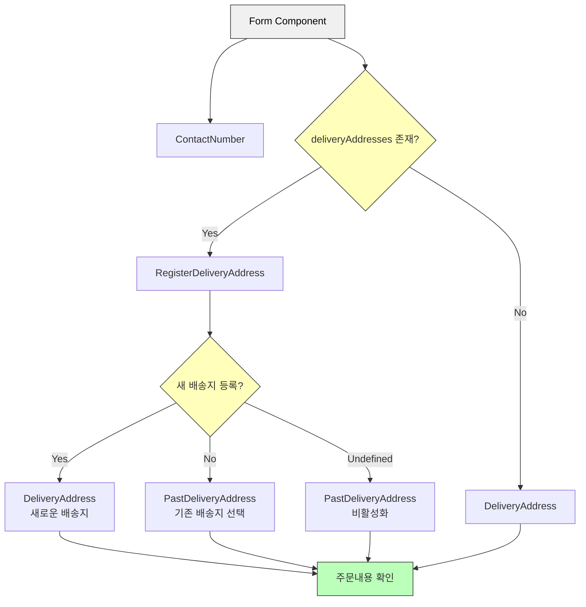

# 5. UI 컴포넌트 테스트

fireEvent vs userEvent

- fireEvent → DOM에 접근하여 이벤트를 일으킨다
- userEvent → 유저의 실제 동작과 유사하게 시뮬레이션 가능하다.

지금은 userEvent가 기본적으로 패키지에 포함되는데 이전(버전은 기억안나지만)에는 userEvent를 별도로 설치해야 했다

UI 컴포넌트 테스트는 간단하게 아래의 방식으로 테스트한다.

그려진거 확인 → 요소 접근 확인 → 요소 동작 확인

## 1. 간단한 UI 컴포넌트 테스트 해보기

우선 아래의 Form 컴포넌트에서 props로 넘겨받은 name이 잘 표시가 되는지 확인해보자

```tsx
type Props = {
  name: string;
  onSubmit?: (event: React.FormEvent<HTMLFormElement>) => void;
};
export const Form = ({ name, onSubmit }: Props) => {
  return (
    <form
      onSubmit={(event) => {
        event.preventDefault();
        onSubmit?.(event);
      }}
    >
      <h2>계정 정보</h2>
      <p>{name}</p>
      <div>
        <button>수정</button>
      </div>
    </form>
  );
};
```

1. 테스팅 라이브러리의 `render` 메서드를 통해 UI 컴포넌트를 렌더링할 수 있다.
2. `screen.getByText` 메서드를 통해 일치하는 문자열을 가진 한 개의 텍스트 요소를 찾는다. 없으면 오류가 발생하면서 테스트가 실패한다.
3. `toBeInTheDocument` matcher를 통해 해당 요소가 DOM에 존재하는지 검증한다. 해당 matcher는 `@testing-library/jest-dom` 으로 확장된 커스텀 matcher 중 하나이다. 명시적으로 import 할 필요는 없는데 이유는 `jest.setup.ts` 에서 import 해주고 있기 때문이다.

```tsx
import { render, screen } from "@testing-library/react";
import { Form } from "./Form";

test("이름을 표시한다", () => {
  // 1. 그린다(렌더링)
  render(<Form name="taro" />);
  // 2. 접근한다(가져온다)
  const text = screen.getByText("taro");
  // 3. 확인한다(검증한다)
  expect(text).toBeInTheDocument();
});
```

```tsx
// jest.setup.ts
import "@testing-library/jest-dom";
import React from "react";

global.React = React; // <- React를 전역 객체에 할당하는 구문
```

여기서 `global`은 `var global: typeof globalThis` 를 나타내는데 `globalThis`의 경우 브라우저냐 노드냐에 따라 다른 전역 객체를 참조하는데 이를 해결하기 위한 방법으로, `ECMAScript 2020`에서 추가되었다. Jest 설정 파일에서 이렇게 선언하는 것은 테스트 환경에서 전역 객체에 대한 타입 정의를 제공하기 위함이다.

[globalThis - JavaScript | MDN](https://developer.mozilla.org/ko/docs/Web/JavaScript/Reference/Global_Objects/globalThis)

```tsx
// 브라우저든 Node.js든 상관없이 동작
global.setTimeout;
global.console.log;
global.fetch;
```

---

## 2. DOM 요소를 가져오는 여러가지 방법

`getByRole` 메서드는 해당 DOM 요소의 암묵적인 역할을 통해 접근할 수 있다.

암묵적 역할(`…ByRole`)을 활용한 쿼리를 우선 사용하도록 권장한다.

웹 접근성도 이와 연관이 있다!

암묵적인 역할 목록: [ARIA in HTML](https://www.w3.org/TR/html-aria/#docconformance)

### HTML 태그와 ARIA Role 표

| HTML 태그                 | Role          | Testing Library 쿼리 예시                     | 비고                                |
| ------------------------- | ------------- | --------------------------------------------- | ----------------------------------- |
| `<h1>` ~ `<h6>`           | heading       | `getByRole('heading', { level: 1 })`          | level 속성으로 헤딩 레벨 지정 (1-6) |
| `<button>`                | button        | `getByRole('button', { name: '제출' })`       | type="button" 기본값                |
| `<li>`                    | listitem      | `getByRole('listitem')`                       | ul/ol 내부 아이템                   |
| `<ul>`                    | list          | `getByRole('list')`                           | 순서 없는 목록                      |
| `<ol>`                    | list          | `getByRole('list')`                           | 순서 있는 목록                      |
| `<a>`                     | link          | `getByRole('link', { name: '홈으로' })`       | href 속성 필요                      |
| ``                   | img           | `getByRole('img', { name: '프로필 이미지' })` | alt 텍스트가 name으로 사용됨        |
| `<input type="text">`     | textbox       | `getByRole('textbox')`                        | 텍스트 입력 필드                    |
| `<input type="checkbox">` | checkbox      | `getByRole('checkbox')`                       | 체크박스                            |
| `<input type="radio">`    | radio         | `getByRole('radio')`                          | 라디오 버튼                         |
| `<select>`                | combobox      | `getByRole('combobox')`                       | 드롭다운 선택                       |
| `<option>`                | option        | `getByRole('option')`                         | select 내부 옵션                    |
| `<table>`                 | table         | `getByRole('table')`                          | 테이블                              |
| `<tr>`                    | row           | `getByRole('row')`                            | 테이블 행                           |
| `<td>`                    | cell          | `getByRole('cell')`                           | 테이블 셀                           |
| `<th>`                    | columnheader  | `getByRole('columnheader')`                   | 테이블 헤더 셀                      |
| `<form>`                  | form          | `getByRole('form')`                           | 폼 요소                             |
| `<article>`               | article       | `getByRole('article')`                        | 독립적인 콘텐츠 영역                |
| `<nav>`                   | navigation    | `getByRole('navigation')`                     | 내비게이션 영역                     |
| `<main>`                  | main          | `getByRole('main')`                           | 메인 콘텐츠 영역                    |
| `<aside>`                 | complementary | `getByRole('complementary')`                  | 부가 콘텐츠 영역                    |
| `<footer>`                | contentinfo   | `getByRole('contentinfo')`                    | 푸터 영역                           |
| `<header>`                | banner        | `getByRole('banner')`                         | 헤더 영역                           |
| `<dialog>`                | dialog        | `getByRole('dialog')`                         | 모달/다이얼로그                     |

### 주요 사용 팁

1. name 옵션

   - 텍스트 콘텐츠
   - aria-label 속성
   - aria-labelledby 참조
   - alt 텍스트 (이미지)

   ```jsx
   getByRole("button", { name: "제출" }); // 텍스트가 '제출'인 버튼
   ```

2. level 옵션

   - heading 역할에서 사용

   ```jsx
   getByRole("heading", { level: 1 }); // h1 태그
   ```

3. 기타 옵션

   - checked: checkbox, radio 상태
   - selected: option 선택 상태
   - expanded: 확장 가능한 요소의 상태

   ```jsx
   getByRole("checkbox", { checked: true });
   ```

```tsx
const text = screen.getByText("taro");

const button = screen.getByRole("button");

const h2 = screen.getByRole("heading", { level: 2 });
```

`toHaveTextContent` matcher의 경우 실제 Element의 해당 text content 와 일치하는지 를 검증한다.

---

## 3. DOM 요소의 이벤트 핸들러 호출하기

앞서 말했듯 `fireEvent`의 경우 해당 DOM 요소 접근하여 이벤트를 호출한다.

`onSubmit` 이벤트가 발생했을 때 `mock`으로 전달한 `mockFn`가 호출이 잘되는지를 확인해야 한다.

`toHaveBeenCalled` matcher를 통해 해당 `mockFn` 함수가 호출되었는지 검증한다.

```tsx
import { fireEvent, render, screen } from "@testing-library/react";
import { Form } from "./Form";

test("버튼을 클릭하면 이벤트 핸들러가 실행된다", () => {
  const mockFn = jest.fn();
  render(<Form name="taro" onSubmit={mockFn} />);
  fireEvent.click(screen.getByRole("button"));
  expect(mockFn).toHaveBeenCalled();
});
```

---

## 4. 리스트 형태의 UI 컴포넌트 테스트

1. 여러 DOM 요소에 접근하는 방법
2. 리스트 아이템이 존재하지 않음을 검증하는 방법

```tsx
// ArticleList.tsx

import { ArticleListItem, ItemProps } from "./ArticleListItem";

type Props = {
  items: ItemProps[];
};

export const ArticleList = ({ items }: Props) => {
  return (
    <div>
      <h2>기사 목록</h2>
      {items.length ? (
        <ul>
          {items.map((item) => (
            <ArticleListItem {...item} key={item.id} />
          ))}
        </ul>
      ) : (
        <p>게재된 기사가 없습니다</p>
      )}
    </div>
  );
};
```

위 컴포넌트를 통해 아이템의 존재 유무에 따라 분기 처리하여 테스트해야 한다.

1. 아이템이 있는 경우 `ArticleListItem` 컴포넌트가 렌더링 되어야 한다.
2. 아이템이 없는 경우 `게재된 기사가 없습니다` 텍스트가 렌더링 되어야 한다.

리스트에 데이터가 표시되는지 확인하기 위해서는 `getAllByRole` 메서드를 사용해야 한다.

지금까지 써온 `getByRole` 와의 차이점은 해당 “역할의 맞는 요소를 하나만 가져오냐 복수로 가져오냐” 이다.

### Testing Library에서 요소를 가져올 때 사용하는 쿼리 테이블

[About Queries | Testing Library](https://testing-library.com/docs/queries/about#types-of-queries)

| 쿼리 유형     | 매치 없음        | 1개 매치  | 여러 개 매치 | 재시도 (async/await) |
| ------------- | ---------------- | --------- | ------------ | -------------------- |
| **단일 요소** |                  |           |              |                      |
| getBy...      | 에러 발생        | 요소 반환 | 에러 발생    | 아니오               |
| queryBy...    | null 반환        | 요소 반환 | 에러 발생    | 아니오               |
| findBy...     | 에러 발생        | 요소 반환 | 에러 발생    | 예                   |
| **다중 요소** |                  |           |              |                      |
| getAllBy...   | 에러 발생        | 배열 반환 | 배열 반환    | 아니오               |
| queryAllBy... | 빈 배열([]) 반환 | 배열 반환 | 배열 반환    | 아니오               |
| findAllBy...  | 에러 발생        | 배열 반환 | 배열 반환    | 예                   |

자세한 설명은 아래와 같다

1. 단일 요소 찾기

   1. `getBy...`
      - 매칭되는 요소를 하나 반환
      - 매칭되는 요소가 없거나 여러 개면 에러 발생
      - 여러 요소를 찾아야 할 때는 `getAllBy` 사용 권장
   2. `queryBy...`
      - 매칭되는 요소를 하나 반환
      - 매칭되는 요소가 없으면 `null` 반환 (요소가 없는 상태를 테스트할 때 유용)
      - 여러 개 매칭되면 에러 발생
      - 여러 요소를 찾아도 괜찮은 경우 `queryAllBy` 사용
   3. `findBy...`
      - Promise를 반환 (비동기 처리)
      - 기본 타임아웃 1000ms 내에 요소를 찾으면 resolve
      - 요소를 못 찾거나 여러 개 찾으면 reject
      - 여러 요소를 찾을 때는 `findAllBy` 사용

2. 다중 요소 찾기

   1. `getAllBy...`
      - 매칭되는 모든 요소를 배열로 반환
      - 매칭되는 요소가 없으면 에러 발생
   2. `queryAllBy...`
      - 매칭되는 모든 요소를 배열로 반환
      - 매칭되는 요소가 없으면 빈 배열(`[]`) 반환
   3. `findAllBy...`

      - Promise를 반환 (비동기 처리)
      - 요소들을 찾으면 배열로 resolve
      - 1000ms 내에 요소를 못 찾으면 reject
      - `findBy`는 `getBy`와 `waitFor`의 조합으로, 마지막 인자로 `waitFor` 옵션을 받음

      ```jsx
      await screen.findByText("text", queryOptions, waitForOptions);
      ```

핵심 포인트:

- 동기 검색: getBy, queryBy, getAllBy, queryAllBy
- 비동기 검색: findBy, findAllBy
- 요소가 없어도 될 때: queryBy, queryAllBy
- 여러 요소 찾기: getAllBy, queryAllBy, findAllBy

지금 예제에서 리스트 형태로 표시되는 것은 li 요소이다 li는 `listitem`이라는 암묵적인 역할이 있다

위 테이블에 언급했듯 리스트 형태는 `getAllByRole`을 써야지 단일 요소와 매칭되는 `getByRole`을 쓰면 에러를 반환한다.

이후 `toHaveLength` matcher를 통해 배열의 길이를 검증한다.

```tsx
// 사용된 fixture
const items: ItemProps[] = [
  {
    id: "howto-testing-with-typescript",
    title: "타입스크립트를 사용한 테스트 작성법",
    body: "테스트 작성 시 타입스크립트를 사용하면 테스트의 유지 보수가 쉬워진다",
  },
  {
    id: "nextjs-link-component",
    title: "Next.js의 링크 컴포넌트",
    body: "Next.js는 화면을 이동할 때 링크 컴포넌트를 사용한다",
  },
  {
    id: "react-component-testing-with-jest",
    title: "제스트로 시작하는 리액트 컴포넌트 테스트",
    body: "제스트는 단위 테스트처럼 UI 컴포넌트를 테스트할 수 있다",
  },
];

test("items의 수만큼 목록을 표시한다", () => {
  render(<ArticleList items={items} />);
  expect(screen.getAllByRole("listitem")).toHaveLength(3);
});
```

> [!NOTE]
> 책에서는 해당 테스트로는 불충분하며 목록 요소를 나타내는 ul 요소가 존재하는가를 검증해야 한다고 한다.
> 물론 삼항연산자가 들어갔기 때문에 ul이 노출이 안되는 상황일 수도 있다.
> 하지만 ul 요소를 통해 다른 무언가를 검증해야 하는 것이 아니라면 li 요소들만 잘 표시가 된다면 ul 요소는 올바르게 표시가 된다고 판단이 될 것 같다는 생각이다.
> 💡 여러분들은 어떻게 생각하시나요?

### 검증을 원하는 요소로 범위 좁히기

여러 ul-li / ol-li 요소들이 포함된 큰 컴포넌트라면 `getAllByRole("listitem")` 을 통해 접근할 때 테스트 대상이 아닌 요소들도 포함될 수 있다.

이 때 사용하는 메서드가 `within` 이다.

매개변수로 넘겨받은 요소 하위로 범위가 좁혀진다.

```tsx
test("items의 수만큼 목록을 표시한다", () => {
  render(<ArticleList items={items} />);
  // ul 태그 가져오기
  const list = screen.getByRole("list");
  // ul이 존재하는지 검증
  expect(list).toBeInTheDocument();
  // within을 통해 list 안에 li의 길이가 의도한 값인지 검증
  expect(within(list).getAllByRole("listitem")).toHaveLength(3);
});
```

### 리스트가 존재하지 않는 경우를 검증하는 방법

아래의 예제에서 items의 길이가 0일 경우 삼항연산자로 `items.length` 를 평가할 경우 falsy한 값이 되기 때문에 true 판정이 아닌 false 판정을 받는다.

그렇게 되면 ul-li 요소가 표시되는 것이 아닌 `<p>게재된 기사가 없습니다</p>` 요소가 노출된다.

```tsx
// ArticleList.tsx

import { ArticleListItem, ItemProps } from "./ArticleListItem";

type Props = {
  items: ItemProps[];
};

export const ArticleList = ({ items }: Props) => {
  return (
    <div>
      <h2>기사 목록</h2>
      {items.length ? (
        <ul>
          {items.map((item) => (
            <ArticleListItem {...item} key={item.id} />
          ))}
        </ul>
      ) : (
        <p>게재된 기사가 없습니다</p>
      )}
    </div>
  );
};
```

그럼 위에서 사용한 테스트코드를 살짝 고쳐서 배열의 길이가 0임을 검증하게 만들어보자

```tsx
test("items에 데이터가 없다면 아이템은 표시되지 않습니다", () => {
  // fixture로 빈 배열 넘기기
  render(<ArticleList items={[]} />);
  // ul 태그 가져오기
  const list = screen.getByRole("list");
  // ul이 존재하지 않는지 검증
  expect(list).not.toBeInTheDocument();
  // within을 통해 list 안에 li의 길이가 0인지 검증
  expect(within(list).getAllByRole("listitem")).toHaveLength(0);
});
```

일단 위 테스트 코드는 잘못되었다.

list가 존재하지 않음을 검증하는 것은 맞으나 존재하지 않는 요소를 가지고 하위의 요소들에 접근하여 테스트하는 것은 잘못되었다.

그렇다면 어떻게 고쳐야할까

시나리오를 다시 그리자면 `items`가 없으면 ul 요소는 표시되지 않고 p 요소의 텍스트를 보여주는 테스트가 되면 된다.

잘못된 시나리오를 넘어서서 일단 `getByRole` 라인에서 에러가 나게된다.

> `TestingLibraryElementError: Unable to find an accessible element with the role "list"`

에러를 해석하자면 `role이 list인 접근가능한 요소를 찾을 수 없다는 것`이다.

이러면 어떻게 없음을 검증하라는 걸까?

일단 에러의 원인은 위에 쿼리의 종류를 정리한 표에서 찾을 수 있다.

기본적으로 `getBy...` 메서드는 매칭되는 요소가 하나 있다는 가정하에 테스트하게되며 존재하지 않음을 검증하기 위해서는 `queryBy...` 메서드를 사용해야 한다.

그래야 요소를 찾지 못하면 `null` 을 반환하게 될테니 말이다.

| 쿼리 유형     | 매치 없음 | 1개 매치  | 여러 개 매치 | 재시도 (async/await) |
| ------------- | --------- | --------- | ------------ | -------------------- |
| **단일 요소** |           |           |              |                      |
| getBy...      | 에러 발생 | 요소 반환 | 에러 발생    | 아니오               |
| queryBy...    | null 반환 | 요소 반환 | 에러 발생    | 아니오               |

그렇다고 해서 `queryBy...` 로 바꿔도 테스트는 실패한다 아까 말했듯 잘못된 테스트라는 것이 여기에서 나타난다.

```tsx
test("items에 데이터가 없다면 아이템은 표시되지 않습니다", () => {
  render(<ArticleList items={[]} />);
  const list = screen.queryByRole("list");
  expect(list).not.toBeInTheDocument();
  expect(within(list).getAllByRole("listitem")).toHaveLength(0); // 에러 발생
});
```

> `items에 데이터가 없다면 아이템은 표시되지 않습니다
TypeError: Expected container to be an Element, a Document or a DocumentFragment but got null.`

위와 같은 에러가 발생하는데 애초에 list가 없기 때문에 실패하는 테스트이다.

그렇기에 list의 배열의 값이 아닌 p 요소의 텍스트 존재로 검증으로 테스트 해야하는 것이다.

위 상황을 고려하면 테스트를 다시 작성하면 아래와 같은 코드가 만들어진다.

```tsx
test("목록에 표시할 데이터가 없으면 '게재된 기사가 없습니다'를 표시한다", () => {
  // 빈 배열을 items에 할당하여 목록에 표시할 데이터가 없는 상황을 재현한다.
  render(<ArticleList items={[]} />);
  // 존재하지 않을 것으로 예상하는 요소의 취득을 시도한다. (queryBy...를 통해)
  const list = screen.queryByRole("list");

  // ========================================

  // [실무에서는 아래 두 단언 중 하나로 검증해도 된다]

  // list가 존재하지 않는다.
  expect(list).not.toBeInTheDocument();
  // list가 null이다. (존재하지 않으면 null 반환)
  expect(list).toBeNull();

  // ========================================

  // '게재된 기사가 없습니다'가 표시됐는지 확인한다.
  expect(screen.getByText("게재된 기사가 없습니다")).toBeInTheDocument();
});
```

### 단일 아이템 컴포넌트 테스트

`ArticleList` 컴포넌트의 아이템은 `ArticleListItem` 컴포넌트로 별도 분리되어 있다.

검증이 필요한 부분을 테스트 코드로 작성하면 된다.

여기서는 a 태그의 url이 의도한 대로 표시가 되는지 검증한다.

```tsx
// ArticleListItem.tsx
export type ItemProps = {
  id: string;
  title: string;
  body: string;
};

export const ArticleListItem = ({ id, title, body }: ItemProps) => {
  return (
    <li>
      <h3>{title}</h3>
      <p>{body}</p>
      <a href={`/articles/${id}`}>더 알아보기</a>
    </li>
  );
};
```

1. 다른 테스트와 동일하게 `render` 메서드를 통해 테스트할 컴포넌트를 가져온다
2. a 요소는 link라는 암묵적인 역할을 가지고 있기 때문에 `screen.getByRole("link"))` 를 통해 가져오고 옵션으로 해당 요소가 가지고 있는 text를 넣는다.
3. `toHaveAttribute(속성이름, 속성값)` matcher를 통해 href 속성이 의도한 url을 가지고 있는지 검증하면 된다

```tsx
const item: ItemProps = {
  id: "howto-testing-with-typescript",
  title: "타입스크립트를 사용한 테스트 작성법",
  body: "테스트 작성 시 타입스크립트를 사용하면 테스트의 유지 보수가 쉬워진다",
};

test("링크에 id로 만든 URL을 표시한다", () => {
  render(<ArticleListItem {...item} />);
  expect(screen.getByRole("link", { name: "더 알아보기" })).toHaveAttribute(
    "href",
    "/articles/howto-testing-with-typescript"
  );
});
```

### Testing Library의 쿼리 우선순위

[About Queries - priority | Testing Library](https://testing-library.com/docs/queries/about/#priority)

1. 모든 사용자가 접근 가능한 쿼리

   - 시각적 사용자와 보조 기술 사용자 모두의 경험을 반영하는 쿼리들

   1. `getByRole`
      - 접근성 트리에 노출된 모든 요소 검색 가능
      - `name` 옵션으로 접근 가능한 이름 필터링
      - 가장 권장되는 최우선 쿼리
      - 예시: `getByRole('button', {name: /제출/i})`
   2. `getByLabelText`
      - form 필드에 최적화
      - 사용자가 라벨 텍스트로 요소를 찾는 실제 경험 반영
      - form 요소 테스트 시 최우선 고려
   3. `getByPlaceholderText`
      - placeholder는 label의 대체재가 아님
      - 다른 대안이 없을 때만 사용
   4. `getByText`
      - form 외 요소는 텍스트로 찾는 것이 일반적
      - div, span, p 같은 비상호작용 요소 검색에 사용
   5. `getByDisplayValue`

      - form 요소의 현재 값으로 검색
      - 값이 채워진 페이지 탐색 시 유용

2. 시맨틱 쿼리

   - HTML5와 ARIA 규격을 따르는 선택자들
   - 브라우저와 보조 기술에 따라 사용자 경험이 다를 수 있음

   1. `getByAltText`
      - alt 텍스트 지원 요소 검색 (img, area, input 등)
   2. `getByTitle`

      - 스크린리더가 일관되게 읽지 않음
      - 시각적 사용자에게 기본적으로 보이지 않음

3. 테스트 ID

   1. `getByTestId`
      - 사용자가 보거나 들을 수 없음
      - role이나 text로 매칭이 불가능하거나 적절하지 않을 때만 사용
      - 동적 텍스트가 있는 경우 등에 사용

핵심 원칙:

- 실제 사용자의 페이지 사용 방식을 최대한 반영
- 접근성을 고려한 쿼리 우선 사용
- TestId는 최후의 수단으로만 사용

---

## 5. 인터랙티브 UI 컴포넌트 테스트

Form 컴포넌트의 다양한 입력과 상태를 체크하는 테스트

접근 가능한 쿼리 기반의 작성법

Form 컴포넌트는

1. form 요소 기반으로 이루어진 컴포넌트
2. 계정 정보를 입력 받는 InputAccount 컴포넌트 (input text기반)
3. 이용약관동의를 위한 Agreement 컴포넌트 (input checkbox 기반)

```tsx
// Form.tsx
import { useId, useState } from "react";
import { Agreement } from "./Agreement";
import { InputAccount } from "./InputAccount";

export const Form = () => {
  const [checked, setChecked] = useState(false);
  const headingId = useId();
  return (
    <form aria-labelledby={headingId}>
      <h2 id={headingId}>신규 계정 등록</h2>
      <InputAccount />
      <Agreement
        onChange={(event) => {
          setChecked(event.currentTarget.checked);
        }}
      />
      <div>
        <button disabled={!checked}>회원가입</button>
      </div>
    </form>
  );
};
```

### Agreement 컴포넌트 테스트

아래의 컴포넌트는 체크박스를 클릭하면 `props`로 넘겨받은 `onChange` 콜백 함수를 호출한다.

```tsx
// Agreement.tsx

type Props = {
  onChange?: React.ChangeEventHandler<HTMLInputElement>;
};

export const Agreement = ({ onChange }: Props) => {
  return (
    <fieldset>
      <legend>이용 약관 동의</legend>
      <label>
        <input type="checkbox" onChange={onChange} />
        서비스&nbsp;<a href="/terms">이용 약관</a>을 확인했으며 이에 동의합니다
      </label>
    </fieldset>
  );
};
```

1. 접근 가능한 이름 인용하기

```tsx
test("fieldset의 접근 가능한 이름을 legend에서 인용합니다", () => {
  render(<Agreement />);
  expect(
    screen.getByRole("group", { name: "이용 약관 동의" })
  ).toBeInTheDocument();
});
```

`fieldset` 요소는 `group`이라는 암묵적인 역할을 한다.

옵션으로 넣은 `name`에 제목을 나타내는 `legend`의 text를 통해 확실하게 원하는 요소를 찾을 수 있다.

1. 체크 박스의 초기 값 검증하기

```tsx
test("체크 박스가 체크되어 있지 않습니다", () => {
  render(<Agreement />);
  expect(screen.getByRole("checkbox")).not.toBeChecked();
});
```

input의 경우 type에 따라 암묵적 역할이 다르다

`input type="checkbox"` 의 경우 checkbox 라는 암묵적 역할을 수행한다.

최초 렌더링시에는 체크가 되어 있지 않으니 `not` matcher와 `toBeChecked` matcher를 통해 초기 상태를 검증한다.

### InputAccount 컴포넌트 테스트

계정 정보를 입력하는 input 요소가 두 개 존재한다.

동일하게 fieldset 요소가 group의 역할을 하고 있다.

```tsx
// InputAccount.tsx
export const InputAccount = () => {
  return (
    <fieldset>
      <legend>계정정보 입력</legend>
      <div>
        <label>
          메일주소
          <input type="text" placeholder="example@test.com" />
        </label>
      </div>
      <div>
        <label>
          비밀번호
          <input type="password" placeholder="8자 이상" />
        </label>
      </div>
    </fieldset>
  );
};
```

이번에는 `fireEvent`가 아닌 실제 유저의 인터렉션과 유사한 재현을 할 수 있는 `userEvent`를 사용한다.

`userEvent`를 사용하기 위해서는 `setup`을 통해 인스턴스를 생성한다.

```tsx
// 초기 셋업
const user = userEvent.setup();
```

> Start a "session" with userEvent. All APIs returned by this function share an input device state and a default configuration.

`userEvent`로 '세션'을 시작합니다. 이 함수가 반환하는 모든 API는 입력 장치의 상태와 기본 구성을 공유합니다.

1. 이메일

```tsx
test("메일주소 입력란", async () => {
  render(<InputAccount />);
  // 1. 이메일의 경우 input은 암묵적으로 textbox 역할을 가지고 있다.
  const textbox = screen.getByRole("textbox", { name: "메일주소" });
  const value = "taro.tanaka@example.com";
  // 2. user.type을 통해 실제 유저의 인터랙션을 재현한다.
  //    모든 입력이 수행될 때까지 기다려야 하기에 비동기 처리를 하고 있다.
  await user.type(textbox, value);
  // 3. toBeInTheDocument matcher를 통해 실제 display된 값이 입력한 값과 일치하는지 검증한다.
  expect(screen.getByDisplayValue(value)).toBeInTheDocument();
});
```

`getByDisplayValue` 메서드는 form 요소의 현재 값을 기준으로 요소를 찾는다.

1. 비밀번호

```tsx
test("비밀번호 입력란", async () => {
  render(<InputAccount />);
  // placeholder에 접근하여 요소 찾기
  const password = screen.getByPlaceholderText("8자 이상");
  const value = "abcd1234";
  await user.type(password, value);
  expect(screen.getByDisplayValue(value)).toBeInTheDocument();
});
```

`input type="password"` 의 경우 다른 input들과는 다르게 암묵적인 역할을 가지고 있지 않다.

이유는 보안과 접근성의 이유인 것 같다.

`testing-library`에도 관련된 내용이 짤막하게だ

[ByRole | Testing Library](https://testing-library.com/docs/queries/byrole/#api)

> Unfortunately, the spec defines that `<input type="password" />` has no implicit role. This means that in order to query this type of element we must fallback to a less powerful query such as

[`ByLabelText`](https://testing-library.com/docs/queries/bylabeltext).

그러면 해당 요소를 어떻게 가져와야할까

3가지 방법이다.

1. 명시적인 role 부여

```html
<label>
  비밀번호
  <input type="password" placeholder="8자 이상" role="textbox" />
</label>

screen.getByRole("textbox", { name: "비밀번호" }))
```

1. label을 통한 접근

```tsx
screen.getByLabelText("비밀번호");
```

1. placeholder를 통한 접근

```tsx
screen.getByPlaceholderText("8자 이상"))
```

### Form 컴포넌트 테스트

```tsx
// Form.tsx
export const Form = () => {
  const [checked, setChecked] = useState(false);
  const headingId = useId();
  return (
    <form aria-labelledby={headingId}>
      <h2 id={headingId}>신규 계정 등록</h2>
      <InputAccount />
      <Agreement
        onChange={(event) => {
          setChecked(event.currentTarget.checked);
        }}
      />
      <div>
        <button disabled={!checked}>회원가입</button>
      </div>
    </form>
  );
};
```

1. 회원가입 버튼 활성화 테스트

활성화 여부 검증은 `toBeDisabled` matcher와 `toBeEnabled` matcher를 사용한다.

```tsx
test("회원가입 버튼은 비활성화 상태다", () => {
  render(<Form />);
  // 초기 렌더링시 회원가입 버튼이 비활성화 되는지 검증
  expect(screen.getByRole("button", { name: "회원가입" })).toBeDisabled();
});

test("이용 약관에 동의하는 체크 박스를 클릭하면 회원가입 버튼은 활성화된다", async () => {
  render(<Form />);
  // user.click 을 활용해 체크박스의 클릭 동장을 재현한다.
  await user.click(screen.getByRole("checkbox"));
  expect(screen.getByRole("button", { name: "회원가입" })).toBeEnabled();
});
```

1. form의 접근 가능한 이름

form에서 접근가능한 이름은 `aria-labelledby` 속성을 이용해서 h2 요소에 인용한다.

`fieldset-legend`와의 관계와 동일하다.

`aria-labelledby` 값에 h2 요소에 id 속성의 값을 넣어주면 된다.

```tsx
<form aria-labelledby={headingId}>
<h2 id={headingId}>신규 계정 등록</h2>
```

```tsx
test("form의 접근 가능한 이름은 heading에서 인용합니다", () => {
  render(<Form />);
  expect(
    // name 옵션으 값으로 활용 가능하다.
    screen.getByRole("form", { name: "신규 계정 등록" })
  ).toBeInTheDocument();
});
```

---

## 6. 유틸리티 함수를 활용한 테스트

form 입력 인터랙션을 함수화해서 활용하는 팁을 다룬다.

흔히보는 배송지 입력 폼이다

특정 조건에 따른 분기 처리가 들어가 있다.

> 지금까지 배웠던 것들을 종합해서 확인할 수 있는 테스트
> 그렇기에 자세한 설명보다는 빠름 흐름 확인을 위해 테스트 코드 내의 주석으로 설명

```tsx
// Form.tsx
import { useState } from "react";
import { ContactNumber } from "./ContactNumber";
import { DeliveryAddress } from "./DeliveryAddress";
import { PastDeliveryAddress } from "./PastDeliveryAddress";
import { RegisterDeliveryAddress } from "./RegisterDeliveryAddress";

export type AddressOption = React.ComponentProps<"option"> & { id: string };
export type Props = {
  deliveryAddresses?: AddressOption[];
  onSubmit?: (event: React.FormEvent<HTMLFormElement>) => void;
};
export const Form = (props: Props) => {
  const [registerNew, setRegisterNew] = useState<boolean | undefined>(
    undefined
  );
  return (
    <form onSubmit={props.onSubmit}>
      <h2>배송지 정보 입력</h2>
      <ContactNumber />
      {props.deliveryAddresses?.length ? (
        <>
          <RegisterDeliveryAddress onChange={setRegisterNew} />
          {registerNew ? (
            <DeliveryAddress title="새로운 배송지" />
          ) : (
            <PastDeliveryAddress
              disabled={registerNew === undefined}
              options={props.deliveryAddresses}
            />
          )}
        </>
      ) : (
        <DeliveryAddress />
      )}
      <hr />
      <div>
        <button>주문내용 확인</button>
      </div>
    </form>
  );
};
```

mermaid로 그려본 분기처리 다이어그램이다.



분기 시점

1. 이전 배송지 없음 (deliveryAddresses x)
2. 이전 배송지 있음 - 신규 배송지 등록 (deliveryAddresses o + registerNew o)
3. 이전 배송지 있음 - 신규 배송지 등록 안함 ( deliveryAddresses o + registerNew x)

이렇게 분기 처리가 다양하니 각 테스트 마다 공통으로 사용되는 함수를 뽑아 놓으면 재활용이 가능하다.

```tsx
// 연락처 입력 함수
async function inputContactNumber(
  inputValues = {
    name: "배언수",
    phoneNumber: "000-0000-0000",
  }
) {
  await user.type(
    screen.getByRole("textbox", { name: "전화번호" }),
    inputValues.phoneNumber
  );
  await user.type(
    screen.getByRole("textbox", { name: "이름" }),
    inputValues.name
  );
  return inputValues;
}

// 배송지 입력 함수
async function inputDeliveryAddress(
  inputValues = {
    postalCode: "16397",
    prefectures: "경기도",
    municipalities: "수원시 권선구",
    streetNumber: "매곡로 67",
  }
) {
  await user.type(
    screen.getByRole("textbox", { name: "우편번호" }),
    inputValues.postalCode
  );
  await user.type(
    screen.getByRole("textbox", { name: "시/도" }),
    inputValues.prefectures
  );
  await user.type(
    screen.getByRole("textbox", { name: "시/군/구" }),
    inputValues.municipalities
  );
  await user.type(
    screen.getByRole("textbox", { name: "도로명" }),
    inputValues.streetNumber
  );
  return inputValues;
}

// 제출 버튼 클릭 함수
async function clickSubmit() {
  await user.click(screen.getByRole("button", { name: "주문내용 확인" }));
}

// 제출 핸들러 함수
function mockHandleSubmit() {
  const mockFn = jest.fn();
  const onSubmit = (event: React.FormEvent<HTMLFormElement>) => {
    event.preventDefault();
    const formData = new FormData(event.currentTarget);
    const data: { [k: string]: unknown } = {};
    formData.forEach((value, key) => (data[key] = value));
    // data를 mockFn 함수에 props로 넘기기
    mockFn(data);
  };
  return [mockFn, onSubmit] as const;
}
```

이 함수들을 활용해서 테스트를 작성해보자

### 이전 배송지가 없는 경우 테스트

```tsx
describe("이전 배송지가 없는 경우", () => {
  test("배송지 입력란이 존재한다", () => {
    // props로 넘기는 deliveryAddresses 값이 없으니 이전 배송지가 없음을 가정
    render(<Form />);
    // fieldset-legend 의 관계를 활용한 요소 찾기 및 존재 검증
    // 연락처는 기본으로 있기에 검증
    expect(screen.getByRole("group", { name: "연락처" })).toBeInTheDocument();
    // 이전 배송지가 없으면 새 배송지 입력을 위한 [배송지 입력 폼] 존재 검증
    expect(screen.getByRole("group", { name: "배송지" })).toBeInTheDocument();
  });

  test("폼을 제출하면 입력 내용을 전달받는다", async () => {
    const [mockFn, onSubmit] = mockHandleSubmit();
    render(<Form onSubmit={onSubmit} />);
    // 함수로 빼둔 입력 폼 관련 이벤트를 발생시킨다.
    const contactNumber = await inputContactNumber();
    const deliveryAddress = await inputDeliveryAddress();
    // 제출 버튼 클릭
    await clickSubmit();

    // onSubmit을 통해 전달된 data를 콜백으로 넘긴 mockFn에 제대로 전달되었는지 검증
    expect(mockFn).toHaveBeenCalledWith(
      expect.objectContaining({ ...contactNumber, ...deliveryAddress })
    );
  });
});
```

### 이전 배송지가 있는 경우 테스트

```tsx
describe("이전 배송지가 있는 경우", () => {
  test("질문에 대답할 때까지 배송지를 선택할 수 없다", () => {
    // props로 넘기는 deliveryAddresses 값이 존재하니 이전 배송지가 있다고 가정
    render(<Form deliveryAddresses={deliveryAddresses} />);
    // 초기 새 배송지 등록을 묻는 컴포넌트 존재 검증 (라디오 값 없음)
    expect(
      screen.getByRole("group", { name: "새로운 배송지를 등록하시겠습니까?" })
    ).toBeInTheDocument();
    // 초기에는 과거 배송지 컴포넌트가 비활성화되어 있는지 검증
    // fieldset 요소에는 disabled 속성이 있다!
    expect(screen.getByRole("group", { name: "이전 배송지" })).toBeDisabled();
  });

  // 새 배송지 등록 라디오 - 아니오 선택
  test("'아니오'를 선택하고 제출하면 입력 내용을 전달받는다", async () => {
    const [mockFn, onSubmit] = mockHandleSubmit();
    render(<Form deliveryAddresses={deliveryAddresses} onSubmit={onSubmit} />);
    // 아니오 - 라디오 버튼 클릭
    await user.click(screen.getByLabelText("아니오"));
    // 이전 배송지가 그대로 있는지 검증 - 새 배송지 입력 안하니까
    expect(
      screen.getByRole("group", { name: "이전 배송지" })
    ).toBeInTheDocument();
    // 연락처 입력
    const inputValues = await inputContactNumber();
    // 제출
    await clickSubmit();
    // 새로 입력한 연락처 값이 mockFn에 제대로 넘어갔는지 검증
    expect(mockFn).toHaveBeenCalledWith(expect.objectContaining(inputValues));
  });

  // 새 배송지 등록 라디오 - 네 선택
  test("'네'를 선택하고 제출하면 입력 내용을 전달받는다", async () => {
    const [mockFn, onSubmit] = mockHandleSubmit();
    render(<Form deliveryAddresses={deliveryAddresses} onSubmit={onSubmit} />);
    // 네 - 라디오 버튼 클릭
    await user.click(screen.getByLabelText("네"));
    // 네 클릭 -> 새로운 배송지 입력 컴포넌트 존재 검증
    expect(
      screen.getByRole("group", { name: "새로운 배송지" })
    ).toBeInTheDocument();
    // 연락처 입력
    const contactNumber = await inputContactNumber();
    // 배송지 정보 입력
    const deliveryAddress = await inputDeliveryAddress();
    // 제출
    await clickSubmit();
    // 새로 입력한 연락처 값이 mockFn에 제대로 넘어갔는지 검증
    expect(mockFn).toHaveBeenCalledWith(
      expect.objectContaining({ ...contactNumber, ...deliveryAddress })
    );
  });
});
```

---

## 7. 비동기 처리가 포함된 UI 컴포넌트 테스트

이전 장에서 다룬 onSubmit의 경우

`onSubmit?: (event: React.FormEvent<HTMLFormElement>) => void`

이런 타입의 함수였다

```tsx
export function handleSubmit(callback: (values: any) => Promise<void> | void) {
  return (event: React.FormEvent<HTMLFormElement>) => {
    event.preventDefault();
    const formData = new FormData(event.currentTarget);
    const values: { [k: string]: unknown } = {};
    formData.forEach((value, key) => (values[key] = value));
    // 1. form을 통해 받은 값을 values 라는 객체 형태로 가공해서 callback에 넘긴다.
    return callback(values);
  };
}
```

이번 장에서는 결과값을 fetch API 사용해 호출하는 방식을 다룬다.

```tsx
export const RegisterAddress = () => {
  const [postResult, setPostResult] = useState("");
  return (
    <div>
      <Form
        // 1. form을 통해 받은 값을 values 라는 객체 형태로 가공해서 callback에 넘긴다.
        onSubmit={handleSubmit((values) => {
          try {
            // 2. 휴대폰 번호에 대해 유효성 검사를 실시한다.
            checkPhoneNumber(values.phoneNumber);
            // 3. 웹 API 클라이언트를 호출한다
            postMyAddress(values)
              .then(() => {
                setPostResult("등록됐습니다");
              })
              .catch(() => {
                setPostResult("등록에 실패했습니다");
              });
          } catch (err) {
            if (err instanceof ValidationError) {
              setPostResult("올바르지 않은 값이 포함되어 있습니다");
              return;
            }
            setPostResult("알 수 없는 에러가 발생했습니다");
          }
        })}
      />
      {postResult && <p>{postResult}</p>}
    </div>
  );
};
```

```tsx
// 2. 휴대폰 번호에 대해 유효성 검사를 실시한다.
export class ValidationError extends Error {}

export function checkPhoneNumber(value: any) {
  if (!value.match(/^[0-9\-]+$/)) {
    throw new ValidationError();
  }
}
```

```tsx
async function handleResponse(res: Response) {
  const data = await res.json();
  if (!res.ok) {
    throw data;
  }
  return data;
}

const host = (path: string) => `https://myapi.testing.com${path}`;

const headers = {
  Accept: "application/json",
  "Content-Type": "application/json",
};

// 3. 웹 API 클라이언트를 호출한다
export function postMyAddress(values: unknown): Promise<Result> {
  return fetch(host("/my/address"), {
    method: "POST",
    body: JSON.stringify(values),
    headers,
  }).then(handleResponse);
}
```

```tsx
// 웹 API 클라이언트의 목함수
import type { HttpError, Result } from "./type";

const httpError: HttpError = {
  err: { message: "internal server error" },
};

const postMyAddressMock: Result = {
  result: "ok",
};

export function mockPostMyAddress(status = 200) {
  // 상태가 300 이상이면 예외를 발생시킨다.
  if (status > 299) {
    return jest
      .spyOn(Fetchers, "postMyAddress")
      .mockRejectedValueOnce(httpError);
  }
  return jest
    .spyOn(Fetchers, "postMyAddress")
    .mockResolvedValueOnce(postMyAddressMock);
}
```

입력한 값들을 가지고 제출 버튼을 클릭하고 해당 값을 반환하는 비동기 함수이다.

```tsx
async function fillValuesAndSubmit() {
  const contactNumber = await inputContactNumber();
  const deliveryAddress = await inputDeliveryAddress();
  const submitValues = { ...contactNumber, ...deliveryAddress };
  await clickSubmit();
  return submitValues;
}

export async function clickSubmit() {
  await user.click(screen.getByRole("button", { name: "주문내용 확인" }));
}
```

### 응답 성공 테스트

```tsx
test("성공하면 '등록됐습니다'가 표시된다", async () => {
  // 웹 API 클라이언트의 목함수 함수 가져오기
  const mockFn = mockPostMyAddress();
  render(<RegisterAddress />);
  // 필요한 폼을 입력하고 제출!
  const submitValues = await fillValuesAndSubmit();
  // 반환한 submitValues값이 제대로 mockFn에 전달되었는지 검증
  expect(mockFn).toHaveBeenCalledWith(expect.objectContaining(submitValues));
  // 성공시 노출되는 텍스트 존재 검증
  expect(screen.getByText("등록됐습니다")).toBeInTheDocument();
});
```

### 응답 실패 테스트

```tsx
test("실패하면 '등록에 실패했습니다'가 표시된다", async () => {
  // 상태 500을 전달함으로써 예외를 발생 시킨다.
  const mockFn = mockPostMyAddress(500);
  render(<RegisterAddress />);
  // 필요한 폼을 입력하고 제출!
  const submitValues = await fillValuesAndSubmit();
  // 반환한 submitValues값이 제대로 mockFn에 전달되었는지 검증
  expect(mockFn).toHaveBeenCalledWith(expect.objectContaining(submitValues));
  // 예외처리가 제대로 되었는지 노출되는 텍스트를 통해 검증
  expect(screen.getByText("등록에 실패했습니다")).toBeInTheDocument();
});
```

### 유효성 검사 오류 테스트

`checkPhoneNumber` 함수를 통해 휴대폰 번호의 유효성을 검사한다.

제출 시 유효하지 않은 값이면 에러를 반환한다.

```tsx
<Form
  onSubmit={handleSubmit((values) => {
    try {
      checkPhoneNumber(values.phoneNumber);
      // ... 생략
    } catch (err) {
      if (err instanceof ValidationError) {
        setPostResult("올바르지 않은 값이 포함되어 있습니다");
        return;
      }
    }
  })}
/>;

export class ValidationError extends Error {}

export function checkPhoneNumber(value: any) {
  if (!value.match(/^[0-9\-]+$/)) {
    throw new ValidationError();
  }
}
```

```tsx
// 유효하지 않은 값을 테스트하기 위한 함수
async function fillInvalidValuesAndSubmit() {
  const contactNumber = await inputContactNumber({
    name: "배언수",
    phoneNumber: "abc-defg-hijkl", // <- invalide!!!
  });
  const deliveryAddress = await inputDeliveryAddress();
  const submitValues = { ...contactNumber, ...deliveryAddress };
  await clickSubmit();
  return submitValues;
}

test("유효성 검사 에러가 발생하면 '올바르지 않은 값이 포함되어 있습니다'가 표시된다", async () => {
  // A : arrange 준비
  render(<RegisterAddress />);
  // A : act 실행
  await fillInvalidValuesAndSubmit();
  // A : assert 검증
  expect(
    screen.getByText("올바르지 않은 값이 포함되어 있습니다")
  ).toBeInTheDocument();
});
```

위 테스트 처럼 준비 - 싱행 - 검증 단계로 테스트하는 것을 AAA 패턴이라고 한다.

`GWT - given-when-then`

거의 비슷하다~

### 알 수 없는 오류 테스트

목 함수를 실행하지 않은 테스트 → 웹 API 요청 처리가 불가 → 원인 불명의 에러 발생

실제 코드에서도 onSubmit에 대한 로직을 다루고 있기에 제대로된 동작 검증을 위해서는 목 함수가 필요하다

```tsx
test("원인이 명확하지 않은 에러가 발생하면 '알 수 없는 에러가 발생했습니다'가 표시된다", async () => {
  render(<RegisterAddress />);
  await fillValuesAndSubmit();
  expect(
    screen.getByText("알 수 없는 에러가 발생했습니다")
  ).toBeInTheDocument();
});
```

---

## 8. UI 컴포넌트 스냅샷 테스트

예기치 않은 UI 컴포넌트 변경 사항 검증 → 스냅샷 테스트로해라!

스냅샷 테스트를 실행하면 HTML 문자열로 해당 시점의 렌더링 결과를 따로 저장한다.

`toMatchSnapshot` matcher를 통해 스냅샷을 찍을 수 있다.

```tsx
test("Snapshot: 신규 계정 등록 폼이 표시된다", () => {
  const { container } = render(<Form />);
  expect(container).toMatchSnapshot();
});
```

같은 경로에 `__**snapshots__`\*\* 디렉토리가 생기고 하위에 `000.tsx.snap` 형식으로 저장된다.

```tsx
// Jest Snapshot v1, https://goo.gl/fbAQLP

exports[`Snapshot: 신규 계정 등록 폼이 표시된다 1`] = `
<div>
  <form
    aria-labelledby=":r4:"
  >
    <h2
      id=":r4:"
    >
      신규 계정 등록
    </h2>
    <fieldset>
      <legend>
        계정정보 입력
      </legend>
      <div>
        <label>
          메일주소
          <input
            placeholder="example@test.com"
            type="text"
          />
        </label>
      </div>
// ... 생략qqqqqqqqqq
```

`.snap` 파일은 git의 추척 대상으로 두고 커밋하는 것이 일반적이라고 한다

해보진 않았지만 플로우는 궁금하군요

스냅샷 테스트 코드 쪽에 대충 변경사항이 발생하면 단언문에 에러가 표기되면서 확인해보면 아래와 같이 변경점을 확인해볼 수 있다.

```text
Snapshot: 계정명인 'taro'가 표시된다
-----
Error: expect(received).toMatchSnapshot()

Snapshot name: `Snapshot: 계정명인 'taro'가 표시된다 1`

- Snapshot  - 1
+ Received  + 1

@@ -2,11 +2,11 @@
    <form>
      <h2>
        계정 정보
      </h2>
      <p>
-       taro
+       jiro
      </p>
      <div>
        <button>
          수정
        </button>Jest
```

새로운 스냅샷으로 갱신하고 싶다면 아래의 커맨드를 실행하자

```bash
$npx jest --updateSnapshot
```

---

## 9. 암묵적 역할과 접근 가능한 이름

꽤나 많은 정보를 위에서부터 중간중간 언급을 했다.

암묵적 역할 기반의 표준은 W3C의 WAI-ARIA라는 사양에 포함되어 있다.

암묵적인 역할 목록: [ARIA in HTML](https://www.w3.org/TR/html-aria/#docconformance)

기본적인 시맨틱 태그에는 role이 매겨져 있다

하지만 div span과 같은 요소들은 없기에 임의로 role 부여가 가능하다

input 태그의 경우 type에 따라 암묵적인 role이 있을 수도 없을 수도 다를 수도 있다.

`aria-{라벨}` 을 요소에 부여함에 따라 테스트 코드에서 요소를 찾을 수 있다.

```tsx
<button aria-label="닫기">×</button>;

const closeButton = screen.getByLabelText("닫기");
```
