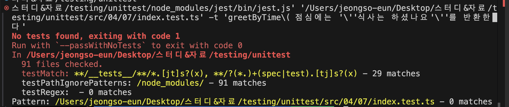

# CHAPTER03. 처음 시작하는 단위 테스트

## 테스트의 구성 요소

```jsx
test(테스트명, 테스트 함수)
test("1+2는 3이다", () => {
	expect(검증값).toBe(기댓값);
});
```

테스트명 : 테스트 내용을 잘 나타내는 제목 할당<br>
테스트 함수: 검증값이 기댓값과 일치하는 검증문인 단언문을 작성한다. 

단언문: expect(검증값).toBe(기댓값);<br>
매처: toBe(기댓값)

### 테스트 그룹 작성

연관성 있는 테스트들을 그룹화하고 싶을 때는 `describe`함수를 사용<br>
`test` 함수는 중첩시킬 수 없지만, `describe` 함수는 중첩이 가능하다. 

```jsx
describe(그룹명, 그룹 함수)

describe("add", () => {
  test("1 + 1은 2", () => {
    expect(add(1, 1)).toBe(2);
  });
  test("1 + 2는 3", () => {
    expect(add(1, 2)).toBe(3);
  });
});
```

### 테스트 실행 방법

제스트가 설치된 프로젝트의 package.json 에서 `npm script`를 추가한다. 

- 이슈 발생  : 테스트 러너가 돌아가지 않아요.. 아시는 분 도와주세요 <br>
testMatch, testRegex 설정 바꿔보는 거 해봤는데 안됩니당 ㅜㅡㅜ
    
    
    

## 조건 분기

### 상한이 있는 덧셈 함수 테스트 , 하한이 있는 뺄셈 함수 테스트

테스트는 통과했지만 70+80이 100이 된다는 것을 테스트 코드만 보고 이해할 수 없다. 

```jsx
test("50 + 50은 100", () => {
  expect(add(50, 50)).toBe(100);
});

test("70 + 80은 100", () => {
  expect(add(70, 80)).toBe(100);
});

test("반환값은 첫 번째 매개변수와 두 번째 매개변수를 더한 값이다", () => {
  expect(add(50, 50)).toBe(100);
});
test("반환값의 상한은 '100'이다", () => {
  expect(add(70, 80)).toBe(100);
});

test("반환값은 첫 번째 매개변수에서 두 번째 매개변수를 뺀 값이다", () => {
  expect(sub(51, 50)).toBe(1);
});
test("반환값의 하한은 '0'이다", () => {
  expect(sub(70, 80)).toBe(0);
});
```

```jsx
describe("사칙연산", () => {
  describe("add", () => {
    test("반환값은 첫 번째 매개변수와 두 번째 매개변수를 더한 값이다", () => {
      expect(add(50, 50)).toBe(100);
    });
    test("반환값의 상한은 '100'이다", () => {
      expect(add(70, 80)).toBe(100);
    });
  });
  describe("sub", () => {
    test("반환값은 첫 번째 매개변수에서 두 번째 매개변수를 뺀 값이다", () => {
      expect(sub(51, 50)).toBe(1);
    });
    test("반환값의 하한은 '0'이다", () => {
      expect(sub(70, 80)).toBe(0);
    });
  });
});
```

## 에지 케이스와 예외 처리

모듈을 사용할 때 실수 등의 이유로 예상하지 못한 입력값을 보낼 때가 있다. 이를 위한 예외 처리 케이스도 함께 테스트를 해야한다. 

**타입스크립트로 입력값 제약 설정**
타입 어노테이션을 붙일 경우 다른 타입의 값이 할당되면 실행하기 전에 오류가 발생한다.

```jsx
function checkRange(value: number) {
  if (value < 0 || value > 100) {
    throw new RangeError("0〜100 사이의 값을 입력해주세요");
  }
}

export function add(a: number, b: number) {
  checkRange(a);
  checkRange(b);
  const sum = a + b;
  if (sum > 100) {
    return 100;
  }
  return sum;
}

export function sub(a: number, b: number) {
  checkRange(a);
  checkRange(b);
  const sum = a - b;
  if (sum < 0) {
    return 0;
  }
  return sum;
}
```

---

**예외 발생 시키기** <br>
입력값이 기댓값과 다르면 예외를 발생시켜 값을 반환하기 전에 프로그램을 중지시킨다. 

```jsx
export function add(a: number, b: number) {
  if (a < 0 || a > 100) {
    throw new Error("0〜100 사이의 값을 입력해주세요"); 
  }
  if (b < 0 || b > 100) {
    throw new Error("0〜100 사이의 값을 입력해주세요");
  }
  const sum = a + b;
  if (sum > 100) {
    return 100; 
  }
  return sum; 
}
```

---

**예외 발생 검증 테스트 / 오류 메시지를 활용한 세부 사항 검증** <br>
예외가 발생하는 경우 예외가 발생하는지 검증하는 테스트, toThrow에 인수를 할당하면 예외에 대한 상세한 내용을 검증 가능 

```jsx
describe("사칙연산", () => {
  describe("add", () => {
    test("반환값은 첫 번째 매개변수와 두 번째 매개변수를 더한 값이다", () => {
      expect(add(50, 50)).toBe(100);
    });
    test("반환값의 상한은 '100'이다", () => {
      expect(add(70, 80)).toBe(100);
    });
    test("인수가 '0~100'의 범위밖이면 예외가 발생한다", () => {
      const message = "0〜100 사이의 값을 입력해주세요";
      expect(() => add(-10, 10)).toThrow(message);
      expect(() => add(10, -10)).toThrow(message);
      expect(() => add(-10, 110)).toThrow(message);
    });
  });
  describe("sub", () => {
    test("반환값은 첫 번째 매개변수에서 두 번째 매개변수를 뺀 값이다", () => {
      expect(sub(51, 50)).toBe(1);
    });
    test("반환값의 하한은 '0'이다", () => {
      expect(sub(70, 80)).toBe(0);
    });
    test("인수가 '0~100'의 범위밖이면 예외가 발생한다", () => {
      expect(() => sub(-10, 10)).toThrow(RangeError);
      expect(() => sub(10, -10)).toThrow(RangeError);
      expect(() => sub(-10, 110)).toThrow(Error);
    });
  });
});
```

---

**intanceof 연산자를 활용한 세부 사항 검증 <br>
상속받은 클래스들을 활용해 입력값을 체크하는 함수**

```jsx
if (err instanceof HttpError) {
  // 발생한 에러가 HttpError인 경우
}
if (err instanceof RangeError) {
  // 발생한 에러가 RangeError인 경우
}

function checkRange(value: number) {
  if (value < 0 || value > 100) {
    throw new RangeError("0〜100 사이의 값을 입력해주세요");
  }
}
```

## 용도별 매처

단언문은 테스트 대상이 기댓값과 일치하는지 매처로 검증한다.

### 진리값 검증

| toBeTruthy | 참인 값(`true`, `"string"`, `1`, `{}` 등)과 일치하는 매처 |
| --- | --- |
| toBeFalsy | 거짓인 값(`false`, `0`, `''`, `null`, `undefined`, `NaN` 등)과 일치하는 매처 |
| toBeNull | `null`인 값과 일치하는 매처 |
| toBeUndefined | `undefined`인 값과 일치하는 매처 |

### 수치 검증

| toBe | 기대값과 정확히 일치하는지 검증하는 매처 (엄격한 `===` 비교) |
| --- | --- |
| toEqual | 객체나 배열을 비교할 때, 구조적으로 동일한 값을 가지는지 검증하는 매처 |
| toBeGreaterThan | 특정 값보다 큰 수인지 검증하는 매처 (`>`) |
| toBeGreaterThanOrEqual | 특정 값보다 크거나 같은지 검증하는 매처 (`>=`) |
| toBeLessThan | 특정 값보다 작은 수인지 검증하는 매처 (`<`) |
| toBeLessThanOrEqual | 특정 값보다 작거나 같은지 검증하는 매처 (`<=`) |
| toBeCloseTo | 소수점 연산에서 근사값이 일치하는지 검증하는 매처 |

### 문자열 검증

| toContain | 특정 문자열이 포함되어 있는지 검증하는 매처 |
| --- | --- |
| toMatch | 정규식을 이용해 문자열이 특정 패턴과 일치하는지 검증하는 매처 |
| toHaveLength | 문자열의 길이가 특정 값과 일치하는지 검증하는 매처 |
| stringContaining | 주어진 문자열을 포함하는 새로운 문자열을 생성하는 매처 |
| stringMatching | 정규식을 이용해 특정 문자열이 패턴과 일치하는지 검증하는 매처 |

### 배열 검증

| toContain | 배열이 특정 요소를 포함하는지 검증하는 매처 |
| --- | --- |
| toHaveLength | 배열의 길이가 특정 값과 일치하는지 검증하는 매처 |
| arrayContaining | 배열이 특정 요소들을 포함하고 있는지 검증하는 매처 |

### 객체 검증

| toMatchObject | 객체의 특정 속성이 기대한 값과 일치하는지 검증하는 매처 |
| --- | --- |
| toHaveProperty | 객체가 특정 속성을 가지고 있는지 검증하는 매처 |
| objectContaining | 객체가 특정 속성들을 포함하고 있는지 검증하는 매처 |

## 비동기 처리 테스트

```jsx
//인수에 대기 시간을 지정하면 지정한 시간만큼 대기하고 경과 시간을 반환값으로 resolve하는 함수
export function wait(duration: number) {
  return new Promise((resolve) => {
    setTimeout(() => {
      resolve(duration);
    }, duration);
  });
}
```

### 비동기 처리가 포함된 함수를 테스트하는 방법

**`Promise`를 반환하면서 `then`에 전달할 함수에 단언문을 작성하는 방법**

```jsx
test("지정 시간을 기다린 뒤 경과 시간과 함께 resolve된다", () => {
      return wait(50).then((duration) => {
        expect(duration).toBe(50);
      });
    });
```

---

**`resolves` 매처를 사용하는 단언문을 `return`하는 방법** <br>
wait함수가 resolve됐을 때의 값을 검증하고 싶을 때 간편하다

```jsx
    test("지정 시간을 기다린 뒤 경과 시간과 함께 resolve된다", () => {
      return expect(wait(50)).resolves.toBe(50);
    });
```

---

**테스트 함수를 `async`함수로 만들고 함수 내에서 `Promise`가 완료될 때까지 기다리는 방법** <br>
resolves 매처를 사용하는 단언문도 await로 대기시킬 수 있다.

```jsx
    test("지정 시간을 기다린 뒤 경과 시간과 함께 resolve된다", async () => {
      await expect(wait(50)).resolves.toBe(50);
    });
```

---

**검증값인 `Promise`가 완료되는 것을 기다린 뒤 단언문을 실행하는 법** <br>
가장 간략한 방법

```jsx
    test("지정 시간을 기다린 뒤 경과 시간과 함께 resolve된다", async () => {
      expect(await wait(50)).toBe(50);
    });
```

---

### Reject 검증 테스트

```jsx
export function timeout(duration: number) {
  return new Promise((_, reject) => {
    setTimeout(() => {
      reject(duration);
    }, duration);
  });
}
```

---

**`Promise`를 `return` 하는 방법, `catch`메서드에 전달할 함수에 단언문 작성**

```jsx
    test("지정 시간을 기다린 뒤 경과 시간과 함께 reject된다", () => {
      return timeout(50).catch((duration) => {
        expect(duration).toBe(50);
      });
    });
```

---

**`reject` 매처를 사용하는 단언문을 활용하는 방법** <br>
단언문을 return 하거나 asnyc/await를 사용한다.

```jsx
    test("지정 시간을 기다린 뒤 경과 시간과 함께 reject된다", () => {
      return expect(timeout(50)).rejects.toBe(50);
    });
    test("지정 시간을 기다린 뒤 경과 시간과 함께 reject된다", async () => {
      await expect(timeout(50)).rejects.toBe(50);
    });
```

---

**`try-catch`문을 사용하는 방법** <br>
Unhandled Rejection을 try블록에서 발생시키고 발생한 오류를 catch블록에서 받아 단언문으로 검증

```jsx
test("지정 시간을 기다린 뒤 경과 시간과 함께 reject된다", async () => {
  expect.assertions(1);
  try {
    await timeout(50);
  } catch (err) {
    expect(err).toBe(50);
  }
});
```

### 테스트 결과가 기댓값과 일치하는지 확인하기

비동기 처리 테스트를 할때 첫번째 줄에 `expect.assertions` 를 추가하면 사소한 실수를 줄일 수 있다.

`동기 함수` 라면 반드시 단언문을 `return` 해야한다. 

**비동기 처리가 포함된 부분을 테스트할 때 다음과 같은 원칙을 가지고 접근**

1. 비동기 처리가 포함된 부분을 테스트할 때는 테스트 함수를 async 함수로 만든다. 
2. `.resolves`  나 `.rejects` 가 포함된 단언문은 `await` 한다. 
3. `try-catch` 문의 예외 발생을 검증할 때는 `expect.assertions` 을 사용한다.