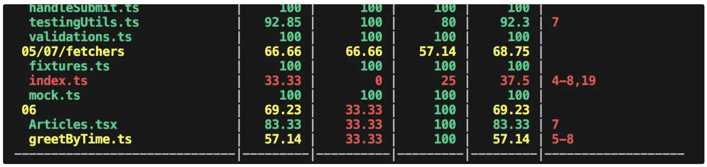
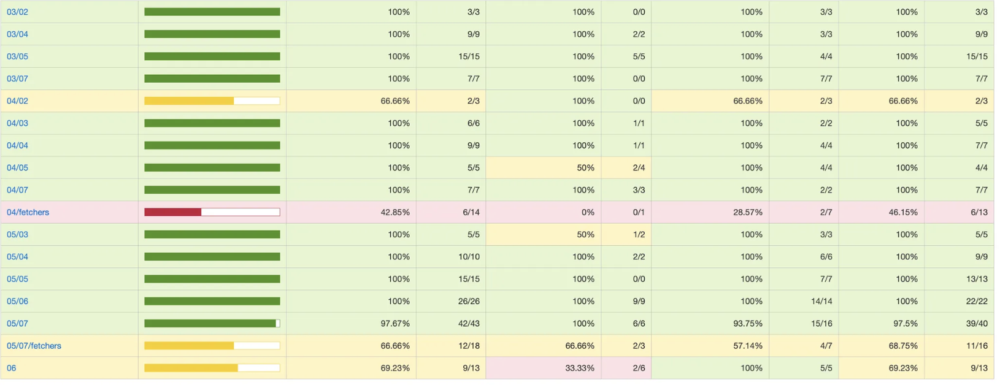

### 커버리지 리포트

테스트 프레임워크에는 구현 코드가 얼마나 테스트됐는지 측정해 리포트를 작성하는 기능이 있는데 이 리포트를 커버리지 리포트라고 한다.

`커버리지 리포트 출력하기`

--coverage 을 추가해 테스트를 실행하면 커버리지 리포트를 확인할 수 있다.

```jsx
npx jest --coverage
```



`커버리지 리포트 구성`

| Stmts(구문 커버리지)  | 구현 파일에 있는 모든 구문이 적어도 한 번은 실행됐는지 나타냄                                      |
| --------------------- | -------------------------------------------------------------------------------------------------- |
| Branch(분기 커버리지) | 모든 조건 분기가 적어도 한 번은 실행됐는지 나타냄( if, case, 삼항연산자를 사용한 분기가 측정 대상) |
| Funcs(함수 커버리지)  | 모든 함수가 적어도 한 번은 실행됐는지 나타냄                                                       |
| Lines(라인 커버리지)  | 모든 라인이 적어도 한 번은 통과됐는지 나타냄                                                       |

```jsx
{
  collectCoverage: false,
  coverageDirectory: "coverage",
}
```

제스트 CLI에서 리포트를 확인할 수도 있고, HTML 로 리포트를 생성하는 기능도 있다.
jest.config.ts 에 위의 코드를 넣으면 커버리지 옵션을 넣지 않아도 리포트가 생성된다.



`녹색`: 테스트가 충분

`노란색` OR `빨간색`: 테스트가 불충분

커버리지 리포트는 구현 코드의 내부 구조를 파악하여 논리적으로 문서를 작성하는 테스트 방법인 `화이트박스 테스트`에 필수다.

커버리지 수치가 높다고 반드시 품질이 높은 것은 아니다. <br>
⇒ 커버리지 충족은 작성된 테스트 통과의 의미지지, 버그가 없다는 것은 아니다.
